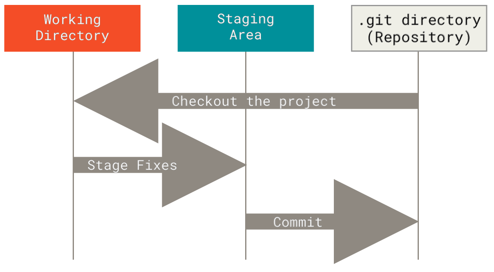

# Git

本文是一篇关于 Git 的教程, 面向完全没有使用过 Git 的学生. 旨在帮助大家理解:

- Git 是什么?
- 为什么要学 Git?
- Git 的设计原理
- 常见 Git 操作

在上述内容有了初步理解后, 感兴趣的同学可以根据推荐资料进一步学习 Git.

江湖传言: "一入git深似海, 从此npy是路人"

## Git 是什么?

你有没有过这样的经历: 课程大作业写到一半, 突然想改个思路, 于是把文件复制一份叫 `project_v2.cpp`

改着改着又觉得不行, 又复制一份叫 `project_v3_final.cpp`

然后还有 `project_v3_final_real_final.cpp`, `project_v3_final_real_final_REALLY_final.cpp`...

恭喜你, 你已经在**手动做版本控制**了! 只不过这种方式, 一言难尽 🤡

**Git** 是一个分布式版本控制系统 (Distributed Version Control System, DVCS). 简单来说, 它帮你:

- **记录文件的每一次变更**: 谁在什么时候改了什么, 一清二楚
- **随时回到任何一个历史版本**: 改崩了? 一条命令回到从前
- **多人协作不打架**: 每个人在自己的分支上开发, 最后合并到一起

Git 由 Linux 之父 [**Linus Torvalds**](https://en.wikipedia.org/wiki/Linus_Torvalds) 在 2005 年创造, 最初是为了管理 Linux 内核的开发. 没错, 就是那个在 Linux 篇里提到的 Linus 🐮

## 为什么要学 Git?

你可能会想: "我一个人写代码, 要什么版本控制? 我又不是在大厂上班."

别急, 以下这些在向你招手:

1. **课程作业和项目**:
    * 课程项目越来越复杂, 代码量越来越大, 不用 Git 管理迟早翻车
    * 很多课程项目是小组合作, 没有 Git 你们怎么协作? 用 QQ 传 zip 吗? 😅
2. **实习和工作**: 几乎所有软件公司都用 Git. 这是基本技能
3. **开源社区**: 想参与开源项目? GitHub/GitLab 上的项目全部基于 Git. 不会 Git 连别人的代码都拿不到.
4. **个人项目管理**: 即使是一个人的项目, Git 也能帮你记录每一次修改, 方便回溯和管理.
5. **这门课**: 你正在看的这本教材, 就是用 Git 管理的. 你要是想给我们提 PR 修个 typo, 也得用 Git 🚀

一句话总结: Git 是程序员的必备技能, 越早学越好, 没有之一.

## Git 的设计原理

在开始敲命令之前, 我们先花几分钟搞懂 Git 的核心设计思想. **别急着跳过这一节!**

理解了原理, 后面的操作就不再是死记硬背, 而是水到渠成!

### 快照, 而非差异

很多版本控制系统 (如 SVN) 存储的是文件的**差异 (delta)**: 每次只记录 "哪一行改了什么"

而 Git 的思路不同: **每次提交, Git 都会对当前所有文件做一个快照 (snapshot)**, 如果文件没有变化, 则只保存一个指向上一次快照的链接

你可以把 Git 想象成一个**时光相机** 📸: 每次 commit 就是给你的项目拍了一张照片, 所有的照片按时间排列, 你随时可以翻到任何一张

### 几乎所有操作都在本地

Git 是分布式的, 意味着你本地就有完整的仓库副本, 包括所有的历史记录.

绝大部分操作 (查看日志, 创建分支, 比较差异) 都不需要联网, 速度飞快. 只有在需要和远程仓库同步时 (push/pull) 才需要网络.

### Git 的三级概念



- **工作区(Working Directory)**: 就是你在电脑上实际看到的文件目录, 你在这里编辑代码
- **暂存区(Staging Area)**: 一个临时的 "准备提交" 区域. 你通过 `git add` 把改动放到这里, 相当于说 "这些改动我确认要提交了"
- **本地仓库**: 通过 `git commit` 把暂存区的内容永久保存到本地仓库, 形成一个新的快照

PS: 与本地仓库对应的是**远程仓库**: 通过 `git push` 把本地仓库的提交推送到远程 (如 GitHub), 供团队其他成员获取

```admonish
为什么要有暂存区? 你可能改了 10 个文件, 但只有其中 3 个是属于同一个功能的修改.

暂存区让你可以只提交这 3 个文件, 保持每次 commit 都干净、有意义.
```

### 分支: Git 的杀手级特性

分支 (Branch) 是 Git 最强大的特性之一. 你可以把分支想象成平行宇宙:

- **main 分支** 是你的 "主世界", 存放稳定可用的代码
- 当你要开发新功能时, 从 main 上 "分裂" 出一个新分支, 在新分支上随便折腾
- 开发完成后, 把新分支 "合并" 回 main

这样做的好处是: 即使你把新功能写崩了, main 分支上的代码完全不受影响. 多人协作时, 每个人在自己的分支上开发, 互不干扰.

```text
        feature-login
       /              \
main ─●───●───●───●────●───●── main
               \      /
                feature-ui
```

### 一个典型的多人协作场景

假设你和npy-1、npy-2一起做课程项目:

1. 你们在 GitHub 上创建了一个远程仓库, main 分支作为 "正式版"
2. 你负责登录功能, 创建 `feature-login` 分支
3. npy-1负责 UI, 创建 `feature-ui` 分支
4. npy-2负责数据库, 创建 `feature-db` 分支
5. 各自在自己的分支上开发, 互不干扰
6. 开发完成后, 各自提交 Pull Request (PR), 经过 Code Review 后合并到 main
7. 如果有冲突 (比如你和npy-1都改了同一个文件), Git 会提示你解决冲突

这就是现代软件开发的标准工作流. 无论是开源项目还是企业内部, 基本都是这个模式.

## 安装与配置

### 安装 Git

- **Linux**: 基本上自带, 没有的话用包管理器装就行
  ```shell
  # Arch Linux
  sudo pacman -S git
  # Ubuntu/Debian
  sudo apt install git
  ```
- **MacOS**: 装了 [Xcode Command Line Tools](https://mac.install.guide/commandlinetools/) 就有了, 或者 `brew install git`
- **Windows**: 从 [git-scm.com](https://git-scm.com/downloads) 下载安装包, 或者用 WSL (推荐)

### 初始配置

安装完 Git 后, 第一件事就是设置你的身份信息. 这些信息会出现在你的每一次 commit 中:

```shell
git config --global user.name "Your Name"
git config --global user.email "your.email@example.com"
```

这里的 `--global` 表示全局配置, 对你电脑上所有的 Git 仓库都生效.

如果你想对某个特定仓库设置不同的身份, 去掉 `--global` 就行.

建议填写的 username 和 email 要和你 GitHub 账号一致, 这样提交才会正确关联到你的 GitHub 个人资料上.

再顺手配几个实用选项:

```shell
# 设置默认分支名为 main (而不是旧版的 master)
git config --global init.defaultBranch main

# 设置默认编辑器 (按你的喜好来)
git config --global core.editor vim
```

查看当前配置:

```shell
git config --list
```

## 常见 Git 操作

理论讲完了, 开始动手! 

下面的操作笔者会按照实际使用的场景来组织, 只包含最基础开发需要的学习内容

更多的内容, 感兴趣的同学可以参考推荐资源继续深入学习.

### 创建仓库

有两种方式:

**(1) 从零开始:**

```shell
mkdir my-project
cd my-project
git init
```

执行 `git init` 后, 当前目录下会多一个隐藏的 `.git` 文件夹, 这就是 Git 仓库的 "大脑", 所有版本信息都存在这里.

**(2) 从远程克隆:**

```shell
git clone https://github.com/xjtu-ics/textbook.git
```

这会把远程仓库完整地下载到你本地, 包括所有历史记录.

### 日常工作流: add, commit, push

这三个命令你会用一万遍, 必须烂熟于心:

```shell
# 1. 查看当前状态 (养成好习惯, 经常看)
git status

# 2. 把修改添加到暂存区
git add file1.cpp file2.cpp    # 只添加指定文件
git add .                      # 添加当前目录下所有修改

# 3. 提交到本地仓库
git commit -m "feat: add login function"

# 4. 推送到远程仓库
git push
```

**关于 commit message: 请写有意义的提交信息!**

"update" / "fix" / "asdf" / "20260102" 这种提交信息, 三天后你自己都看不懂当时改了什么. 

推荐使用 [Conventional Commits](https://www.conventionalcommits.org/zh-hans/v1.0.0/) 规范, 比如:

- `feat: 新增用户登录功能`
- `fix: 修复某 bug` (很细微的错误也可以用 `typo` / `nits` 之类的代替)
- `docs: 更新 README 中的安装说明`
- `refactor: 重构数据库连接模块`

### 查看历史

```shell
# 查看提交日志
git log

# 简洁版 (推荐, 一行一个 commit)
git log --oneline

# 图形化查看分支合并历史 (很酷)
git log --oneline --graph --all
```

### 查看差异

```shell
# 查看工作区和暂存区的差异 (还没 add 的修改)
git diff

# 查看暂存区和最近一次 commit 的差异 (已经 add 但还没 commit 的)
git diff --staged

# 查看两个 commit 之间的差异
git diff commit1 commit2
```

### 撤销操作

人非圣贤, 孰能无过. Git 提供了多种 "后悔药":

**还没 add 的修改, 想撤销:**

```shell
# 撤销某个文件的修改, 恢复到最近一次 commit 的状态
git checkout -- file.cpp
# 或者更新的写法
git restore file.cpp
```

**已经 add 了, 想从暂存区撤出来:**

```shell
# 把文件从暂存区移出, 但保留工作区的修改
git reset HEAD file.cpp
# 或者更新的写法
git restore --staged file.cpp
```

**已经 commit 了, 想修改:**

```shell
# 修改最近一次 commit 的信息
git commit --amend -m "new message"

# 回退到某个 commit (保留修改在工作区)
git reset --soft HEAD~1

# 回退到某个 commit (保留修改在工作区, 但清除暂存区)
git reset HEAD~1
```

`git reset --hard` 会丢弃所有修改, 请务必三思而后行!

如果你已经 push 到远程仓库了, 不要随便 reset, 那样会给协作的队友带来大麻烦.

### 分支操作

分支是你在 Git 中最常打交道的东西之一:

```shell
# 查看所有分支
git branch          # 本地分支
git branch -a       # 包括远程分支

# (1) 创建新分支
git branch feature-login

# (2) 切换到某个分支
git checkout feature-login
# 或者更新的写法
git switch feature-login

# (3) 创建并切换 (一步到位, 等于 1 + 2)
git checkout -b feature-login
# 或者
git switch -c feature-login

# 删除分支 (确保已经合并后)
git branch -d feature-login
```

### 合并分支

当你在 feature 分支上开发完毕, 需要把代码合并到 main:

```shell
# 先切回 main 分支
git switch main

# 把 feature-login 合并到当前分支 (main)
git merge feature-login
```

如果两个分支修改了同一个文件的同一部分, Git 会提示**合并冲突 (merge conflict)**. 打开冲突文件, 你会看到类似这样的标记:

```text
<<<<<<< HEAD
这是 main 分支的内容
=======
这是 feature-login 分支的内容
>>>>>>> feature-login
```

你需要手动决定保留哪部分 (或者两者都保留), 删除那些 `<<<<<<<` `=======` `>>>>>>>` 标记, 然后:

```shell
git add conflicted-file.cpp
git commit -m "resolve merge conflict"
```

合并冲突是 Git 初学者最怕的东西, 但其实没那么可怕. 

冲突只是 Git 在告诉你: "这两个分支都改了同一个地方, 我不知道该听谁的, 你来决定." 冷静处理就好.

### 远程仓库操作

```shell
# 查看远程仓库信息
git remote -v

# 添加远程仓库
git remote add origin https://github.com/username/repo.git

# 从远程拉取最新代码
git pull              # = git fetch + git merge
git fetch             # 只拉取, 不合并 (更安全)

# 推送到远程
git push
git push -u origin main   # 第一次推送时, 设置上游分支
```

注意! `git pull` = `git fetch` + `git merge`

如果你想更安全一点, 可以先 `git fetch` 看看远程有什么变化, 然后再决定要不要合并. 

直接 `git pull` 虽然方便, 但有时候会产生意料之外的合并.

### .gitignore

有些文件你不希望 Git 跟踪, 比如编译产物、IDE 配置文件、敏感信息等. 在项目根目录创建一个 `.gitignore` 文件:

```text
# 编译产物
*.o
*.exe
build/

# IDE 配置
.vscode/
.idea/

# 系统文件
.DS_Store
Thumbs.db

# 敏感信息
.env
credentials.json

# Python
__pycache__/
*.pyc
.venv/
```

`.gitignore` 应该在项目初始化的时候就创建好.

GitHub 在创建仓库时可以[**选择模板**](https://github.com/github/gitignore), 比如 C++、Python、Node.js 等, 会自动帮你生成对应的 `.gitignore`.

### 暂存工作进度: stash

有时候你正在 feature 分支上写代码, 突然有个紧急 bug 需要修. 但是你当前的代码还没写完, 不想 commit 一个半成品. 这时候 `stash` 就派上用场了:

```shell
# 暂存当前修改
git stash

# 查看暂存列表
git stash list

# 恢复最近一次暂存
git stash pop

# 恢复但不删除暂存记录
git stash apply
```

用 `stash` 把手头的半成品先存起来, 切到别的分支修 bug, 修完再切回来 `stash pop` 恢复, 一切如故.

## GitHub 协作基本流程

Git 管的是版本控制, GitHub 管的是代码托管和协作. 二者经常一起用, 但它们不是一回事! Git 是工具, GitHub 是代码托管平台!

### Fork + Pull Request 工作流

这是开源项目最常用的协作方式, 也是你给这本教材提 PR 的正确姿势:

1. **Fork**: 在 GitHub 上把别人的仓库 "复刻" 到你自己的账号下
2. **Clone**: 把你 fork 后的仓库克隆到本地
   ```shell
   git clone https://github.com/你的用户名/textbook.git
   ```
3. **创建分支**: 在本地创建一个新分支来做修改
   ```shell
   git switch -c fix-typo
   ```
4. **修改代码, 提交, 推送**:
   ```shell
   git add .
   git commit -m "fix: 修正第三章的一个 typo"
   git push -u origin fix-typo
   ```
5. **创建 Pull Request**: 在 GitHub 上从你的分支向原仓库的 main 分支发起 PR
6. **等待 Review**: 项目维护者会审核你的代码, 可能会提出修改意见
7. **合并**: 审核通过后, 维护者会把你的 PR 合并到主分支

### 保持 Fork 同步

你 fork 的仓库不会自动和原仓库保持同步. 如果原仓库有了新的提交, 你需要手动同步:

```shell
# 添加原仓库为 upstream
git remote add upstream https://github.com/xjtu-ics/textbook.git

# 拉取原仓库的最新代码
git fetch upstream

# 合并到你的 main 分支
git switch main
git merge upstream/main

# 推送到你的 fork
git push
```

## Cheat Sheet

| 操作 | 命令 |
| --- | --- |
| 初始化仓库 | `git init` |
| 克隆仓库 | `git clone <url>` |
| 查看状态 | `git status` |
| 添加到暂存区 | `git add <file>` |
| 提交 | `git commit -m "message"` |
| 查看日志 | `git log --oneline` |
| 查看差异 | `git diff` |
| 创建分支 | `git branch <name>` |
| 切换分支 | `git switch <name>` |
| 合并分支 | `git merge <name>` |
| 拉取远程 | `git pull` |
| 推送远程 | `git push` |
| 暂存进度 | `git stash` |
| 恢复进度 | `git stash pop` |

## 总结与推荐资源

Git 的世界远比这篇教程所能覆盖的要大得多. 这里我们只讲了最核心、最常用的部分, 足够你应对日常开发和课程项目了. 如果你想继续深入, 下面是一些推荐资源:

**入门级**

- [Pro Git (Chapter 1/2/3/5/6)](https://git-scm.com/book/zh/v2)
    - 这是 **Git 官方推荐的免费电子书**, 从入门到进阶都有, 中文翻译质量很高.
    - 本文的部分内容也参考了这本书. 读完本文, 该书前三章基本可以无障碍扫过了.
    - 注意这本书是一本 **"新华字典"**, 讲得非常全面, 不建议一口气读完; 可以当成工具书, 先尝试整体浏览, 学个关键概念/命令, 然后再看完整篇. 不断迭代学习+开发使用, 过几年自然就全都会了.
- [Learn Git Branching](https://learngitbranching.js.org/?locale=zh_CN)
    - 一个**交互式**的 Git 学习网站, 通过**可视化**的方式教你理解分支操作, 非常直观.
    - 做完基础部分你就能超过 80% 的人了.
- [Happy Git and GitHub for the useR](https://happygitwithr.com/)
    - 很基础, 且分的场景很细, 值得新手入门
    - 尽管最初目标读者是使用 R 进行数据分析的人, 但对 System 领域的人依然有用

**进阶级**

- [Oh S__t, Git!?!](https://ohshitgit.com/zh)
    - 名字很粗暴, 但内容很实用. 专门收录了各种 "Git 操作翻车了怎么办" 的场景和解决方案.
- [Git Flight Rules](https://github.com/k88hudson/git-flight-rules/blob/master/README_zh-CN.md)
    - 程序员的 Git 操作 "飞行手册", 收录了大量常见问题的解决方案.
- [Pro Git (整本书)](https://git-scm.com/book/zh/v2)

**实践建议**

说到底, 学 Git 最好的方式就是**用 Git**. 建议你:

1. 从现在开始, 所有代码项目都用 Git 管理
2. 在 GitHub 上创建自己的仓库, 把作业和项目都放上去
3. 找一个感兴趣的开源项目, 尝试提一个 PR (哪怕只是修个 typo)
4. 和同学一起做项目时, 强制使用 Git 协作

不要怕犯错! Git 的设计哲学就是让你可以大胆尝试 -- 因为几乎所有操作都是可以撤销的!

多用、多试、多犯错, 你会发现 Git 其实没那么难, 而且一旦用顺了, 就再也回不去了 🚀

------

© 2026. ICS Team. All rights reserved.
