# G__hub? Github!

> 这篇文章会带你走近全球最大“同性交友网站”😍😍😍

众所周知，GitHub是一个全球最大的代码托管平台，在这里我们借助Git来管理项目代码。

在GitHub上，我们可以很轻松的找到一些开源代码，因此，GitHub也有“程序员的维基百科”之称 👀

经常上网冲浪的同学肯定会听说很多github的戏称，比如 Ga_hub :))

那是因为GitHub上有95%的用户都是 🧔‍♂️

因此GitHub也被称为全球最大同性交友网站

这里拿一份某不知名人类高质量男性约会简历举例，你心动了吗❤️

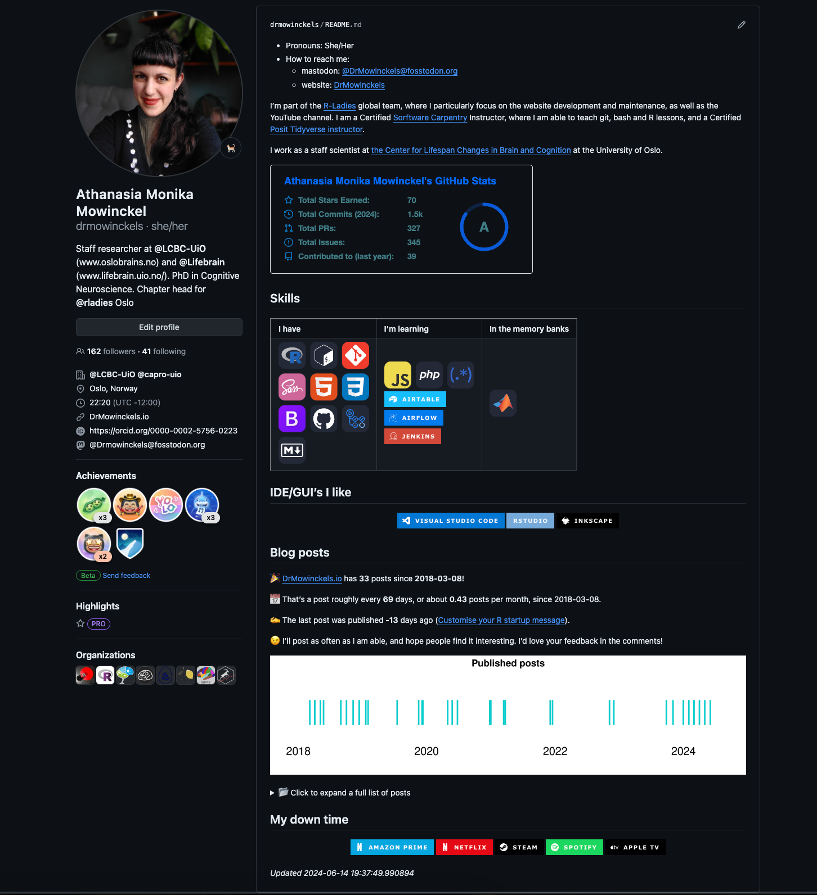

~~心动不如行动🐛~~

## 如何从零开始使用github

这篇文章会以一个刚开始学习的 Github 小白视角写的，希望能帮助到想开始学习 GitHub 又不知如何上手的学习者🧐

大家可能会对有以下困惑：

1. GitHub 是干什么用的？现在我只知道它跟代码有关 T_T
2. 联想英文构词法，不难理解Github应该是跟Git相挂钩？但是这两个具体有什么关联吗？
3. 大家都说 GitHub 是个开源社区，可以在上面与其他人一起切磋技术、完善代码，那具体是怎么与别人交流呢？

### 注册账号并浏览初始页面

打开 GitHub 网站，首页如下图所示，点击右上角`Sign up`按钮，进入注册页面。使用电子邮件注册，设置好用户名和密码，即可生成账号。

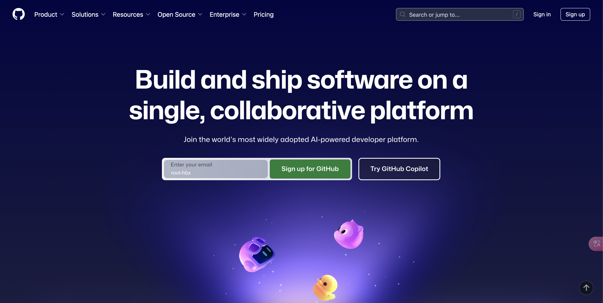

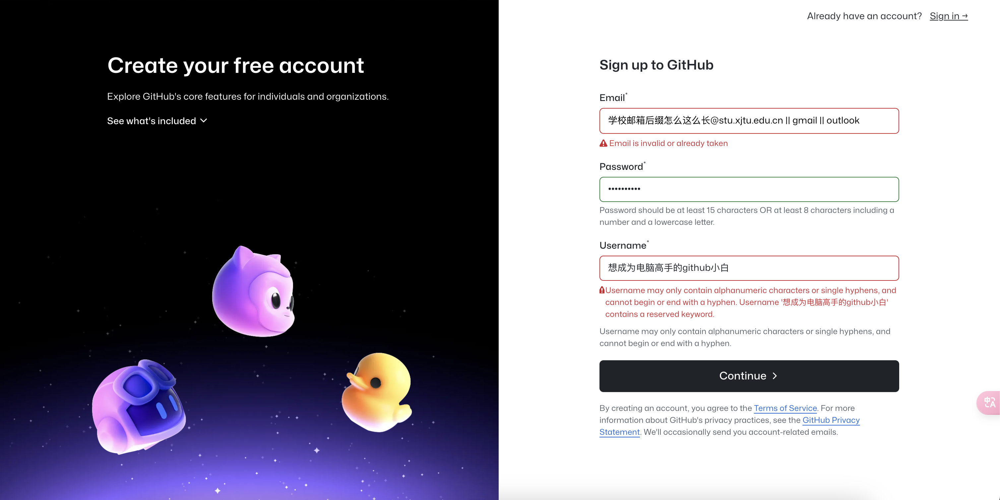

完成注册后，点击旁边的`Sign in`登录即可

这时你会看见初始页面如下（肯定没有笔者这里展示的丰富，因为你刚注册，是新号）：

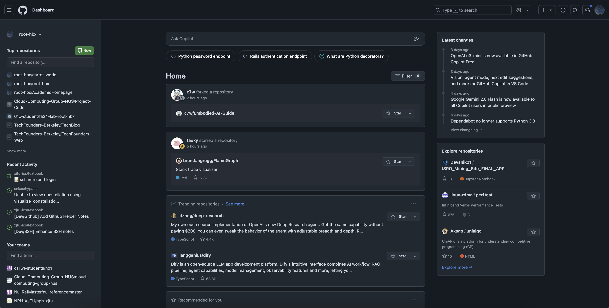

整个界面分成左中右三个部分，简单概括就是：

- 左: 自己的仓库 / 自己近期的活动 / 自己的团队
- 中: 关注的人(~~我想约的人~~)的动态
- 右: 官方推荐，兴趣投喂，发现新的热门/有趣仓库

这个界面被叫做“公告栏” (Dashboard)

### 工具栏

点击右上角的个人头像，你会发现有很多栏目:

- Your Profile
- Your Repository
- Your Copilots
- Your Projects
- Your Stars
- Your Organizations
- ...

这个就是工具栏，是集很多功能显示于一体的“目录”，了解一下即可。我们会在后面逐个介绍主要功能的使用

### 个人主页 (Your Profile)

在之前的Dashboard中，点击右上角的个人头像，在下拉列表中选择`Your profile`项，到达个人主页。

主页面可以对比本文开头给出的“人类高质量男性约会简历”，了解一下 Github Profile 的使用方式:

1. 点击头像下方的`Edit profile`按钮，可以修改自己的个人信息，比如这里的简介，公司、地址、联系方式等；而如果是别人的个人主页，这里看到的就是`Follow`（关注）按钮和别人的展示信息 👻
2. "`Pinned`" 区域是自己的个人展示区，在自己的仓库中精选几个放到这里展示，让别人能很快发现你的闪光点 ✨
3. 活跃度表格：绿色格子越多，颜色越深，说明该用户在 GitHub 上提交次数越多，是重度网瘾患者 🚀
4. 雷达图：显示你/你看的用户的个人工作重心，是commit多，还是pr多...
    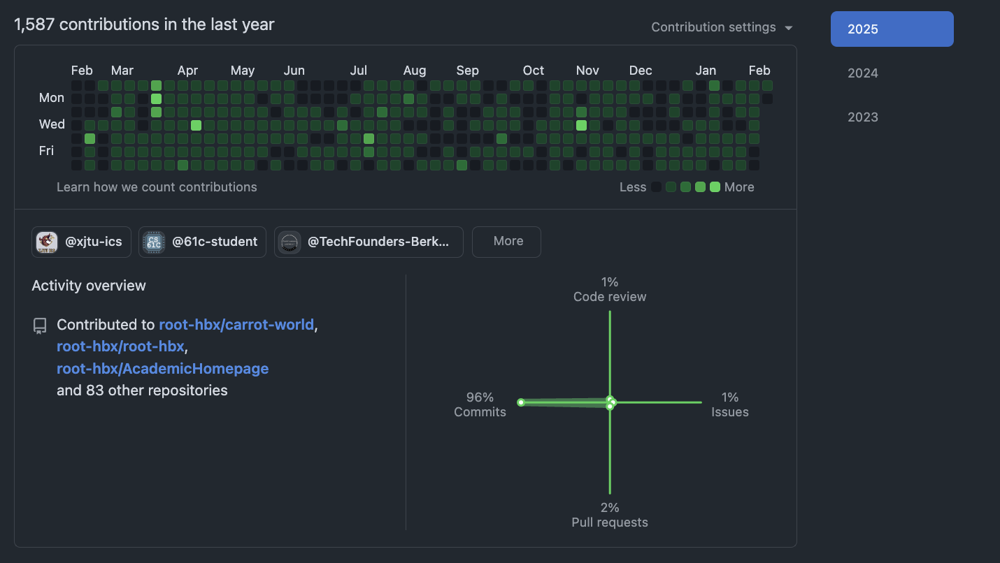

这里集中简单解释一下雷达图旁批这四个名词的含义，只是直观理解:

- `Commit`: 你在自己仓库里做了更改并提交，比如你写了一篇博客并传到github仓库，这就算一次“commit”
- `Pull Request`: 你对别人的仓库做了更改，要跟仓库主人说一声并经过他的同意，这个“待检查的更改”就叫做一次“Pull Request”，简称PR
- `Issue`: 你看了别人的教程仓库，但是还是有困惑/发现错误，要跟人家提问题，这就叫“issue”
- `Code Review`: 你是大佬，别人交的代码要你过目，你“过目”的过程就叫“code review”

这几个词非常非常重要，这里我只是形象的打个比方，不完全正确，后面会做详细讲解✅

这时我们注意到主页面上方有菜单栏:

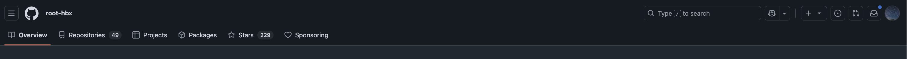

- `Overview`: 就是你现在看到了个人页面，用于向别人展示你的个人形象
- `Repositories`: 存放个人代码的仓库，我们将在后面做详细解释
- `Projects`: 相当于是个计划表，你可以在这里列上对应的计划，可以进行链接
- `Packages`: 你所发布的代码包，暂且不用管
- `Stars`: 这就是传说中的 Star🌟🌟🌟 我们看技术文章可能常会遇到如“GitHub 上 Star 数过万的项目”等，就是指这个Star！比如，我们觉得一个仓库很棒，那就在它的右上角点个 Star，就相当于是"一键三连"了，之后还可以在自己的主页中点击星星图标查看
- `Sponsoring`: 你可能还会注意到上面的图片显示了这个专栏，不过大概率你现在是没有的，先不用管

### Star

接触计算机科学来已有近两年半(警觉🐔⚠️)，你肯定听说过“高star项目”之类的表达

这里的star表示你的 “喜欢/赞赏”

具体可以看你的菜单栏:

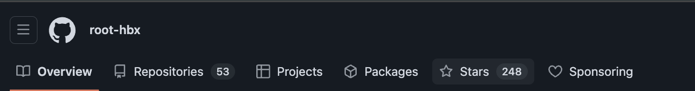

点击 `Stars`，相当于现在来到你的“打赏列表”:

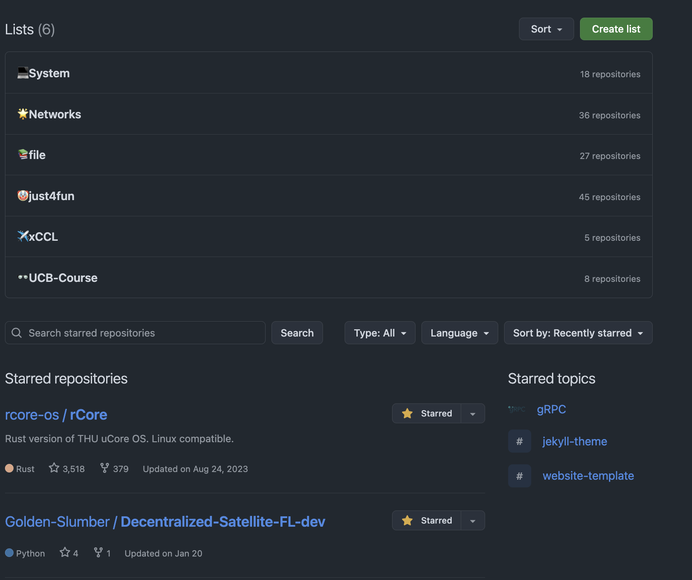

当你在开源社区冲浪时，看见自己觉得还不错的项目，可以考虑给一个star

给star后，就会在这里呈现 👍

同时，你也可以对star列表进行合理的分类，点击右上方的 `create list` 即可

比如，看上面的图片，这是笔者的“打赏列表”，分成 `System` / `Networks` 等类别 🌟

## 如何创建你的第一个仓库

我们经常会听到 “在github上创建一个仓库” 这类说法，这里我们会手把手教你如何来做

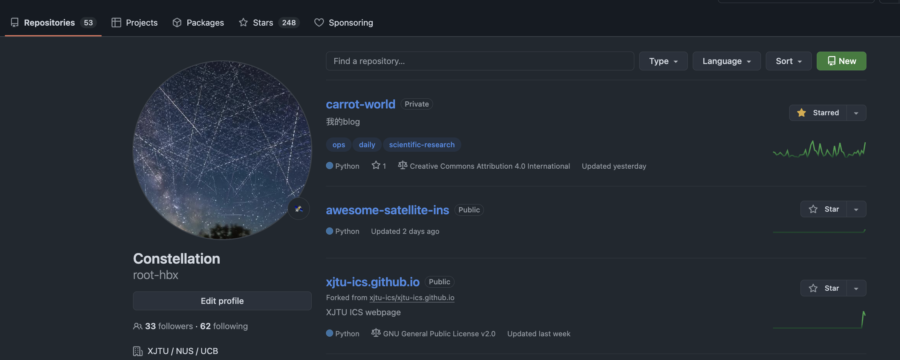

在菜单栏中，选择 `Repositories` 进入你的仓库列表:

点击右上角，`New`

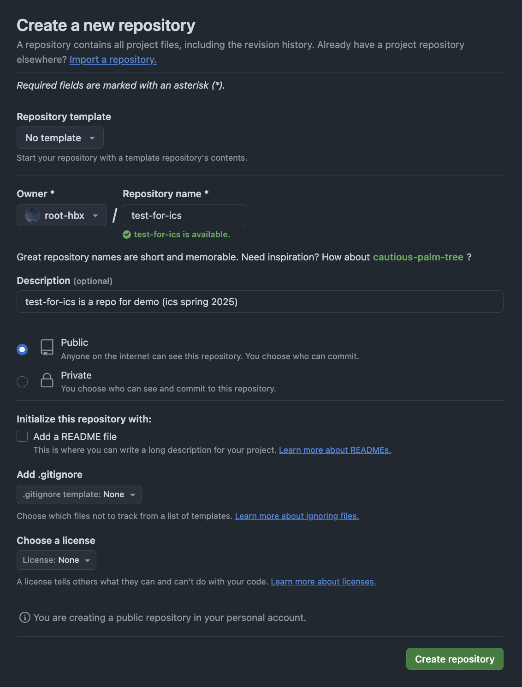

在创建的界面里:

1. Repository name: 你想给这个仓库取什么名？
2. Description (optional): 对这个仓库的一句话介绍
3. `Public` / `Private`: 公有还是私有
    - 公有: 所有用户都能看见这个仓库的全部内容和操作
    - 私有: 只有你自己可以看 (比如ics的实验，就需要你们自行创建private仓库)
4. Add a README file (optional): 给这个仓库默认加一个“说明界面”
5. Add .gitignore (optional): 给这个仓库默认加一个“自忽略白名单”
6. Choose a license (optional): 选择一个默认的开源协议
7. 点击 `Create Repository` 即可

## 如何创建/加入一个组织

> 组织: organization

这里以 [XJTU-ICS](https://github.com/xjtu-ics) 课程对应的开源社区为例 👏

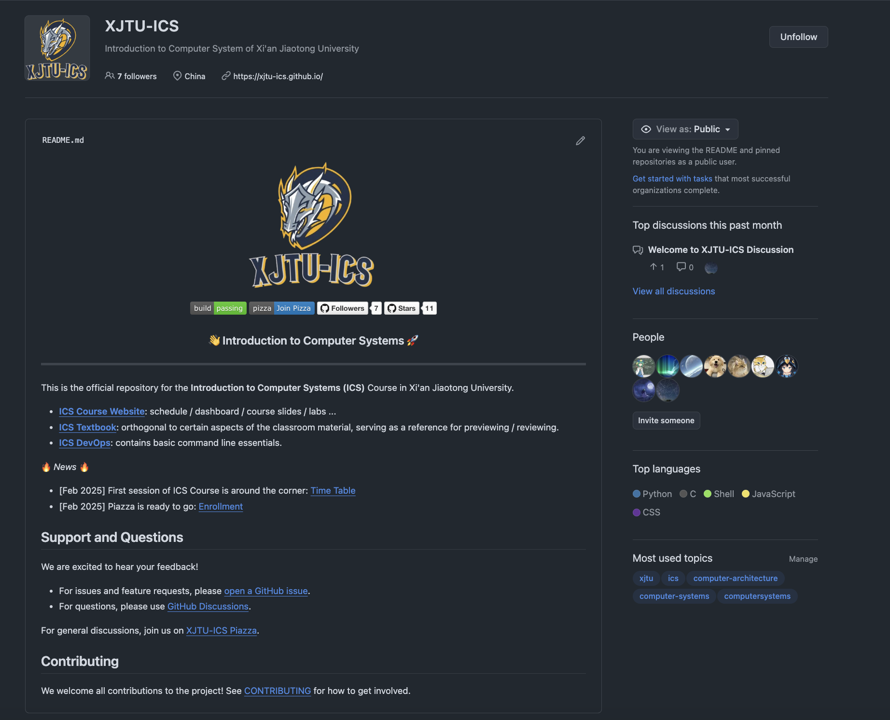

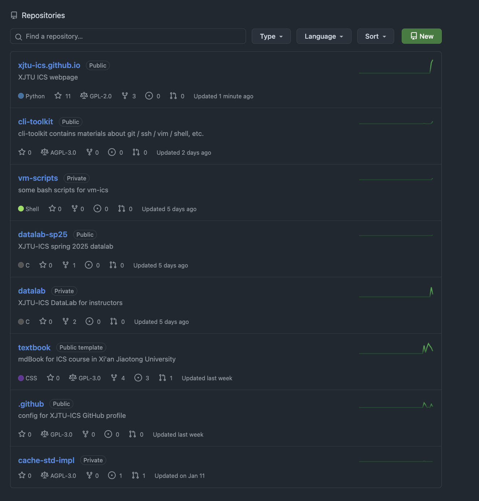

organization 也有 profile、也有repo，你可以简单的把它看成一个“更大”的用户

具体如何创建、管理一个organization，此处省略，感兴趣的同学可以自行上网搜索

## TL;DR

至此，github的“最基础入门之旅”就结束 🎉🎉🎉

很显然这只是github的冰山一角，更多的内容还得自行去探索，我们这里只是给大家一个最基础的宏观介绍，相当于是“埋下一颗种子”

至于是否能成长为“参天大树”，还得看你自己的求知欲和实践情况 😄

这里给出一些“探索路线”的推荐 👍

Basic Operation (ignored for now):

- [ ] How to create a repo and make a commit
- [ ] Local machine and remote repo
- [ ] Connect github with SSH (server / local machine)

Advanced (ignored as well):

- [ ] Github Action and Workflows
- [ ] Github Pages
- [ ] Make a PR
- [ ] Report an Issue
- [ ] Github Organization Management
- [ ] GPG Keys
- ...

希望大家可以在开源这条路上越走越远 💪

------

© 2025. ICS Team. All rights reserved.