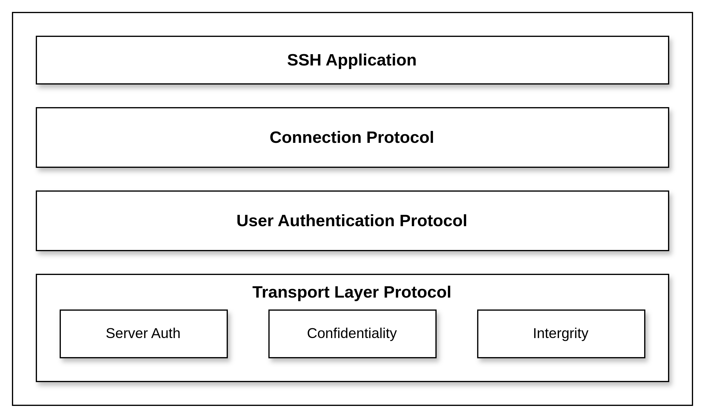

# SSH

现在是5202年，你在无数学长学姐的安利下选择了《计算机系统导论》，并被告知这门课有可能是你在沙坡村学院能够上到的最有用的课。

在被沙坡村学院折磨了许久之后，你像抓住了救命稻草一般，准备再度踏上计算机学习的正轨... :books: :muscle: 

突然，你的手机震动一下，打开一看是助教在ICS课程群里发送了消息：

“...我们为大家准备了服务器，并创建了账号密码，需要使用服务器的同学请SSH到服务器上...”

然而，你没有听说过SSH，也不知道它如何使用，只是盯着自己电脑上的Dev C++发呆，:thinking: :sob:

“算了，先开一把瓦吧”，你对自己说到... :satisfied:

这篇文章，我们将手把手教你如何使用SSH，常见的SSH使用场景，如何编写SSH配置文件...

此外，我们还会介绍SSH的底层工作原理，供对底层感兴趣的同学进行学习 :tada:

当然，笔者不过是比你们多上了两年学的学长/学姐，对于SSH的理解难免出现偏差 :warning: 或错误 :skull_and_crossbones:，欢迎各位同学批评指正 :rose:

## 什么是SSH？

SSH(Secure Shell)是一个**应用层协议**，旨在在不安全的网络上提供安全的远程访问和网络服务。

在SSH出现之前，一般是使用Telnet和FTP等进行远程登陆和文件传输。

然而这些传输方式均采用**明文**进行传输，相当于直接公开自己传输的信息，十分不安全。

SSH使用**加密技术**在两台通信主机之间建立了一个安全的通信信道，因此更加适合现代网络环境。



```admonish   
**明文**和**密文**是密码学中的两种术语。  
假设两台主机之间需要传递的内容称为信息，则明文指没有任何修饰的（例如加密）原始信息，密文则指使用加密技术进行加密之后的信息。
```

```admonish  
SSH一般指协议标准，而我们日常用的SSH工具一般是OpenSSH，这是SSH协议的开源实现。
```

## SSH的常见使用场景

一般而言，SSH主要有下面几种应用场景：
- 远程登陆
- 安全文件传输
- 端口转发

### SSH登陆远程服务器

SSH远程登陆类似于Windows系统上的远程桌面，不过不同的是，没有桌面环境，只有一个命令行终端。

使用SSH登陆服务器之后，你可以像在本地使用终端一样来操作服务器，这在网络管理和远程开发中十分常见。

由于笔者使用的是物理机Arch Linux，因此下面主要以Linux系统为例介绍命令。

```admonish
本文后续统一将自己本地的主机称为客户端，将远程主机称作服务器。无特殊说明时，客户端和服务器均为Linux系统。
```

#### For Linux

SSH的登陆验证方式主要有**用户密码**验证和**密钥验证**两种

##### 用户密码登陆

用户密码登陆是常见的身份验证方式，一般使用以下的命令格式：

```bash
ssh user@host [-p port]
```

详细解释一下上述命令：
- `ssh`：表示使用`ssh`命令
- `user`：表示需要远程登陆的主机上的用户名，如果用户名和本地用户名相同，则这一部分可以省略
- `host`：表示要登陆的主机名，可以是主机的域名，也可以是主机的IP地址（公网IP或者局域网内私有IP）
- `-p port`：可选，用于指定端口，默认端口为22，如果SSH服务器监听默认端口，则可以省略这一部分

输入上述命令之后，如果没有问题，终端会提示让你输入密码（首次登陆密码一般会告知你，或者按照自己重新设置的密码），

正确输入密码之后，终端上如果输出一堆系统信息，然后打印出远程主机的终端提示符，则说明我们成功登陆了 :tada:

````admonish tip
首次登陆时终端会显示类似这样的一段话（例如ssh首次登陆github）：  
```
The authenticity of host '[ssh.github.com]:443 (<no hostip for proxy command>)' can't be established.  
ED25519 key fingerprint is SHA256:+DiY3wvvV6TuJJhbpZisF/zLDA0zPMSvHdkr4UvCOqU.  
This key is not known by any other names.  
Are you sure you want to continue connecting (yes/no/[fingerprint])?  
```
这段话的目的就是告诉你，客户端知道了这台服务器的公钥的fingerprint，但是无法验证服务器的身份，主要是用于防止中间人攻击。  
你需要输入`yes`，`no`或者`fingerprint`来跳过验证直接连接，拒绝连接或者使用`fingerprint`来验证。  
大部分安全（相信我，没人会攻击你每月几块钱的云服务器的 :blush:）的情况下，可以直接输入`yes`。  
对于公开的服务器，比如Github，官方一般会提供`fingerprint`供用户验证，例如[Github SSH Key fingerprints](https://docs.github.com/en/authentication/keeping-your-account-and-data-secure/githubs-ssh-key-fingerprints) 。   
输入fingerprint并按下回车，这时终端会提示：  
```
Please type 'yes', 'no' or the fingerprint:
```
此时输入官方提供的fingerprint，如果验证通过，则终端会提示：  
```
Warning: Permanently added '[ssh.github.com]:443' (ED25519) to the list of known hosts.
```
表示这台服务器通过了认证，并且会永久添加到`known_hosts`，这是`~/.ssh/`目录下的一个文件。  
这个文件中记录了所有通过认证的服务器，当下次连接服务器时，若服务器在`known_hosts`中出现，则会将服务器公钥的fingerprint和这个文件中记录的fingerprint比较，若匹配成功则连接继续，否则会发出警告，提醒你服务器fingerprint改变，需要用户自己确认服务器身份。
````

```admonish tip
fingerprint指公钥的**数字指纹**，由服务器公钥通过特定哈希算法（如SHA256）生成，这样长度比较短小，方便比较。  
对于公开的大型服务器，如Github等，一般会给出自己服务器公钥的fingerprint，用于用户验证服务器身份。  
如果是自己的公网服务器，可以登陆上服务器查看公钥fingerprint，服务器公钥一般位于`/etc/ssh/`目录下，命名为`ssh_host_xxx_key.pub`，xxx是算法类型，比如使用rsa算法生成的公钥文件就是`ssh_host_rsa_key.pub`。  
服务器在第一次安装ssh服务器时会生成这些文件，使用命令`ssh-keygen -lf /etc/ssh/ssh_host_rsa_key.pub`
可以查看公钥的fingerprint。
```

```admonish danger  
用户密码登陆方式存在安全性问题，尽管用户密码会通过加密传输，如果用户设置的密码比较简单（尤其是root用户的密码），很容易被黑客通过暴力破解出来，因此十分建议配置ssh文件，使用密钥进行登陆，这样不仅提高了安全性，每次登陆时也不用输入密码，实现免密登陆。  
如果需要将服务器部署在公网，通过建议在第一次登陆之后就**禁用密码登陆**或者**限制尝试次数**，以及**修改ssh默认端口**等一系列复杂的操作来确保安全。
```

```admonish example
TODO: login EXAMPLE
```

##### 密钥登陆

前面提到，用户密码登陆的方式并不安全，因此更加建议使用密钥进行身份验证。同时，这种方式也无需每次都输入密码，使用起来更加方便。

首先我们需要在本地创建一对公钥和私钥，可以使用下面这条命令进行创建：

```bash
ssh-keygen
```

这条命令默认使用ED25519算法生成长度为256位的密钥对

一些常用可选项：
- `[-t rsa | dsa | ecdsa | ecdsa-sk | ed25519 | ed25519-sk | rsa]`：指定加密算法，不同加密算法复杂性和安全性也不同
- `[-b bits]`指定密钥长度，有些加密算法，如rsa，密钥长度是可以变化的

输入以下命令了解更多：
```bash
ssh-keygen --help
```

输入上述命令之后，不出意外的话，会提示指定密钥存放路径，默认为`～/.ssh/id_rsa`（如果使用rsa算法），若你不想指定其他路径的话，直接按回车即可。

接着会提示你输入密码和确认密码，这个密码是每次使用密钥需要输入的，如果不想设置密码，直接按两次回车即可。

于是我们的ssh密钥对就生成好了 :muscle:

通过`ls`查看`～/.ssh`目录或者你自己指定的存放目录

```bash
ls /your/path/to/ssh/keypair
```

目录下会存在两个文件`keypair.pub`和`keypair`，其中**keypair**是你自己指定的文件名，或者使用特定算法生成的默认名，例如`id_rsa`，带有`pub`后缀的是公钥，不带后缀的是私钥。

```admonish danger
注意私钥一定不要透露给任何人，否则加密就失效了
```

然后我们需要将公钥复制到服务器上，这可以使用以下命令：

```bash
ssh_copy_id [-i /your/path/to/ssh/keypair.pub user@host]
```

上述命令`-i`选项指定公钥文件目录，如果你没有自己指定密钥名，则可以省略这个选项

拷贝成功之后，就可以免密登陆啦 :tada:

```bash
ssh user@host [-i /your/path/to/ssh/keypair]
```

如果你不是默认路径，使用`-i`选项指定路径即可

```admonish example
TODO: login EXAMPLE
```

##### 配置config文件快速登陆

尽管使用公钥登陆的方式免去了密码，但是每次登陆还是需要输入很长一串东西，太繁琐

作为计算机专业的同学，当然是要学会编写各种配置简化使用，下面我们介绍如何配置ssh以更高效的使用

ssh的配置文件位于`~/.ssh/config`，如果没有就创建一个，使用编辑器（推荐`vim/neovim`，毕竟是神之编辑器）打开这个文件，然后输入以下内容（具体内容替换成自己的）

```
Host hostname
    HostName host
    User user
    Port port
    IdentifyFile /your/path/to/ssh/keypair
```

详细解释一下上述的每个字段：
- `Host`：给你自己要连接的服务器随便起个名
- `HostName`：这里host填入实际服务器的域名，或者公网IP，或者局域网内的私有IP
- `User`：填入自己服务器上的用户名
- `Port`：SSH服务器监听的端口，默认为22，如果SSH服务器监听22，可以去掉这一行
- `IdentifyFile`填入自己的私钥文件的地址

全部配置完成之后，输入以下命令：

```bash
ssh hostname
```

即可成功登陆，是不是简单了很多呢

```admonish example
TODO: login EXAMPLE
```

#### For MacOS

#### For Windows

### SCP安全传输文件


## SSH的工作流程和原理

## 其他SSH使用场景

### vscode使用SSH进行远程开发

### github使用SSH

### 使用SSH连接自己的虚拟机

------

© 2025. ICS Team. All rights reserved.
