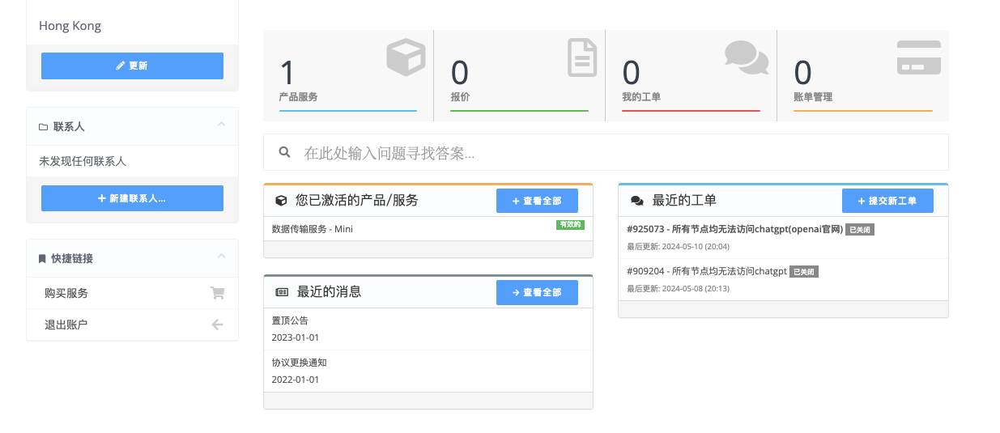
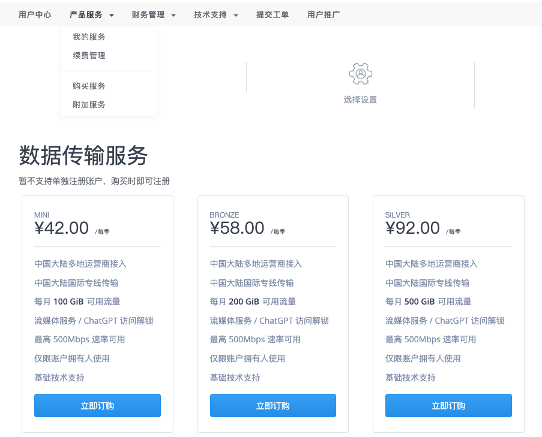
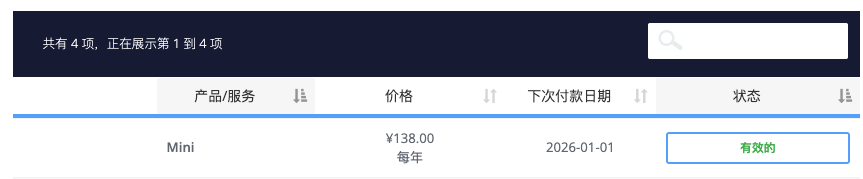
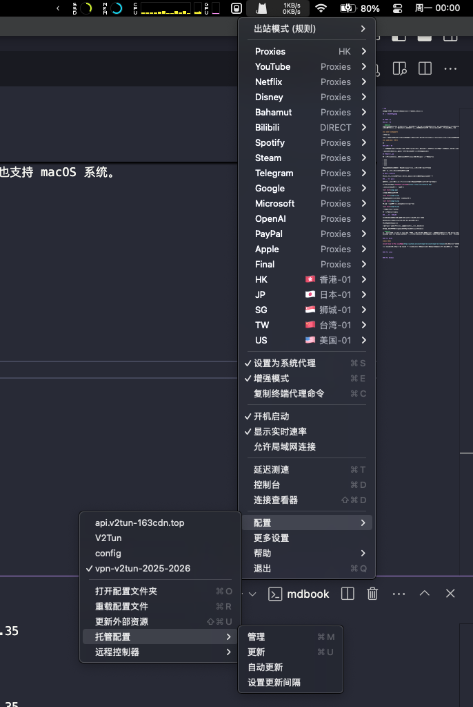
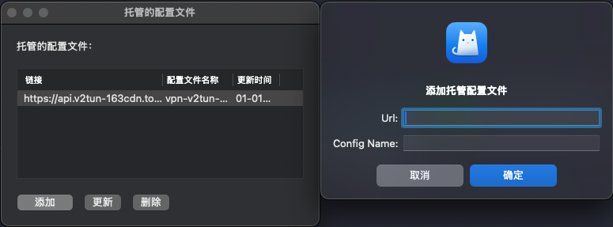
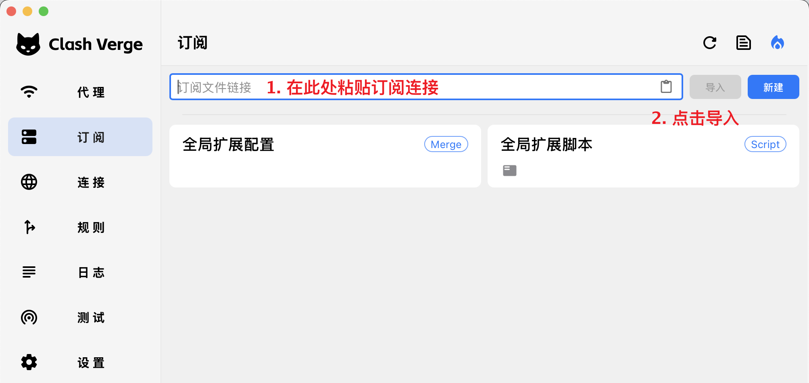
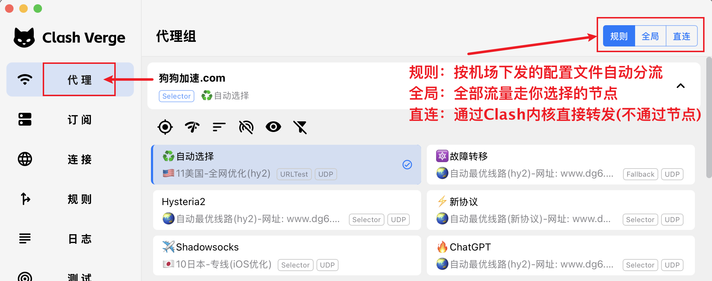
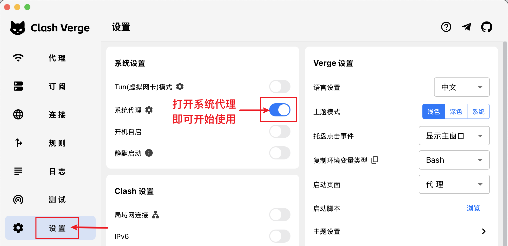
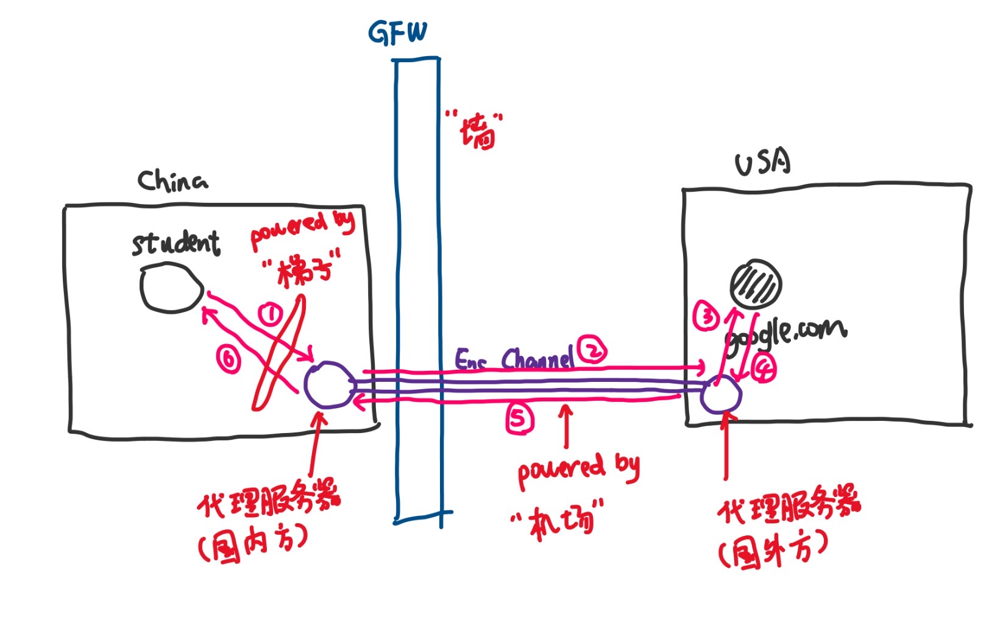

# VPN

这篇笔记会告诉你一些与VPN有关的概念，并且手把手教你如何“科学上网”

读完此篇，你应该会对“科学上网”有一个非常直观的理解与初印象，这些思考将有助于打破你和相关网络科普博客之间的技术壁垒，并有利于你在未来学习网络虚拟技术😄

## 为什么要写这篇文章

这篇笔记纯粹是从技术的角度做一个科普，目的绝非提供翻墙的工具！

相信大家作为一名计算机专业学生，在刚接触写代码时，肯定会遇见各种问题。

如果你不理解何为“翻墙”，很大程度上你的搜索引擎是百度，代码参考来源是博客园和CSDN等，你肯定会有相当多的“看了等于没看”的查阅经历😄

这时就体现“全局化知识谱系”的重要性了，要想实现这点，我们不得不采用“翻墙”的方式进行对知识的攫取与学习🎉

相信你或多或少会在身边同学的介绍或国内论坛上的推荐中得知“翻墙”这件事，此时你会上网搜索，然后你会多见以下几个概念：

- 机场
- 墙
- 梯子

我们将在这篇笔记中做一个初步的介绍。

## VPN的背景

### 墙是什么

```admonish
防火长城（英语：Great Firewall，常用简称：GFW），中文也称中国国家防火墙，通常简称为墙、防火墙等，中国国家互联网信息办公室称为数据跨境安全网关，是中华人民共和国政府监控和过滤国际互联网出口内容的软硬件系统集合，用于通过技术手段，阻断不符合中国政府要求的互联网内容传输，通用入境网点位于北京、上海、广州。
```

GFW三定律：

- GFW 第一定律：只要是 “用户产生内容”(User-generated content, UGC) 的国外网站都会被和谐
- GFW 第二定律：只要是被和谐的网站，国内一定会有个克隆版
- GFW 第三定律：没有被和谐的网站一定不是同类竞争者中最出色的

**1) 只有中国有墙吗?**

显然不是！

国家防火墙并非中国的专利。实际上，美国也有国家网络监控系统，对进出美国的每一封电子邮件进行内容扫描。不同的是，中国的国家防火墙会直接切断敏感连接，而美国的国家防火墙（考虑更名）则只是做数据监控记录。伊朗、巴基斯坦、古巴、朝鲜、南韩等使用与金盾类似的国家防火墙。

从维基百科提供的数据来看，除去少数的欠发达地区，绝大多数国家都有自己的网络审查机制！网络安全是国家安全的重要组成部分🎉

**2) 墙的好处是什么?**

1. 网络安全是国家安全的重要组成部分
2. 保护我国互联网企业的发展
3. 有利于维护我国的社会稳定与和谐
4. 降低了国民被外界不良消息洗脑的可能性

### 梯子是什么

出于各种需求，尤其是学术交流，很多时候“被墙”会导致我们无法获取前沿的知识与见解，这无形中拖慢了我们的研究进展。

为了解决这个问题，我们需要越过GFW访问国外的服务器，这时就需要梯子🪜

## VPN的工作原理

这一部分非常有趣，建议大家自己花点时间在网上搜索，这里提供一些参考的教程：

- [墙和梯子](https://yangzhang.site/Note/GFW/intro/)
- [科学上网学习笔记](https://gfw.gujiakai.top/gfw-de-xiang-guan-jie-shao)
- [防火长城是如何检测和封锁完全加密流量的](https://gfw.report/publications/usenixsecurity23/zh/)
    - [A Paper from USENIX Security Symposium 2023](https://gfw.report/publications/usenixsecurity23/data/paper/paper.pdf)
- [GFW原理考](https://shinya.click/fiddling/tech-about-gfw)
- [GFW详细学习](https://mba811.gitbooks.io/web-study/content/fq/fq1.html)

考虑到大家目前会更关心如何“一键获取”翻墙教程，我们会在未来加入对VPN工作原理的讲解，此处按下不表

紧接着我们直奔主题：我的电脑如何翻墙？

## 如何使用VPN翻墙

这里我们以使用clash科学上网为例，我们将展示在不同系统的电脑上翻墙的全过程

### 第一步: 买机场

你可以自行上网搜索哪些机场便宜又好用，但是考虑到此时你还在墙内，大概率看不到😅

我在这里比较推荐 [某不知名随机bit组成](https://v2tun.ch/clientarea.php) (应该可以直接在墙内访问)

进入后选择“产品服务 > 购买服务”



选择你喜欢的套餐并缴费



之后你来到首页，选择“您已激活的产品/服务”



点击你所购买的服务，进入后向下翻找，找到“订阅”


复制你的“Clash订阅口令”

这一部分就完结撒花了🎉

### 第二步: 配置梯子

有个很有意思的问题，如果你现在还在墙内，是没法点击下载链接的

既然没法下载，就不能翻墙，这似乎形成逻辑上的闭环了🤔

这里推荐的解决方法是：

找你身边翻过墙的同学，让他们给你搭个网桥，使用他们的网下载 ✈️

或者你也可以碰碰运气，指不定啥时候github可以登上，然后下载 ✅

或者你可以带杯奶茶来找助教 😄

```admonish
由于 Clash 核心删库导致多个 Clash GUI 客户端也随之停更，很多市面上曾经流行的地址已经失效，显示 404 了，目前更建议使用 Clash Meta 开源内核的客户端。
已安装的 Clash for Windows 仍然可以继续使用，只是会缺少后续版本更新。建议安装 Clash Verge，使用 Meta 开源内核。Clash Verge 同时也支持 macOS 系统。

出于多样性考虑，我们为MacOS介绍ClashX for Mac，但在介绍windows和linux时，介绍Clash Verge🐱
```

#### For MacOS

**下载链接**

[ClashX for Mac 官方地址](https://clashx.org/clashx-download/)（✅︎正常，截至20250126）

**操作步骤**

启动 ClashX，点击状态栏中的 ClashX 图标，依次选择「配置」、「托管配置」、「管理」，在弹出的界面点击添加订阅:



点击添加，加入第一步中的clash订阅口令于`URL`栏，并写一个你喜欢的名字于`Config Name`:



若干秒后将在软件里看到刚刚添加的配置文件，We did it!

现在你需要做的是：

点击 ClashX 状态栏图标，将「出站模式」选为「规则判断」，在「Proxy」或「Gloabal」策略组中可以选择自己喜欢的线路，然后点击「设置为系统代理」即可开始使用:


当然，我的个人习惯是开启:

「规则判断」「设置为系统代理」「增强模式」「开机启动」「显示实时速率」

恭喜你！现在你已经成功“翻墙”了！🧨✈️🪜

鉴于你已经可以“科学上网”了，你需要做的是熟悉一下梯子的使用方式：

这里附上[参考链接](https://www.v2rayfree.eu.org/post/clash-for-mac-tutorial/)，不做赘述

#### For Linux

**下载链接**

[Clash Verge](https://github.com/clash-verge-rev/clash-verge-rev)（✅︎正常，截至20250126），版本选择在[这里](https://github.com/clash-verge-rev/clash-verge-rev/releases)看

**操作步骤**

这一部分跟Windows的完全一致，我们直接在windows的部分进行介绍

#### For Windows

**下载链接**

[Clash Verge](https://github.com/clash-verge-rev/clash-verge-rev)（✅︎正常，截至20250126），版本选择在[这里](https://github.com/clash-verge-rev/clash-verge-rev/releases)看

**导入订阅**



**选择节点与模式**



**开启代理**



恭喜你！现在你已经成功“翻墙”了！🧨✈️🪜

现在你需要做的是熟悉一下梯子的使用方式:

[Clash Verge Docs](https://www.clashverge.dev/guide/quickstart.html)

## 复盘与思考

现在又回到本文开始时提出的问题：什么是墙、机场、梯子？

走完这份教程，我们在这里简单理解一下（其实不完全正确，但是便于理解）：



------

© 2025. ICS Team. All rights reserved.