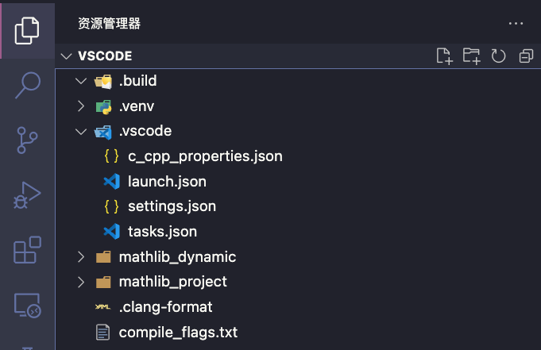
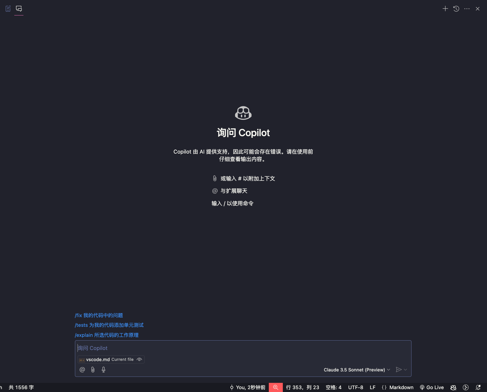
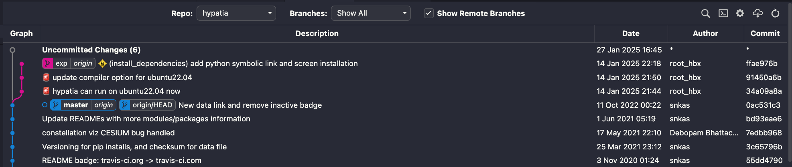
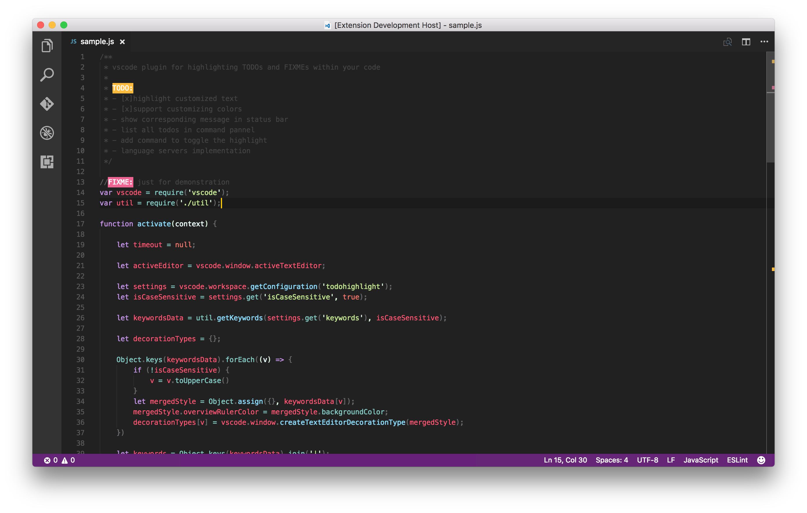
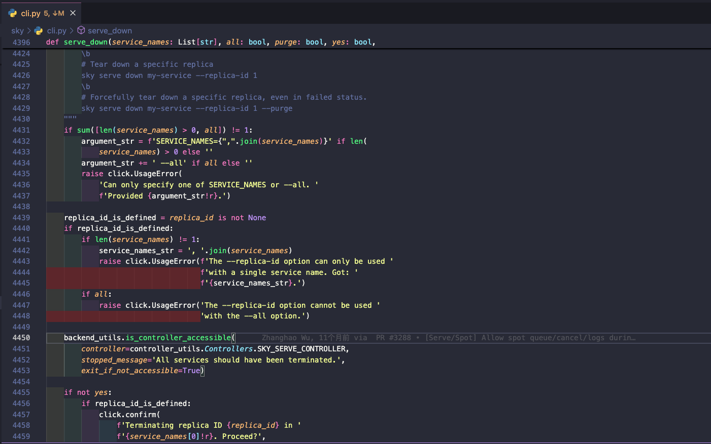
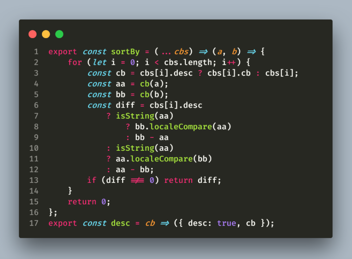

# How to Use VSCode

这篇笔记会手把手教你如何在不同系统的电脑上安装VScode；如何写配置文件，让你的C++代码跑起来；跑起来以后如何Debug...

此外，我们还会从一个“老鸟”程序员的视角，给大家推荐一些辅助后期开发的插件🎉

## 为什么要用 VSCode

都2025年了，不会真有人还在用 [Dev C++](https://www.bloodshed.net/) 等小学生工具写C++代码吧😅

选择VSCode的理由包括但不限于：

1. 开源：版本迭代快，功能齐全
2. 几乎可以用来编写任何语言、甚至能写文档、渲染PDF：只要是关于文本编辑/代码编辑，VS Code都有相应的插件去支持
3. 插件市场庞大，客制化程度高：VS Code通过内置的设置和插件市场基本都可以满足你的需求

这就是为什么VSCode被誉为“新编辑器之神” 🔥🔥🔥

```admonish
一般意义上，我们认为：“编辑器之神”是Vim；“神之编辑器”是Emacs，详见 [《编辑器之战》](https://upclinux.github.io/intro/07/vim-and-emacs/)

但是在2025年的视角来看，笔者更倾向于认为:

“编辑器之神”是VSCode；“神之编辑器”是Vim
```

## 如何安装 VSCode

### For MacOS

为什么总是把MacOS优先介绍，主要原因有两点：

第一：

笔者是Mac战神，基本没用过Windows（刚上大一用过，太难用了，直接换电脑！）

第二：

我相信在座的绝大多数人都使用windows系统！我猜测是高考结束后被各种论坛（知乎/B站/...）上的“Mac不适合工科学生”等言论吓到了。没办法，只能入手windows😅

在这种背景下，Mac用户作为“长期被忽略”的“少数群体”，很难得到相关的指导与教程😭

另外，以往的任课老师大多会以Windows系统为例说明如何写代码，这对使用苹果电脑也就是Mac的同学很不友好。而且有些老师在编程环境的配置、编辑器的选取上也会有一些忽略，这部分的内容往往让同学们自学；而网上的博客或教程良莠不齐，很多时候会出现版本错误/系统不匹配/配置过时等现象

因此，这份教程提供对于 MacOS (Apple Silicon) 的手把手教学！如果你有什么困惑与建议，欢迎课下跟TA交流🥤

#### 基础编程环境配置

提前说明，下列步骤需要严格遵循给出的顺序，并且要确保全程可以使用“墙外的网”⚠️

**(1) 安装 XCode**

xcode 是苹果提供的一个开发工具集，类似于微软的 visual studio

1. 从 App store 或苹果开发者网站安装 Xcode。
2. 待XCode安装完毕，安装 `Xcode command line tools`，只需要在CLI中运行：
    ```sh
    xcode-select --install
    ```
运行命令后，按照指引，你将完成 `Xcode command line tools` 安装🌹

**(2) 安装 Homebrew**

包管理工具让软件的安装（升级）和卸载都变得简便了许多。Homebrew 就是 Mac 下面的这样一个包管理工具（类似于 `apt-get`, `yum`）。

在你电脑的Terminal中，按照[官网给出的安装方式](https://brew.sh/)做：

```sh
# 一键安装
/bin/bash -c "$(curl -fsSL https://raw.githubusercontent.com/Homebrew/install/HEAD/install.sh)"
```

**(3) 安装编译器g++**

省流：当你安装好XCode时，它就已经自带g++了🎉

你可以在CLI中看看长啥样：

```sh
❯ g++ --version
Apple clang version 15.0.0 (clang-1500.1.0.2.5)
Target: arm64-apple-darwin24.0.0
Thread model: posix
InstalledDir: /Library/Developer/CommandLineTools/usr/bin
```

这里有个很有意思的现象:

```admonish
明明我装的是g++，为什么上面显示`clang version 15.0.0`?

这是因为在 macOS 上，g++ 实际上是 clang++ 的一个符号链接。macOS 系统自带的编译器工具链并不是 GNU GCC，而是基于 LLVM 的 Clang 工具链。

所以，当你运行 g++ 时，它会调用 Clang 编译器，而 Clang 的版本显示出来了。即使你安装了 GNU 的 GCC 编译器，g++ 可能依然会指向 Clang。
```

**(4) 安装编辑器VSCode**

VSCode，全名是Visual Studio Code.app，一般缩写成`VSC`

在微软[VSCode官网](https://code.visualstudio.com/)直接下载macOS平台的最新版本即可

下载安装后，双击打开应用即可，所有的安装流程到此结束，下面开始书写配置文件

#### 书写配置文件

VSCode对c++的配置是以文件夹（及其内部的文件系统）为覆盖单位，这点跟python不同。python有全局，也有基于文件夹的虚拟环境(pyenv)，也有池化的(conda)。

C++ for VSC 是基于文件夹的，可以给不同的项目文件夹建立不同的配置。

这里笔者介绍的主要应用场景是 单文件cpp 的编译（比如你要写洛谷的算法题），并不一定适用于 CMake 等工具。

我会在每一个部分附上参考脚本，它们都是开箱即用的，你可以直接复制粘贴到你的项目中🎉

**（1）建立项目文件夹**

我们需要先选中/新建一个合适的项目文件夹，然后使用VSCode打开它，在这里我们将书写“专用于这个文件夹”的配置文件。

形如这份项目构建示意图 (你可以自动忽略`.venv` / `mathlib_dynamic` / `mathlib_project` / `.DS_Store` 及其子文件系统)：



```
❯ tree -L 2 -a
.
├── .DS_Store
├── .build
├── .clang-format
├── .venv
│   ├── bin
│   ├── include
│   ├── lib
│   ├── pyvenv.cfg
│   └── share
├── .vscode
│   ├── c_cpp_properties.json
│   ├── launch.json
│   ├── settings.json
│   └── tasks.json
├── compile_flags.txt
├── mathlib_dynamic
│   ├── lib
│   ├── main
│   ├── main.cpp
│   ├── mathlib.cpp
│   └── mathlib.h
└── mathlib_project
    ├── lib
    ├── main
    ├── main.cpp
    ├── mathlib.cpp
    └── mathlib.h

12 directories, 16 files
```

所有对c++的配置都在`.vscode`文件夹下，其余我们先暂时不用管

**（2）配置文件**

1. 确保 `clang++` 已经正确安装（通过 `clang++ -v` 可以验证）
    - 对于 macOS，运行 `xcode-select --install` 可以安装好本文用到的所有包
2. 确保 vscode 已启用 [CodeLLDB](https://marketplace.visualstudio.com/items?itemName=vadimcn.vscode-lldb) 插件（报错无法下载可以先按报错给的 url 用浏览器下载，然后手动安装）
3. `tasks.json`，放入 `.vscode` 文件夹中
4. `launch.json`，放入 `.vscode` 文件夹中
5. 在文件夹里新建一个 `.build` 文件夹（ macOS / Linux 必做）
    - 把所有的可执行文件放到 `./build/` 文件夹下，这样可以避免污染项目根目录，也可以方便地清理编译产生的中间文件。
6. 按 F5 (FN + F5)，就可以编译调试了

参考的`task.json`:

```json
{
    "version": "2.0.0",
    "tasks": [
        {
            "type": "shell",
            "label": "C/C++: clang++ build active file",
            "command": "/usr/bin/clang++", // `which clang++` may help you find this path
            "args": [
            "--std=c++17",
            "-fcolor-diagnostics",
            "-fansi-escape-codes",
            "-g",
            "${file}",
            "-o",
            "${workspaceFolder}/.build/${fileBasenameNoExtension}"
            "-fstandalone-debug", // to enable viewing std::string etc. when using lldb on Windows or Linux 
            ],
            "options": {
            "cwd": "${fileDirname}"
            },
            "group": {
            "kind": "build",
            "isDefault": true
            },
            "detail": "Task generated by Debugger."
        }
    ]
}
```

参考的`launch.json`:

```json
{
    "version": "0.2.0",
    "configurations": [
        {
        "name": "C/C++: clang++ build and debug active file customize",
        "type": "lldb",
        "request": "launch",
        "program": "${workspaceFolder}/.build/${fileBasenameNoExtension}",
        "args": [],
        "cwd": "${workspaceFolder}",
        "preLaunchTask": "C/C++: clang++ build active file"
        },
        {
        "name": "C/C++ Runner: Debug Session",
        "type": "lldb",
        "request": "launch",
        "args": [],
        "cwd": "/Users/huluobo/code_projects/vscode",
        "program": "/Users/huluobo/code_projects/vscode/build/Debug/outDebug"
        }
    ]
}
```

参考的`c_cpp_properties.json`:

```json
{
  "configurations": [
    {
      "name": "macos-clang-arm64",
      "includePath": [
        "${workspaceFolder}/**"
      ],
      "compilerPath": "/usr/bin/clang",
      "cStandard": "${default}",
      "cppStandard": "${default}",
      "intelliSenseMode": "macos-clang-arm64",
      "compilerArgs": [
        ""
      ]
    }
  ],
  "version": 4
}
```

参考的`settings.json`:

```json
{
  "files.associations": {
    "iostream": "cpp",
    "cstring": "cpp",
    "algorithm": "cpp",
    "queue": "cpp",
    "iomanip": "cpp",
    "__config": "cpp"
  },
  "C_Cpp_Runner.cCompilerPath": "clang",
  "C_Cpp_Runner.cppCompilerPath": "clang++",
  "C_Cpp_Runner.debuggerPath": "lldb",
  "C_Cpp_Runner.cStandard": "",
  "C_Cpp_Runner.cppStandard": "",
  "C_Cpp_Runner.msvcBatchPath": "",
  "C_Cpp_Runner.useMsvc": false,
  "C_Cpp_Runner.warnings": [
    "-Wall",
    "-Wextra",
    "-Wpedantic",
    "-Wshadow",
    "-Wformat=2",
    "-Wcast-align",
    "-Wconversion",
    "-Wsign-conversion",
    "-Wnull-dereference"
  ],
  "C_Cpp_Runner.msvcWarnings": [
    "/W4",
    "/permissive-",
    "/w14242",
    "/w14287",
    "/w14296",
    "/w14311",
    "/w14826",
    "/w44062",
    "/w44242",
    "/w14905",
    "/w14906",
    "/w14263",
    "/w44265",
    "/w14928"
  ],
  "C_Cpp_Runner.enableWarnings": true,
  "C_Cpp_Runner.warningsAsError": false,
  "C_Cpp_Runner.compilerArgs": [],
  "C_Cpp_Runner.linkerArgs": [],
  "C_Cpp_Runner.includePaths": [],
  "C_Cpp_Runner.includeSearch": [
    "*",
    "**/*"
  ],
  "C_Cpp_Runner.excludeSearch": [
    "**/build",
    "**/build/**",
    "**/.*",
    "**/.*/**",
    "**/.vscode",
    "**/.vscode/**"
  ],
  "C_Cpp_Runner.useAddressSanitizer": false,
  "C_Cpp_Runner.useUndefinedSanitizer": false,
  "C_Cpp_Runner.useLeakSanitizer": false,
  "C_Cpp_Runner.showCompilationTime": false,
  "C_Cpp_Runner.useLinkTimeOptimization": false,
  "C_Cpp_Runner.msvcSecureNoWarnings": false
}
```

现在你的C++代码应该可以跑起来了, Congratulates!

如果你好奇这些json是干什么用的，它们对VSC做了什么，欢迎移步至[这篇Blog](https://blog.bxhu2004.com/BLOG/vscode-cpp/config/#vscode-for-macos)。这篇笔记的配置部分到此结束！

### For Windows

前往[VSCode官网](https://code.visualstudio.com/download)下载安装包, 下载结束后双击打开安装包, 按照提示一步步安装即可.

在纯 Windows 环境下搭建开发环境, 尤其是 C/C++ 开发环境是一种精神酷刑. 所以我推荐你用 WSL2, 在 Windows 继承的 Linux 环境中进行开发. 具体教程请参考[这里](https://orion-zhen.github.io/article/how-to-code-on-windows/). 后续的配置同 Linux 部分.

### For Linux

首先祝贺你愿意使用 Linux 作为你的主力环境. 恭喜你向极客迈进了一步! 🚀

如果你正在使用 Arch Linux, 那太棒了, 我太喜欢你了! 可以加个 QQ 吗? ❤️

#### Arch Users

对 Arch Linux 用户, 想要安装 VSCode, 有以下三种方式:

1. 从 [arch4edu](https://help.mirrors.cernet.edu.cn/arch4edu) 源安装 (最推荐)
2. 从 AUR 安装 (需要你能科学上网)
3. 从 VSCode 官网安装包安装 (不推荐)

**从 archl4edu 源安装**

首先添加 archlinuxcn 源, 如果你没添加过的话:

- 编辑 `/etc/pacman.conf` 文件. 你用 vim, neovim, nano 什么都好, 只要你会用就行. 然后在文件末尾添加以下内容:

```text
[archlinuxcn]
SigLevel = Optional TrustAll
Server = Server = https://mirrors.cernet.edu.cn/arch4edu/$arch
```

- 刷新 pacman 缓存: `sudo pacman -Syyu`
- 安装 VSCode: `sudo pacman -S visual-studio-code-bin`

**从 AUR 安装**

- 首先确保你有 `yay` 包管理器, 如果没有, 请安装先添加 [archlinux-cn](https://www.archlinuxcn.org/) 源, 然后运行 `sudo pacman -S yay` 安装.
- 然后运行 `yay -S visual-studio-code-bin` 安装 VSCode.

#### Debian/Ubuntu Users

对于 Debian/Ubuntu 用户, 你可以直接从[VSCode官网](https://code.visualstudio.com/download)下载 `.deb` 安装包, 然后使用 `apt` 安装:

```sh
sudo apt install <your-downloaded-vscode>.deb
```

但有一说一, Ubuntu 全是私货, 系统臃肿容易崩溃, 非常不推荐使用.

#### 为什么你应该使用 Arch Linux

**1. 极简主义与高度定制化**

- **纯净起点**：Arch 不预装冗余软件, 安装后仅包含基础系统(base-devel), 用户可完全按需构建系统环境. 这种"空白画布"特性吸引了追求系统精简和掌控力的用户.
- **DIY 哲学**：从内核模块到桌面环境(如 KDE/GNOME 或轻量级 WM), 所有组件均由用户主动选择, 避免了其他发行版因预装软件导致的资源占用或风格冲突.

**2. 滚动更新与软件时效性**

- **前沿软件生态**：作为滚动更新(Rolling Release)发行版, Arch 用户可直接获取最新稳定版软件(如 Linux 内核、开发工具链), 无需等待大版本升级。对开发者、硬件兼容性(如新显卡支持)或追求新功能的用户至关重要.
- **更新可控性**：通过定期维护(如查看 [Arch News](https://archlinux.org/news/))和谨慎处理关键包(如 `pacman -Syu` 前检查更新日志), 可有效避免更新冲突.

**3. Arch User Repository (AUR)**

- **海量软件覆盖**：AUR 社区仓库提供超过 8 万个第三方软件包(如小众工具、闭源程序), 通过 `yay`/`paru` 等工具可一键编译安装，极大扩展了软件可用性.
- **用户贡献驱动**：AUR 的开放性允许用户快速发布新软件包或补丁, 解决了其他发行版仓库更新滞后的问题(例如第一时间体验 beta 版应用).

**4. 卓越的文档与社区**

- **Arch Wiki**: 被公认为 Linux 领域最全面、细致的文档库, 涵盖系统配置、故障排查、软件优化等, 即使非 Arch 用户也常参考.
- **问题解决效率**: 社区倾向于提供"授人以渔"的解决方案(如解释配置原理而非直接给命令), 有助于用户深入理解系统运作.

**5. 现代工具链与安装简化**
- **安装体验进化**: 官方提供的 `archinstall` 脚本简化了安装流程, 30 分钟内即可完成基础系统部署, 降低了传统 CLI 安装的学习曲线.
- **Pacman 包管理**: `pacman` 命令简洁高效(如 `pacman -Syu` 更新全系统, `pacman -Qs` 搜索包), 配合 AUR 助手工具形成强大的软件管理生态.

#### 配置 C/C++ 开发环境

就我个人而言, 我几乎不使用 VSCode 原生的配置文件. 因为我也经常使用 NeoVim, 所以需要跨编辑器通用才行. 我选用的方案是 CMake. 这里就不展开讲解 CMake 的语法和教程了, 可以通过[这个仓库](https://github.com/ttroy50/cmake-examples)来学习 CMake 的用法.

想要让 CMake 与 VSCode 集成, 可以安装以下插件, 这也是我自己在使用的:

- [CMake Tools](https://marketplace.visualstudio.com/items?itemName=ms-vscode.cmake-tools)
- [CMake Language Support](https://marketplace.visualstudio.com/items?itemName=josetr.cmake-language-support-vscode)
- [CMake Integration](https://marketplace.visualstudio.com/items?itemName=go2sh.cmake-integration-vscode)

如果你在寻找跨平台通用的格式化方案, 我推荐 `clang-format`. VSCode 插件 [Clang-Format](https://marketplace.visualstudio.com/items?itemName=xaver.clang-format) 提供了集成方案.

## 如何使用VSCode进行调试

这一部分强烈建议跟着[官方文档](https://code.visualstudio.com/docs/editor/debugging#_debug-actions)走一通

如果你觉得不够直观，可以看看这个: [一份CMU强烈推荐的Debugging Tutorial](https://www.youtube.com/watch?v=G9gnSGKYIg4)

这些调试的技巧将会非常有利于你构建大规模代码库

## VSCode中的插件推荐

这一部分笔者会给一些自用的VSC插件推荐，亲测好用，不仅能提升日常代码开发效率，也可以美化界面，提升写代码的幸福感

当然这只是很小的一部分，如果你有什么比较好的建议，欢迎在仓库的issue中提出，或者提个PR👏


0）[Chinese (Simplified)](https://marketplace.visualstudio.com/items?itemName=MS-CEINTL.vscode-language-pack-zh-hans)

适用于 VS Code 的中文（简体）语言包👄

1）[Dracula Theme Official](https://marketplace.visualstudio.com/items?itemName=dracula-theme.theme-dracula)

一个非常适合程序员的主题，通过美观度提升写代码的幸福感😘

2）[C/C++](https://marketplace.visualstudio.com/items?itemName=ms-vscode.cpptools)

写大型项目必备的道具，支持“一键跳转”等功能，神中神💰

3）[Github Copilot](https://marketplace.visualstudio.com/items?itemName=GitHub.copilot)

这个不用说了吧🚀



4）[Git Graph](https://marketplace.visualstudio.com/items?itemName=mhutchie.git-graph)

能够清晰地显示不同分支，并且进行快捷操作，神中神😍



5）[GitLens](https://marketplace.visualstudio.com/items?itemName=eamodio.gitlens)

清晰地显示每行代码的提交者，方便“找锅”😄


6）[Gitmoji](https://marketplace.visualstudio.com/items?itemName=seatonjiang.gitmoji-vscode)

让你的每个commit信息变得有趣👍

```sh
# my personal format
🎉 (branch_name) commit message
```

7）[Live Server](https://marketplace.visualstudio.com/items?itemName=ritwickdey.LiveServer)

在VSC中快捷使用默认浏览器渲染HTML网页🛜


8）[vscode-pdf](https://marketplace.visualstudio.com/items?itemName=tomoki1207.pdf) 和 [PDF Preview](https://marketplace.visualstudio.com/items?itemName=analytic-signal.preview-pdf)

PDF预览👌

9）[Remote - SSH](https://marketplace.visualstudio.com/items?itemName=ms-vscode-remote.remote-ssh)

SSH远程连接🎉

10）[TODO Highlight](https://marketplace.visualstudio.com/items?itemName=wayou.vscode-todo-highlight)

高亮显示TODO等信息，醒目🌟



11）[indent-rainbow](https://marketplace.visualstudio.com/items?itemName=oderwat.indent-rainbow)

高亮缩进，便于观察，尤其是大型项目开发👀



12）[CodeSnap](https://marketplace.visualstudio.com/items?itemName=adpyke.codesnap)

适合给代码截屏并展示，很美观👍



------

© 2025. ICS Team. All rights reserved.