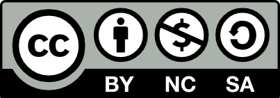

# Introduction to Computer System

> By [Boxuan Hu](https://bxhu2004.com/), based on lectures by [Danfeng Shan](https://dfshan.github.io/), [Hao Li](https://aquatoney.github.io/), and others.

These are the course notes for COMPSCI 400727: Introduction to Computer System at Xi'an Jiaotong University.

Here is the official course description:

This course is inspired by the [CMU-15-213 curriculum](https://www.cs.cmu.edu/~213/) and delves into the intricacies of computer hardware, guiding students through the step-by-step process of how C code is translated into X86_64 assembly and executed on the CPU. The course is structured with increasing levels of complexity:

It begins with __data representation__, introducing the fundamental concepts of __assembly language__, followed by an exploration of memory structure and the significance of __cache design__. The course then covers __CPU pipelining__ and strategies for program optimization to enhance performance. Additionally, we will examine how a C program transitions into machine-readable machine code, including the process of __linking__. Finally, the concept of __virtual memory__ will be introduced.

As an introductory course to systems, it offers both depth and breadth, serving as a prerequisite for future research in computer architecture and network systems.

## Disclaimer: Beta

These notes have not been proofread. They likely contain errors.

If you’re a ICS student at XJTU, in any case of dispute, the official course lectures are the correct source of truth.

## Corrections

As of the Spring 2025 semester, this textbook is still being actively maintained and updated.

If you see any parts that needs to be corrected, please open a Github issue [here](https://github.com/xjtu-ics/textbook/issues).

## Source and Changelog

The source for the textbook and a log of all changes is [available on Github](https://github.com/xjtu-ics/textbook).

## License

This work is licensed under a [Creative Commons Attribution-ShareAlike 4.0 International License](https://creativecommons.org/licenses/by-sa/4.0/).

## Acknowledgements

The design of this textbook is inspired by many outstanding courses. We would like to express our gratitude to the following courses that have provided us with valuable inspiration:

- [CS168 @UC Berkeley](https://textbook.cs168.io/)
- [CS161 @UC Berkeley](https://fa24.cs161.org/)
- [CSAPP @CMU](https://www.cs.cmu.edu/~213/)
- [Operating System @PKU](https://pku-os.github.io/)
- [ICS @NJU](https://nju-projectn.github.io/ics-pa-gitbook/ics2024/)
