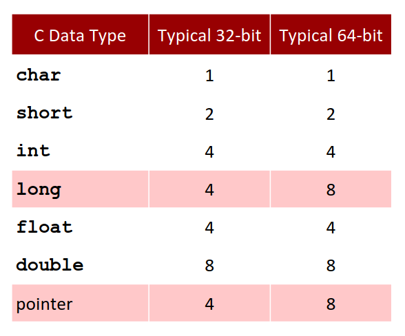
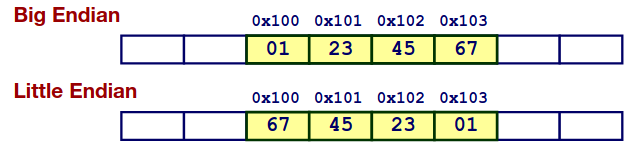

# Chapter 2.1 Information Storage

> Everything is bits.

## Introduciotn

欢迎来到计算机系统底层的世界，如果你只是一个初学者，这里一定~~(maybe)~~ 会颠覆你对计算机的认知，理解系统精巧的设计 ~~(以及被各种繁琐的 historical stuff 气晕)~~  😎.

### What is bits?

区别于高级语言所提供的纷繁复杂的数组类型，计算机系统中所有数据都是由一个个二进制位组成，一个二进制位就是所谓的 **bit** 。所有数据类型不过是对不同数量的位人为做出的不同的解释。

一般的整数可以简单的通过**位权(Weight)** 用二进制表示，而整数又可以通过对应**ASCII**码表示字符...

\\(114514_{10}\\) 二进制下表示为 \\(11011111101010010_{2}\\).

\\(1.1_{10}\\) 二进制下表示为 \\(1.00011[0011]..._{2}\\) (\\(1.919810\\) 二进制小数循环节太长了 😭).

### Hexadecimal

冗长的二进制位书写与阅读都极为不方便，相信你也不想在写代码时为了写一个\\(1024_{10}\\)而写10位。于是人们用**十六进制(Hexadecimal)** 来表示二进制位。

为什么用十六进制呢?用更为熟悉的十进制不是更好懂吗？~~早晚有一天你会觉得十六进制比十进制更好懂。~~

\\(16=2^4\\)，每一个十六进制位恰好对应着四个二进制位，在两者相互转化时按位直接一一对应更为方便。

十六进制、二进制与十进制三者间的相互转化相信你已经听过无数次了(高中数学、程序设计、数电、汇编...)，这里就不再赘述了。

### Byte

冗长的二进制位不仅仅不方便人类阅读，单独的位也不方便计算机在存储系统管理。

**Bytes**：大多数计算机采用8位的块，又称**字节(Byte)**，作为最小的可寻址内存单位。**1 Byte = 8 bits**.

高级语言中常见的数据类型也以字节作为基本单位。下面给出 C 语言中的常见数据类型对应字节数的表。



可以看见对大多数数据类型，32位与64位机器所用字节数一致，除开两个例外 long and **pointer**.

Why? 为了说明这个问题我们需要一点**虚拟内存(virtual memory)** 与**字长(word size)** 的概念。

### Virtual Memory and Word

在前文中我们提到```字节是一个最小可寻址内存单位```，但什么是内存呢？什么是寻址呢？

我们这里提到的内存是指**虚拟内存**，是操作系统与硬件隐藏了物理内存管理的细节为程序提供的
一个较低层次的**抽象**，为程序提供一个连续、统一的地址空间，使得程序员无需关心底层的物理内存如何分配。

关于什么是抽象，作为计算机科学的核心概念之一，课程内由于课时原因没有讲解实在可惜，为什么不尝试问问 GPT or Deepseek ```计算机科学中的抽象是指什么？``` 呢？

用人话来说就是我们暂时可以不用管计算机物理上是怎么复杂的存储，可以简单的认为操作系统(OS)为内存中的每个字节建立了像数组一样的的索引，直接用索引号就可以找到对应的内存单位，就像一个**字节数组**一样。这个索引的过程就是内存寻址，而每个索引号也就对应了内存中一个字节，一个**地址(Address)**。

这不就是C语言中的**指针(pointer)** 吗！没错，C语言中的指针就对应了字节数组的一个索引。那么指针为什么在不同机器中有不同的字节数呢？这就引出**机器字长**这一概念。

> **机器字长(word size)**：CPU处理数据的基本单位，即处理器一次性能处理、存储、传输的二进制位数。

我们所谓的32位、64位机器中的32、64指的就是机器的**机器字长**。而机器字长也是CPU支持的**最大寻址空间**，所以在32位机器中最大寻址空间的索引就只能是32位，那么指针变量长度为4字节，同理64位机器则是8字节，刚刚的疑问也就迎刃而解了。

### Byte Ordering

一个整型需要4个字节，那么字节在在内存中是按什么顺序排布的呢？常见的惯例是**大端法和小端法**

下图中展示一个例子简单了解一下大端与小端。```x=0x01234567``` 存储在起始地址为 ```&x=0x100``` 的位置上。



两者的选择几乎没有什么技术上的理由，更多是出于惯例和历史遗留。和直觉相反的是多数的新式处理器两者均可以，反倒是操作系统仅能适用一种。

## Bit-level Manipulations

### Boolean Algebra

我们假定你作为一个大二CS学生应当熟悉四种基本位运算(&、|、~、^) .

如果你对离散数学的简要介绍的代数系统还有记忆的话，那么接下来的内容想必你会非常亲切(~~厌恶~~)。

考虑四种基本位运算运算以及定长的位向量集合，可以建立布尔环，有逆元、分配律之类的性质。想学习进一步的知识，(~~透彻~~)理解布尔代数以及代数系统，*Abstract Algebra* is all you need.

### Bitwise Operations in C

注意区别位运算(&、~)和逻辑运算即可(&&、!)，这应该不需要我们课程科普。

一个swap小游戏:

```C
void swap(int *x,int *y)
{
    (*y) = (*x) ^ (*y);
    (*x) = (*x) ^ (*y);
    (*y) = (*x) ^ (*y);
    return;
}
```
如果运行一下，你可以惊奇的发现这段代码没有定义中间变量就实现了变量交换诶 🧐， 实际上用加减也能达到同样的效果，这里不再列出，感兴趣的同学可以尝试一下。

### Shift Operations

1. **左移(Left Shift)**：舍弃掉左溢出的位，在空出的右侧填0。
2. **右移(Right Shift)**：舍弃掉右溢出的位，那么在空出的左侧填什么呢？和左移一样填0吗？NO！
    - **逻辑右移(Logical shift)**：在左侧填0，简单的规则。
    - **算数右移(Arithmetic shift)**：在左侧填**原本的最高位**。

How strange! 为什么要有特殊的算数右移呢？

正如其名，为**算数**而生，这个疑问将在有符号整数运算那一节将得到解答。

事实上 C 语言大部分实现中所有有符号整数右移均采用算数右移而无符号整数采用算数右移~~(然而 C 的标准中却没有规定这一点)~~。在 Java 中，你甚至能显式的指定右移的类型！

------

关于 Information Storage 这个话题就谈论这么多吧，我想我们已经对位有了基本的了解与熟悉。后面两节我们将讨论一个个二进制位会怎么构成我们熟悉的整数，并在运算上表现出奇妙~~(?)~~ 的性质。

------
© 2025. ICS Team. All rights reserved.