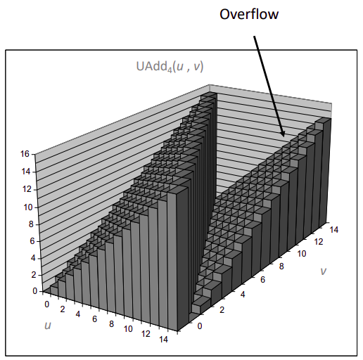
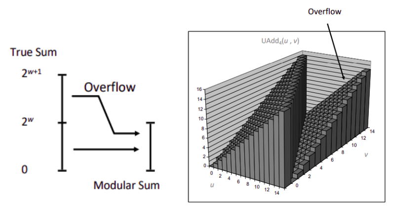
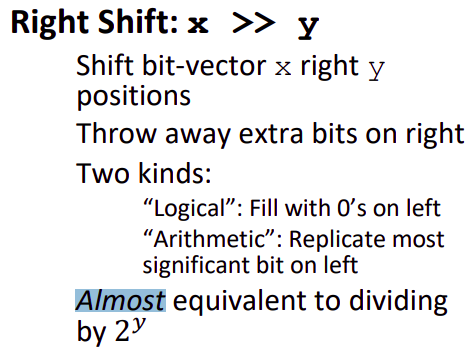

# Chapter 2.3 Integer Arithmetic

上一节我们讨论了整型的表示，这一节我们将延用上一节的风格，运用位权式去解释整型在运算中表现出的性质。

虽然仍然有语言支持无精度限制的运算，但更多的时候，运算时是限制了位数的。

## Addition

### Unsigned Addition

我们记无符号加法为 \\(+_{\omega}^{u}\\)，即 \\(\omega\\) 位限制下无符号数加法。

虽然加数仅有 \\(\omega\\) 位，但结果却可能有 \\(\omega+1\\) 位，额外溢出的位只能被舍弃，联想上一节截断的表示，形式化的定义加法为:

\\[s=x_{1} +^{u}_\omega y=(x+y) \space mod \space 2^{\omega} \\]

不难发现，一旦发生了溢出，必然 \\(2^{\omega}>x\\) 且 \\(2^{\omega}>y\\) 所以 \\(s < x \\) 且 \\(s < y\\)，可以用这个方法检验溢出。

> 模数加法实际上形成了一个阿贝尔群。



### Tow's Complement Addition

补码表示整数 \\(2^{\omega-1} \leq x < 2^{\omega-1}\\)。补码的加法和无符号**加法在位表现上完全一致**，一个自然的想法就是转化为无符号数的加法之后再对位权进行重新解释，但在数值上还不够直观，这里我们给出一组数值的形式:

\\[
x+_{\omega}^{u}y=
\begin{cases}
x+y-2^{\omega}, \space x+y \geq 2^{\omega-1} 
\newline x+y, \space\space\space\space -2^{\omega-1}\leq x+y\le 2^{\omega-1} 
\newline  x+y+2^{\omega}, \space x+y \le -2^{\omega-1} 
\end{cases}
\\]

证明也相对容易，从位权的角度：

1. 当发生正溢出时，进位实际上位权从 \\(2·2^{\omega-2}\\) 变化为 \\(-2^{\omega-1}\\)，产生 \\(-2^{\omega}\\) 的差值。
2. 当发生负溢出时，从位权的角度也是和正溢出类似的变化，此处不再赘述。



关于补码的加法运算还有一个点值得一说，显然我们只需要关注加法而不需要关注减法，当遇到减法时我们转化为加上减数的**减法逆元**就可以了。这个减法逆元我们记做 \\(-^{t}_{\omega}x\\),区别于一般的整数中的减法逆元就是 \\(-x\\)，在计算机中**大多数情况下**就是 \\(-x\\)，但计算机取负数时实质上执行的是取补码的过程，考虑补码表示范围的不对称性，实际上有:

\\[-\_{\omega}^{t}x=
\begin{cases}
TMin\_{\omega}, \space x=TMin\_\omega \newline
-x, \space \space \space x\ge TMin\_{\omega}
\end{cases}
\\]

你对 \\(TMin_{\omega}=1[00..00]\_{\omega-1}\\) 按位取反加一就是本身！即 \\(TMin_{\omega}\\) 的逆元是其本身。

## Multiplication

对于无符号数，也和加法截断想法一致，这里不再赘述，只给出表达式 \\(x*\_{\omega}^{u}y=x*y\mod 2^{\omega}\\)。

而对于补码乘法也是完全一致，由于在位表现上一致，同样第一想法是转化为补码乘在转化回去，我们还是来看看数值上的表现。现要对有符号数 \\(x\\) 和 \\(y\\) 转化为无符号数 \\(x_u=x+x_{\omega-1}·2^{\omega}, y_u=y+y_{\omega-1}·2^{\omega}\\)，那么有:

\\[x\_u·y\_u=\(x+x\_{\omega-1}·2^{\omega}\)·\(y+y\_{\omega-1}·2^{\omega}\)\\]

\\[=x·y+x·y_{\omega-1}·2^{\omega}+x_{\omega-1}·y·2^{\omega}+x_{\omega-1}·y_{\omega-1}·2^{2\omega}\equiv x·y(mod\space 2^{\omega})\\]

所以在数值上截断意义下，转化为无符号数取模等价于直接相乘取模。再重新解释为有符号数就可以了。

## Shifting

### Left Shift

在本章第一节我们提到左移的概念，左移相对比较简单，左移 \\(k\\) 位**完全等价**于乘以 \\(2^{k}\\)，注意这里的乘不是现实中的乘而是无符号数或者有符号数乘~~(应该不需要提醒吧)~~。

大部分同学应该会有一个朴素的认知就是**位移和加法快于普通乘法**，所以我们可以用加法和位移得组合去代替乘法，这里也蕴含了快速乘与倍增得思想，这里就不在展开了。

总有些兄弟写代码时爱用复杂的位运算代替一般的算数运算，展现自己程序中的超高性能，曾经我也是其中一员~~(然后去不懂位运算的哥们那里装X)~~，但当我们查看汇编代码，一看傻眼了，你做的优化，聪明的编译器早就帮你做了 😎 所以，最好别这样做，在现在的编译器优化下，这种方法不会加快你的程序，但却对代码可读性有实打实的破坏。

### Right Shift

在第一节中，我们提到过右移分为逻辑与算术，对无符号数的逻辑右移我们就不谈了，相信大家都了解。

我们直接来看算术右移，PPT上有一句话非常有意思，但课上没有展开讲。



"**Almost**"，可以回去看看左移时我们用的什么词:“**完全等价**”。为什么左移是完全等价而右移又是几乎等价呢。

显然当符号位为 \\(0\\) 时和逻辑右移表现是一致的，我们只需要关注符号位为 \\(1\\) 时的情况就好了，我们仅仅考虑右移 \\(1\\) 位时的表现，右移 \\(k\\) 位是类似的~~(但用Markdown写公式难度却完全不一样)~~。对于最高位为 \\(1\\) 的有符号数 \\(x\\) 其右移一位后 \\(x'\\) 位权表达式如下:

\\[x'=-2^{\omega-1}+2^{\omega-2}+\sum_{i=1}^{\omega-2}x_{i}·2^{i-1}=-2^{\omega-2}+\sum_{i=1}^{\omega-2}x_{i}·2^{i-1}\\]
对比 \\(x\\) 的位权式:
\\[x=-2^{\omega-1}+\sum_{i=0}^{\omega-2}x_{i}·2^{i}\\]

不难发现 \\(x'=\lfloor x/2 \rfloor\\)，那么 ```almost``` 在哪儿我请问了？诶这熟悉 C 语言的同学可能就发现不同了，C 语言中的除法应当是**向零取整**的，也就是说正数应当向下取整符合右移，但负数应当**向上取整**，但右移对于负数而言是向下取整。至于应当怎样才能让负数右移也向零取整呢？

这里提一个名词**舍入**，感兴趣的同学可以去了解一下，本文就不再赘述了，这里只是为了提醒一下大家这除法与右移这两种行为的不同，并解释一下PPT上的```almost```，对这个问题的讨论就在这里终止了~~(因为笔者已经写公式写吐了)~~。

------

那么这一节的主要内容就到此为止了，也是本章的结尾。这一章从第两节起，开始主要运用位权的方式，从数学上证明了很多同学们~~耳熟能详~~的性质，提供一个用数学更为严谨的方法研究计算机整数表示的视角。应该是涵盖课笔者认为有趣或值得一证的性质，希望能对你理解整型的表示有所帮助。

最后提供一个 C 语言小谜题供大家思考:

```C
int is_overflow_add(int x,int y)
{
    int sum = x + y;
    return sum - x == y;
}
// 这个小函数能完成检验是否溢出的目的吗？

int is_overflow_mul(int x,int y)
{
    int mul = x * y;
    return abs(mul / x - y) > 1e-5; 
}
// 这个小函数能完成检验是否溢出的目的吗？
```

------

© 2026. ICS Team. All rights reserved.