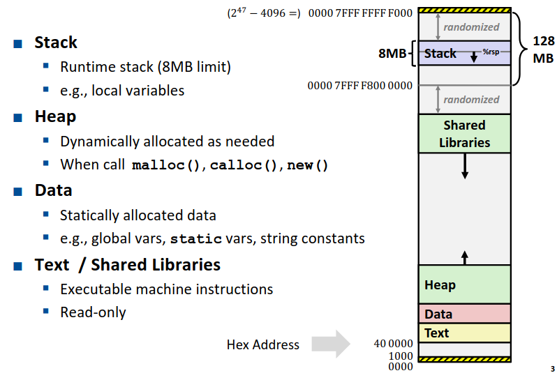
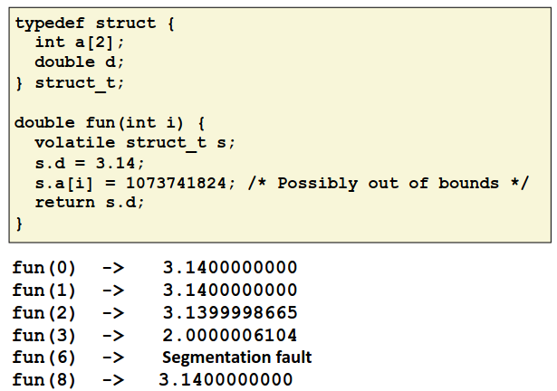
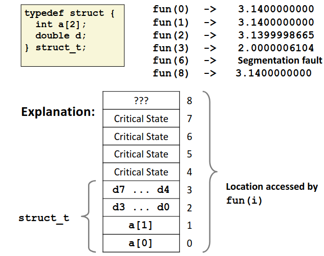
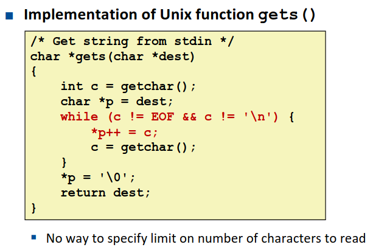
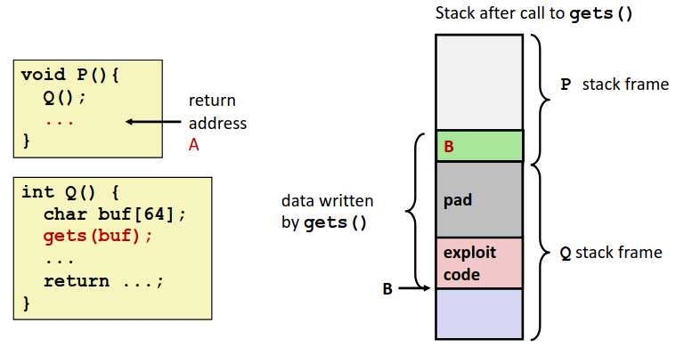
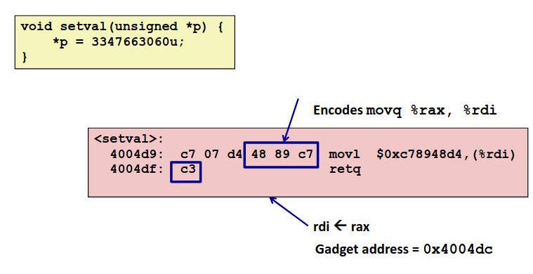
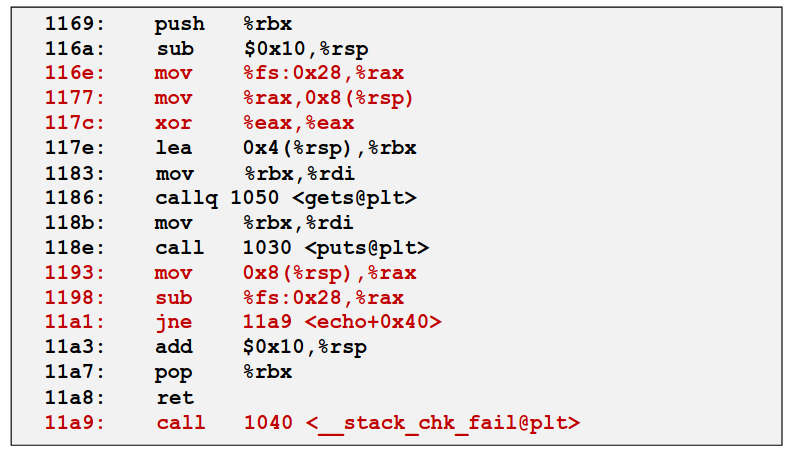

# Chapter 3.10 Advanced Topic

经过前面的学习，我们已经掌握了基础机器级代码的知识，在本章的最后一节我们将讨论一个有趣的话题：内存以及内存溢出。

相信大家都是对内存溢出深恶痛绝，C 语言作为一个不检查数组越界的语言，由于程序员的疏忽导致越界而造成的 bug 不计其数。

然而内存溢出不仅仅只会造成 bug，还会带来一些有趣的黑客技术，我们将简单介绍两种攻击技术以及保护手段。并且你会在 attack lab 中运用这个知识去攻击我们为你提供的简单程序。

如果你看了本节的内容并完成了 attack lab 后跃跃欲试，去学习了一些更为先进的技术，准备干一些不为人知的勾当，请在被捕并判处有期徒刑 ~~(这取决于你干了票多大的)~~ 后不要供出 ics 课程组😎
(你日后若惹出祸来.jpg)

## Memory Layout

要介绍内存溢出以前我们先要了解内存是什么样的。在之前的内容中我们已经提及过一些，这里再总结一下。下图展示了 Linux 系统中内存地址的分配。

<div align="center">

</div>

从图中不难看到，虽然我们常说64位机器地址总共有 64 位，然而我们内存空间实际上只用了 47 位，然而这个数字实际上已经足够大了。

图中也简要介绍了一下不同的内存区域是用于什么功能的。其中 Stack, Heap, Data, Text 这些区域之前我们已经多次接触过了比较熟悉了。至于 Shared Libraries 是做什么的，我们将在 Link 那一章节中介绍。

## Buffer Overflow

在简要的回顾了一下内存布局之后，我们开始今天的主题：**内存溢出**。

### Vulnerability

我们举一个简单的内存溢出的例子。下图是一个简单的代码以及一些输入时的结果。

<div align="center">

</div>

可以看到由于 C 语言不做越界检查，导致明明 ```a```数组仅有两个元素，却可以访问 ```a[2]```乃至```a[8]```，这时候编译器会顺延访问 ```a``` 后面的内存，并将那些内存字节解释为 ```int``` 并进行运算。可以看见当 ```i=2,3```时，根据结构体排列顺序， ```a``` 后面的 ```double``` 的值被篡改了。

但奇怪的是为什么 ```i=6```时会发生 segmentation fault 但 ```i=8```时却没什么~~（看似）~~ 影响了呢？这就需要研究一下栈中元素的排列了。下图是这个函数栈排布的示意图。

<div align="center">

</div>

显然在这个函数的栈帧中，```a[6]```会访问到一些不应当访问的部分，导致报错，而进一步访问```a[8]```时越过了这个重要的部分。根据之前的知识可能是访问到了栈帧中的**返回地址**，也有可能会是我们在之后会介绍的**金丝雀**。

我们再举一个例子，我们来拷打一下 C 语言的一些库函数的设计。

在初学 C 语言时，相信有老师告诉过我们，不要用 ```gets``` **不安全**，今天我们终于可以解释清楚为什么不安全了。下图是一个 ```gets``` 的典型实现。

<div align="center">

</div>

可以看到这个函数不会对输入进行任何的限制，只是一味读入直到遇见换行或者文件结尾(EOF)。那么我们大可输入一长串字符来**刻意制造一个内存溢出**，以达到一些不可告人的秘密。这就引出了今天介绍的第一个黑客技术：**Code Injection Attacks**.

### Code Injection Attacks

如果我们通过反汇编，碰巧发现~~（精心搜寻）~~ 了一个像```gets```一样的漏洞。

我们可以干什么？我们可以输入一个‘碰巧’的非常长的字符串，制造一个内存溢出，如果‘碰巧’这个字符串溢出更改后的栈帧中，函数返回时‘碰巧’返回到了你插入字符串的部分的地址，然后顺着执行了一串代码，‘碰巧’这段看似毫无意义的字符串解释为机器代码的话是帮你‘碰巧’得到了服务器的 root 权限，你‘碰巧’得到了你所有想要的，实在运气太好了！

当然不是碰巧，一切都是预先设计好的，我们通过预先分析栈帧，就可以清晰的得知返回地址存在栈中的位置，通过溢出篡改那个地址的值，让他返回到我们设计好的注入代码的位置，就可以执行我们注入的代码了。

下图是一个注入攻击的简单示意图。

<div align="center">

</div>

### Protection

如果我们预先知道了这种攻击手段，我们该怎样保护我们的程序免收攻击呢？

1. **Avoid Overflow Vulnerabilities in Code**: 最好的方法，如果每一个程序员都接受过 ics 的教育，那么他会自觉的用 fgets 代替不安全的 gets，无时无刻不谨记着检查溢出。那么黑客也就无机可乘了。

2. **System-Level Protections Can Help**: 然而不是每个程序员都上过 ics 课~~(有可能只是他没选上课吧)~~。那么我们这些上过 ics 课的‘高手’们自然要设计出一些机制去让他们写出不安全的代码也免受攻击。

    - **Randomized stack offsets**: 如果栈起始的地址是一个随机数，那么在每次执行时栈帧的位置都不同，那么黑客就不知道篡改返回地址应该返回到哪个地方才能执行他们的注入代码了。

    - **Non-executable memory**: 栈是拿来存数据的地方，不是用来存代码的地方！如果操作系统好好监管，将栈设做**不可执行区**，那么黑客试图在栈上执行代码时会被操作系统无情的杀死。

## Bypassing Protection

道高一尺魔高一丈，你栈随机了，我不知道返回到栈的哪个地方了，我就不返回到栈上嘛，你**写好的原有的代码**的地址总不是随机的吧？栈上不让执行，你原有的代码总让执行吧？聪明的黑客发明了一种新技术**Return-Oriented Programming Attacks**。

如果我将字符串设置为一串**程序原有的代码的地址**，这些代码有一个共有的特征：进行了一些简单的操作之后调用了指令 ```0x3c: ret```，那么会返回到我在栈中准备好的下一个位置，依次进行下去，我会通过一个个简单的指令，拼出一段程序，达成我不可告人的目的。

这些以 ```0x3c``` 结尾的代码，被黑客们称为 **gadget**，下图是一个 gadget 的例子。

<div align="center">

</div>

你说这能干啥？但是，一个足够大的工程上商业上的程序，虽然不会有像我们实验中那样可以营造的 gadget，但足够大的样本也会产生足够的 gadget 去让黑客发掘了。拼拼凑凑总能凑出些东西来实施一些破坏了。

那么魔高一尺道高一丈，我们总得有些办法来阻止黑客吧，毕竟不是所有聪明的人都去挖空心思攻击别人了，总还有些高手费尽心思来防范攻击吧。

我们回想一切漏洞的根源：**内存溢出**。前面的技术总是通过溢出的数据篡改了栈帧。那么我们如果能够检查到栈帧被篡改，发现这个现象时直接退出，不给黑客留下操作空间不就可以了吗？

**金丝雀(Canaries)** 应运而生。

金丝雀这个名字有一个由来，传说金丝雀这种动物很怕死，并且对有毒气体非常敏感。由于矿井中可能出现有毒气体，而人的嗅觉不一定对那些气体敏感，那么那些煤矿工人在下矿时就会带上一只金丝雀，这样如果金丝雀出现了异常的反应证明存在有毒气体。

那么我们在创建栈帧的时候也带上一只“金丝雀”，下图是一个简单的例子。

<div align="center">

</div>

可以看到图中红色部分的代码，可以理解为，我们在创建栈帧时就取一个随机值，把这个随机值保存在一个寄存器中，并存在栈中，在退出函数时，我们再检查这个寄存器中的值和保存在栈中的值是否一致，如果不一样，要么是无意为之的溢出，要么有别有用心的人刻意篡改，直接报错退出。

这个技术就叫金丝雀技术，它杀死了通过一般的栈溢出攻击的可能性。现代编译器在编译的时候都会为栈中加上一只“金丝雀”，像我们的 attack lab 的程序都是通过特定的指令去让编译器关掉金丝雀的~~(无视风险继续访问)~~，否则你的技术是无法攻克金丝雀的。

这时候你可能想说了，诶，道高一尺魔高一丈，我想学...打住打住，我们对这些技术的介绍就到此为止了，可以看到我们介绍的黑客技术所利用的漏洞都已经被修复了，如果你想听点没被修复的漏洞，可能你今天上的课，明天课程组就在橘子里了。更多的技术等待着你自己探索了，你日后若是惹出事来...

------

那么这一节的知识就到此为止了，我们整个第三章程序的机器级表示也就介绍完了。相信大家在学习完这一章的内容后对程序有了更深入的理解，希望这对你有帮助🌹


------

© 2026. ICS Team. All rights reserved.