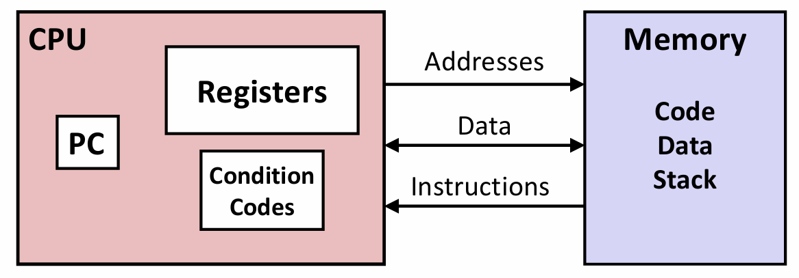
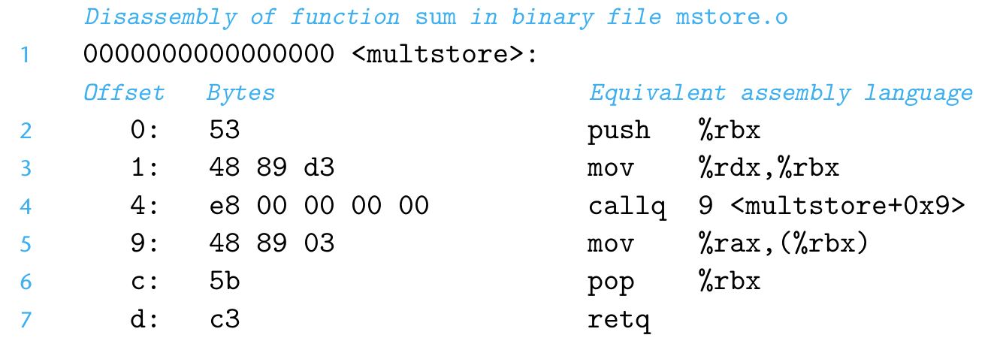

# Chapter 3.2 Program Encodings


## Machine-level Code

讲到机器级代码，我们就必须了解抽象的概念。**抽象**（Abstraction）是简化复杂的现实问题的途径，是计算机科学中最为重要的概念之一。比如我们为一组函数规定一个简单的应用程序接口（API）就是一个很好的编程习惯，程序员无需了解它内部的工作便可以使用这些代码。这就是抽象的作用。

计算机系统使用了多种不同形式的抽象，利用更简单的抽象模型来隐藏实现的细节。包括指令集架构抽象，微体系结构抽象，逻辑计算抽象（想必大家在数电的学习中对此已非常熟悉了~）等。

对于机器级编程来说，以下两种抽象尤为重要：


1. **指令集体系架构或指令集架构**（Instruction Set Architecture, ISA）：用来定义机器级程序的格式和行为。
它定义了处理器状态、指令的格式，以及每条指令对状态的影响。

2. **虚拟内存**：机器级程序使用的内存地址是虚拟的，提供的内存模型看上去是一个非常大的字节数组，使得应用程序认为它拥有连续的可用的内存（一个连续完整的地址空间）。

## Programmer-Visible State of Processor

x86-64的机器代码和原始的C代码差别非常大，程序员通常在C代码中看不到的处理器状态在机器代码中都是可见的：

<div align="center">

</div>
<center>Assembly/Machine Code View</center>

* **程序计数器（Program Counter，PC）**,在x86-64中用%rip(~~rest in peace~~🤨)表示，给出将要执行的下一条指令在内存中的地址。

* 整数**寄存器文件（Register file）**：包含16个命名的位置，分别存储64位的值。这些寄存器可以存储地址或整数数据。作用：记录程序状态；保存临时数据。

* **条件码（Condition Codes）寄存器**：保存最近执行的算术或逻辑指令的状态信息，用于实现控制或数据流中的条件变化，如if和while语句。

* 一组向量寄存器可以存放一个或多个整数或浮点数值。


## Code Example

### 1. Compile Into Assembly

假设我们写了一个C语言代码文件mstore.c，包含如下函数定义：

```C
long plus(long x, long y); 

void sumstore(long x, long y, long *dest)
 {
 long t = plus(x, y);
 *dest = t;
 }
 ```

 在命令行使用“-S”选项：

```C
 linux> gcc –Og –S mstore.c
```

这会使GCC运行**编译器**，产生一个汇编文件mstore.s：

```C
sumstore:
 pushq   %rbx
 movq    %rdx, %rbx
 call    plus
 movq    %rax, (%rbx) 
 popq    %rbx  
 ret
```

上面代码中每一个缩进行都对应一段机器指令。比如，pushq指令表示将寄存器%rbx的内容压入程序栈中。

事实上，这段代码是简化版的，剔除了很多我们不太关心也看不懂的信息。😂

Actually, this is what it really looks like...

```C
    .globl sumstore
    .type sumstore, @function
 sumstore:
 .LFB35:
    .cfi_startproc
    pushq %rbx
    .cfi_def_cfa_offset 16
    .cfi_offset 3, -16
    movq  %rdx, %rbx
    call  plus
    movq  %rax, (%rbx)
    popq  %rbx
    .cfi_def_cfa_offset 8
    ret
    .cfi_endproc
 .LFE35:
    .size sumstore, .-sumstore
```

是不是看花眼了？别担心，事实上所有以‘.’开头的行但是指导汇编器和链接器工作的伪指令，看的时候可以忽略~

### 2. Generate Object Code

使用"-c"命令行选项：

```C
linux> gcc –Og –c mstore.c
```

此时GCC会**编译**并**汇编**该代码，产生目标代码文件mstore.o，它是二进制格式的，上面汇编代码对应的目标代码序列如下：

```C
0x0400595: 
 0x53
 0x48
 0x89
 0xd3
 0xe8
 0xf2
 0xff
 0xff
 0xff
 0x48
 0x89
 0x03
 0x5b
 0xc3
```

从中我们再次印证了机器执行的程序只是一个字节序列，它对于产生这些指令的源代码几乎一无所知。


要查看机器代码文件的内容，有一类称为**反汇编器**（Disassembler）的程序非常有用。这些程序根据机器代码产生一种类似于汇编代码的格式。在Linux系统中，带`-d`命令行标志的程序OBJDUMP可以充当这个角色：

```C
Linux> objdump -d mstore.o
```

结果如下：

<div align="center">

</div>


```admonish info
反汇编器只是基于机器代码文件中的字节序列来确定汇编代码，它不需要访问该程序的源代码或汇编代码。

反汇编器使用的指令命名规则与GCC生成的汇编代码有细微差别。在上面的示例中，它省略了很多指令结尾的'q'（我们都知道'q'代表"quad"，指的是4个字即8个字节），因为是大小指示符，在大多数情况中可以省略。而反汇编器又给call和ret指令添加了'q'后缀，同样，省略这些后缀也没问题。
```

### 3. Generate the Executable File

生成可执行的代码需要对一组目标代码文件运行链接器，而这一组目标代码文件中必须有一个main函数。假设在文件main.c中有如下函数：

```C
 #include<stdio.h>

 void multstore(long,long,long*);
 
 int main(){
     long d;
     multstore(2,3,&d);
     printf("2*3-->%ld\n",d);
     return0;
 }
long mult2(longa,longb){
   long s=a*b;
   return s;
 }
```

然后我们用如下方法生成可执行文件prog：

```C
 linux>gcc-Og-oprogmain.cmstore.c
```

链接是在程序开始执行时发生的。其实链接器的工作主要就是解析文件之间的引用，与静态运行时库结合（例如，malloc、printf 的代码）；也有一些库是动态链接的。

**下面概括了一般的C程序编码过程：**

假设一个C程序有两个文件p1.c和p2.c。用Unix命令行编译这些代码。

```C
linux> gcc –Og -o p p1.c p2.c 
```


gcc调用了一整套的程序，将源代码转化成可执行代码：

1. 首先，C**预处理器**（Preprocessor）扩展源代码，插入所有用`#include`命令指定的文件，并扩展所有用`#define`声明指定的宏。

2. 其次，**编译器**（Compiler）产生两个源文件的汇编代码p1.s和p2.s。

3. 接下来，**汇编器**（Assembler）将汇编代码转化成二进制目标代码文件p1.o和p2.o。

4. 最后，**链接器**（Linker）将两个目标代码文件与实现库函数的代码合并，产生最终的可执行代码文件p。


以上就是C文件被转化为可执行文件的全过程，相信大家对于程序编码已经有了一个较为透彻的理解。


btw，还要提醒大家一个关于**汇编代码格式**的问题。

本课程的表述是ATT（根据“AT&T”命名的）格式的汇编代码，这是GCC、OBJDUMP和其他一些我们使用的工具的默认格式。

而Microsoft的工具和来自Intel的文档，其汇编代码的格式是Intel格式的。

以下是它们二者的对比：

|                  | Direction of Operands | Memory Operands |Prefixes     |Suffixes      | Register Name |
|:----------------:|:---------------------:|:---------------:|:-----------:|:------------:|:-------------:|
| **Intel Syntax** | instr dest, src       | [rbx]           |1            |mov           | rbx           |
| **AT&T Syntax**  | instr src, dest       | (%rbx)          |$1           |movq, movl... | %rbx          |

区别：
1. Intel是先destination后source,而ATT是先source后destination。
2. Intel省略寄存器名字前的‘%’符号。
3. Intel立即数无前缀‘$’，指令的大小指示后缀也被省略。
4. Intel描述内存位置用的是[]，而ATT用的是()。

------

© 2026. ICS Team. All rights reserved.