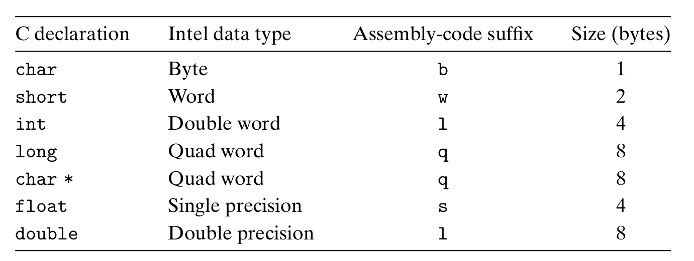

# Chapter 3.3 Data Formats

在上一节中，我们已经接触到了一些机器指令中的数据格式，本节将具体介绍C语言数据类型对应的x86-64表示。

首先我们要明确一个观点，机器只是简单地将内存看成一个按字节寻址的巨大数组，C语言中的聚合数据类型，如数组和结构体，在机器代码中也是用一组连续的字节表示。即使是对标量数据类型，汇编代码也不区分有符号数或无符号数，不区分各种类型的指针，甚至不区分指针和整数。

所以在汇编代码中，所有的数据类型都是”Integer“，也就是没有类型之分，而只有大小之分，如1个字节，2个字节，4个字节和8个字节。

下面是具体的C语言数据类型在汇编中的对应表：

在上一节中，我们已经向大家介绍了‘q’后缀的含义，此处又出现了如b，w，l的后缀，这也许让你有些迷惑。

实际上，产生这样的后缀名是有历史根源的。由于是从16位体系结构扩展而来的（还记得那个具有划时代意义的8086吗？它就是第一代16位处理器），Intel用术语“字（word）”表示16位数据类型。因此，称32位数为“双字（double words）”，称64位数为“四字（quad words）”。

而不同位数对应的数据传送指令也有四种：movb（传送字节，byte）、movw（传送字，word）、movl（传送长字，long word）和movq（传送四字）。

本课程不涉及浮点数，故不予讨论。有兴趣的同学可以参考[CS:APP](https://csapp.cs.cmu.edu/)进行学习。

------

© 2025. ICS Team. All rights reserved.