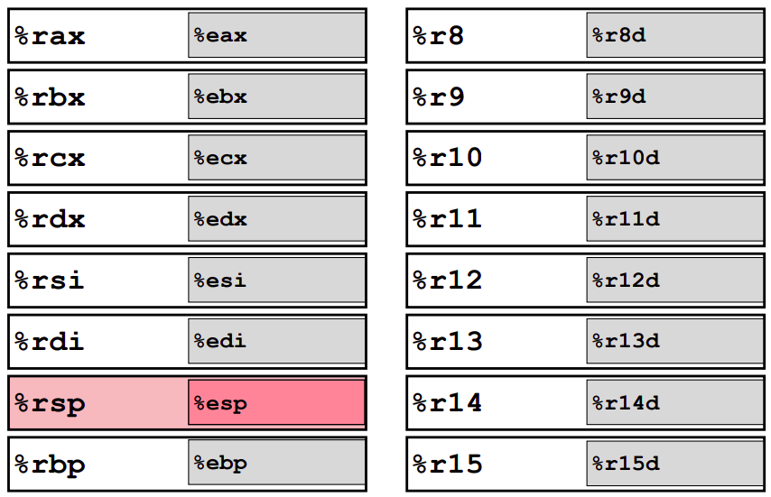
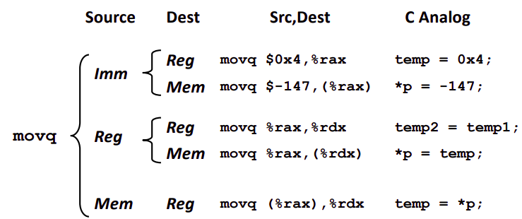

# Chapter 3.4 Accessing Information

## Register

前文中我们提到过寄存器这个对大部分同学十分陌生的名词，因为同学们经常接触的抽象程度较高的高级语言中上，寄存器已经被隐藏不再可见，但在机器级代码中，寄存器却是表示数据的重要一环，我们有必要深入了解一下它。

一个 x86-64 的 CPU 包含一组 16 个存储 64 位值的通用目的寄存器，用于存储整数数据以及指针，他们和 CPU 靠的很近，访问速度极快，当然数量也十分有限。下图中展示了这 16 个寄存器。



可以看到这 16 个寄存器他们的名字都是以 **%r** 开头，不过后面还跟着一些不同命名规则的名字。在历史上每个寄存器都有特殊的用途，他们的名字反应了这些特殊的用途，但后来不再有这个约束。随着时代发展，寄存器从最初的 8 位一步步变为 16 位、32 位，再到今天的 64 位，图中以 **%e** 命名开头的寄存器就是 32 位寄存器。

还应当注意到的是其实 CPU 中并不是只有 16 个寄存器，还有许多寄存器但从机器级代码的角度不可见，被保留给 CPU 进行一些硬件的实现。

## Instruction

### 操作数

在介绍一些基本的指令之前，我们需要先知道数据在机器语言中的表示，我们称之为**操作数(operand)**。大体上来讲总共有三类：

1. **立即数**：用来表示常数值，立即数的书写规范是一个 '**$**' 符号后面跟一个用 C 标准表示的常数值。如果不是十进制表示，需要指示出进制，比如 ```$0x17``` 就表示十六进制下的 \\((17)_{16}\\)。

2. **寄存器**：前文介绍的寄存器，直接用它的名字表示就可以了 ```%rsp``` 就表示前文表中的 %rsp 寄存器。

3. **内存引用**：它会根据计算出来的地址，访问某个内存的位置。一般而言我们用 **()** 来表明这是一个内存地址的表示，比如 ```(%rsp)``` 就表示将寄存器 %rsp 中的值视为内存地址，访问那个内存地址。

### 数据传送指令

我们将主要介绍 movq 这个指令，这个指令需要两个操作数，分别表示数据源和数据目的，这个指令也正如其名，将源的数据复制一份到目的当中，在前几节中我们介绍过后缀 q ，表示移动的是 64 位数据。

指令格式: **```movq Source,Dest```** ，注意源在第一个操作数位，目的在第二操作数位。这一点和汇编课上讲的的 80x86 格式的汇编相反，同时上两节课的同学注意区分，别混淆了。

这里的 ```Source```与```Dest```的对应上文中讲的操作数，比如我们可以把一个立即数移入寄存器中，或者内存当中。但显然我们不能把寄存器的值移入立即数中。看到这你应该可以意识到，目的与源应当有些限制，具体限制如下图所示。



可以看到除了不能移入立即数的限制以外，只有一种组合受到限制，即**源和目的都是内存**也是不可行的，这主要是为了执行效率考虑而设计的，大部分同学经过那么多节课的熏陶，应该都有一个基本的认知：从内存中读取、存储数据都十分慢。那么一条指令既要从内存中读，又要写入内存，过于慢了，干脆拆成多条指令来执行。

图中还展示了汇编指令对应的 C 中的操作，将寄存器理解为局部变量，内存引用理解为指针确实是不错的理解方式。

### 寻址

我们先前的例子中，内存地址的表示都相对简单，但往往我们会需要更为复杂的内存表示模式，方便我们更好的定位，下面由简单到复杂介绍地址的表示：

1. **Normal: (R) -> Mem[Reg[R]]**，最为简单的表示方式，前文也已经解释过了，不再赘述。

2. **Displacement: D(R) -> Mem[Reg[R]+D]**，即在寄存器的值的基础上加上一个偏移量 D ，这个 D 用立即数表述。这个设计主要方便我们访问结构体中的成员。例如我们想要一个结构体中的第二个成员，已知这个结构体的起始地址存在 %rbp 中，而结构体的第一个成员占了八字节（比如是一个``` long```），那么我们需要的目的成员的地址就可以表示为 ```8(%rbp)```，可以用 ```movq 8(%rbp),%rdx``` 将它取出。

3. **Most Genneral Form D(Rb,Ri,S) -> Mem[Reg[Rb]+S*Reg[Ri]+D]**，其中 D 和第二条中一样是偏移量，而其中的另外几个符号我们还是通过 C 中的概念来类比解释：
    - Rb，**base register**，一个结构体数组的起始地址。
    - Ri，**index register**，结构体数组的索引，我们要找第 Reg[Ri] 个元素。
    - S，**scale**，比例因子，这个结构体数组每个成员占的字节数。注意 S 的取值只能是 1, 2, 4, or 8.

有了最通用的形式，可以发现前两种形式不过是省掉了一些元素的形式罢了。这个一般形式中除了 Rb 不能省去以外其他部分都可以合乎逻辑的组合。

------

© 2025. ICS Team. All rights reserved.