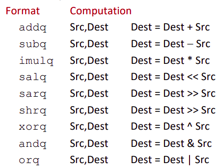

# Chapter 3.5 Arithmetic and Logical Operations

在一小节我们讲了机器级程序中数据的转移，这一节我们进一步深入，了解基本的算术逻辑操作。

## Address Computation Instruction

我们先延续上一节的内容介绍一个特殊的地址计算指令 **leaq**，和 movq 极其相同。

格式为 **```leaq Src, Dst```**, 其中的```Src```是一个地址表达式，它的形式应当符合上一节结尾介绍的地址表达式的要求，而 ```leaq``` 指令会将源中计算出的地址的**地址值**赋给目的。区别于```movq```，它会将地址指向的内存值取出赋给目的。

这条指令的设计最初的目的是快速计算地址的值，然而后来的编译器发现这条指令计算值是不是地址又有什么关系呢，反正计算出了一个值，就可以用这个指令来进行一些运算。比如:

```C
long m12(long x)
{
    return x*12;
}
```

会被编译器翻译为:

```armasm
leaq (%rdi,%rdi,2), %rax  # t=x+2*x
salq $2, %rax             # return t<<2
```

这种诡异的设计令人摸不着头脑，可能来自于设计师下午茶时间的灵光一动，或者是早上没睡醒时的胡言乱语，但已经无从考证，anyway，总之习惯就好。这条指令是算数运算中用的比较多的指令，要能理解是什么意思。

## Some Arithmetic Operations

我们在此列举出常见的运算，这张表也不用背，大部分看名字一眼就知道什么意思，考试也会给出一张表告诉你每条指令是什么。

先是常见的二元运算：



要强调的是一定要注意对于二元运算两个操作数之间的顺序，尤其是减法比较反人类的直觉，一定是目的减去源的值存储在目的中。

还需要注意的是我们的加或乘运算没有区别有无符号，可以回想一下我们在第二章运算中强调的，无符号数与补码在运算上的一致性。

接下来是常见的一元运算：


看到了 C 中的 ```++i```，无内鬼，来点谭浩强教材笑话。所以```(++i++)+((++i)++)+(i++)++```到底等于多少呢？

## Example

本课程要求的对算术逻辑运算的知识并不复杂，我们举个简单的例子来熟悉一下一些简单的指令。

看如下一个程序：

```C
long arith(long x,long y,long z)
{
    long t1 = x + y;
    long t2 = z + t1;
    long t3 = x + 4;
    long t4 = y * 48;
    long t5 = t3 + t4;
    long rval = t2 * t5;
    return rval;
}
```

对应每条一一翻译为汇编代码如下：

```armasm
arith: 
    leaq    (%rdi,%rsi), %rax     # t1
    addq    %rdx, %rax            # t2
    leaq    (%rsi,%rsi,2), %rdx
    salq    $4, %rdx              # t4
    leaq    4(%rdi,%rdx), %rcx    # t5
    imulq   %rcx, %rax            # rval 
    ret
```
我们也在汇编码中简单标注了计算的值对应C中的变量，对照着看相信比较容易可以看懂。

------

© 2025. ICS Team. All rights reserved.