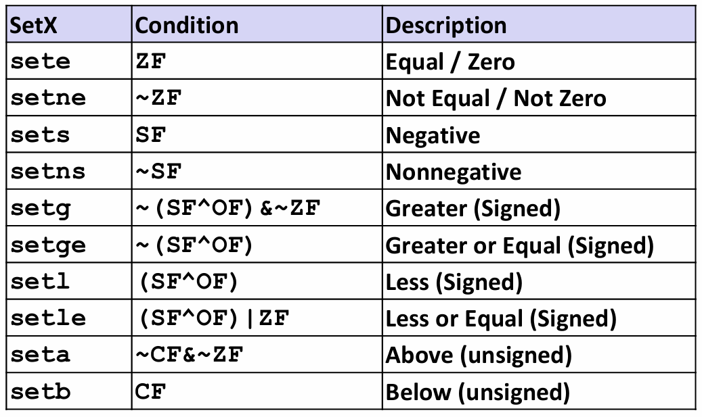
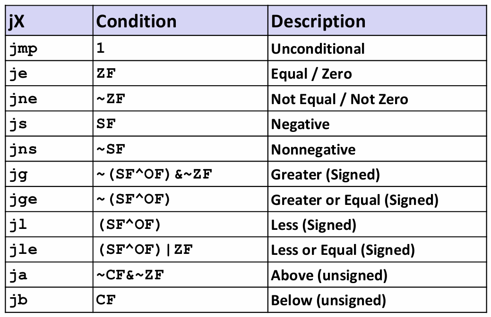
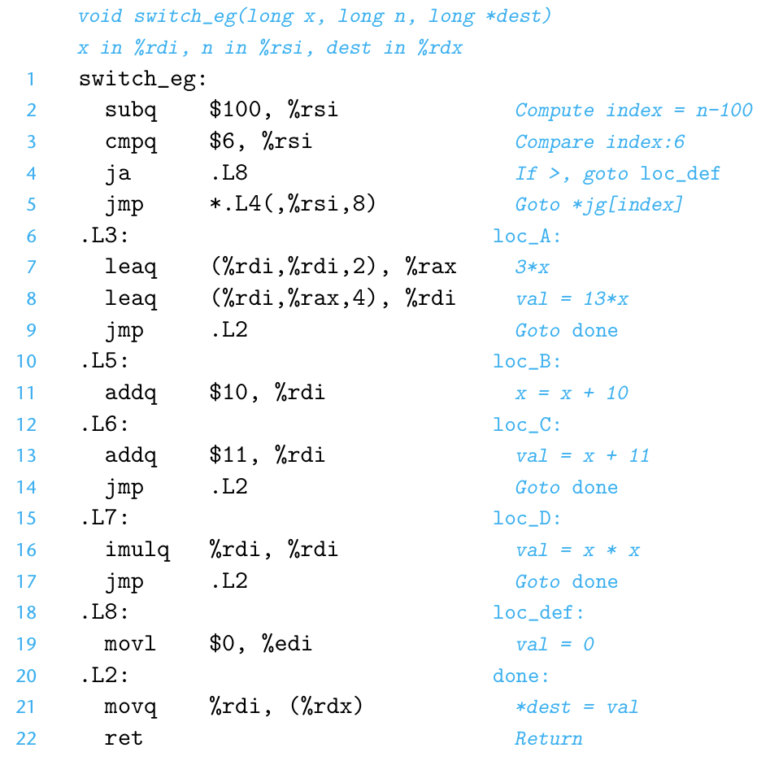

# Chapter 3.6 Control

到目前为止，我们只考虑了直线代码的行为，也就是指令一条接着一条顺序地执行。然而C语言中有很多结构要求有条件的执行，即根据数据测试的结果来决定操作执行的顺序，比如条件语句、循环语句和分支语句。

本节将涉及实现条件操作的两种方式，并描述表达循环和switch语句的方法。

## Condition Code

除了整数寄存器，CPU还维护着一组单个位的**条件码**（Condition Code）寄存器，它们描述了最近的算术或逻辑操作的属性。最常用的条件码有：

* CF (Carry Flag) (for unsigned)：进位标志。最近的操作使最高位产生了进位。可用来检查无符号操作的溢出。
* ZF (Zero Flag)：零标志。最近的操作得出的结果为0.
* SF (Sign Flag) (for signed)：符号标志。最近的操作得到的结果为负数。
* OF (Overflow Flag) (for signed)：溢出标志。最近的操作导致一个补码溢出（正溢出或负溢出）。

For example：

加法运算 addq Src,Dest ↔ t = a+b

| 条件码 | C 表达式                    | 说明       |
|--------|-----------------------------|------------|
| CF     | (unsigned) t < (unsigned) a | 无符号溢出 |
| ZF     | (t == 0)                    | 零         |
| SF     | (t < 0)                     | 负数       |
| OF     | (a<0==b<0) && (t<0 !=a<0)   | 有符号溢出 |

除了leaq指令（用于进行地址计算，不改变任何条件码），我们前面学习的所有的整数算术操作的指令都会设置条件码。

另外，还有两类指令CMP和TEST，它们只设置条件码而不改变其他寄存器。

* CMP指令与SUB指令的行为一样，根据两个操作数之差来设置条件码，只是不更新目的寄存器。通常用于`if(a<b){...}`。

* TEST指令与AND指令的行为一样，同样是只设置条件码（只有ZF和SF，ZF Set when a&b==0，SF Set when a&b<0）而不改变目的寄存器的值。典型的用法是`testq %rax, %rax`用来检查%rax和零的大小关系。

## Access Condition Code

条件码通常不会直接读取，常用的使用方法有三种：

1. 可以根据条件码的某种组合，将一个字节设置为0或1。
2. 可以条件跳转到程序的某个其他的部分。
3. 可以有条件地传送数据。

对于第一种情况，我们用SET指令来实现：

<div align="center">

</div>

这些指令的后缀不再是操作数的大小，而表示不同的条件。例如setl和setb分别表示“小于时设置（set less, signed）“和”低于时设置（set below, unsigned）“，切勿混淆。同时要注意有符号数和无符号数在相同指令下的不同后缀。

一条SET指令的目的操作数是低位单字节寄存器元素之一(还记得那个巨大的寄存器表格吗😎，没错，这里指的是它的最右边那一列，如%al, %r8b, etc.)，指令会把这个字节设置成0或1。为了得到一个32位或64位结果，必须对高位清零。

我们用一个简单的C语言表达式x<y来说明。

```C
 int gt (long x, long y)
 {
   return x > y;
 }
```
对应汇编指令：

```C
 cmpq   %rsi, %rdi   # Compare x:y
 setg   %al          # Set when >
 movzbl %al, %eax    # Zero rest of %rax
 ret
```

其中%rdi存放x，%rsi存放y，%rax存放返回值。

注意比较的次序（cmp src, dest）！（再次强调啊🤣）

还有一个比较奇怪的地方需要注意，这里movbl指令不仅把%eax的高3个字节清零，还会把整个寄存器%rax的高4个字节都清零。这是因为x86-64的惯例是任何为寄存器生成32位值的指令都会把该寄存器的高位部分置为0。

## Jump Instructions

正常执行的情况下，指令按照它们出现的顺序一条一条地执行。**跳转**（jump）指令会导致执行切换到程序中一个全新的位置。在汇编代码中，这些跳转的目的地用一个**标号**（label）指明。

示例（人为编造的，只是为了展示其用法）：

```C
  movq $0,%rax       #Set %rax to 0
  jmp .L1            #Goto .L1
  movq (%rax),%rdx   #Null pointer dereference (skipped)
.L1:
  popq %rdx          #Jump target
```
 
指令jmp .L1会导致程序跳过movq指令，而从popq指令开始继续执行。在产生目标代码文件时，汇编器会确定所有带标号指令的地址，并将**跳转目标**（目的指令的地址）编码为跳转指令的一部分。
 
下表列出了所有jump指令。这些指令的名字和跳转条件与SET指令相匹配。
 

<div align="center">

</div>

## Conditional Moves

实现条件操作的传统方法是通过使用**控制**的条件转移。当条件满足时，程序沿着一条执行路径执行；而当条件不满足时，就走另一条路径。这种机制虽然简单，但在现代处理器上可能会非常低效。

一种替代的策略是使用**数据**的条件转移。这种方法计算一个条件操作的两种结果，然后再根据条件是否满足从中选取一个。这样就可以用一条简单的条件传送指令来实现它，更符合现代处理器的性能特性。

我们以一个例子说明：

```C
long absdiff(long x, long y)
 {
   long result;
   if (x > y)
     result = x-y;
   else
     result = y-x;
   return result;
 }
```

产生的汇编代码：

```C
 absdiff:
 movq    %rdi, %rax  # x
 subq    %rsi, %rax  # result = x-y
 movq    %rsi, %rdx
 subq    %rdi, %rdx  # eval = y-x
 cmpq    %rsi, %rdi  # x:y
 cmovle  %rdx, %rax  # if <=, result = eval
 ret
```

我们可以看到在汇编中，既计算了x-y的值，也计算了y-x的值。然后再测试x是否小于等于y，如果是，就在函数返回result前，将eval复制到result中。

条件数据传送提供了一种用条件控制转移来实现条件操作的替代策略，只能用于非常受限制的情况（当计算量非常大时，性能大大降低）。不过这种情况还是相当常见的，而且与现代处理器的运行方式更契合。

## Loops

C语言提供了多种循环结构，即do-while、while和for。汇编中没有相应的指令，可以用条件测试和跳转组合起来实现循环的效果。

### Do-While Loop

do-while语句的通用形式如下：

```C
do 
  Body-statement
  while (Test);
```

goto版本：

```C
loop:
 Body-statement
 if (Test)
   goto loop
```

效果：重复执行Body-statement，对Test求值，如果求值结果非零，就继续循环。可以看到，在do-while语句中，**Body-statement至少会执行一次**。

下面来看一个例子（goto version），它计算了一个无符号长整型变量 x 中有多少个二进制位是 1 ：

```C
long pcount_goto(unsigned long x) {
 long result = 0;
 loop:
   result += x & 0x1;
   x >>= 1;
 if(x) goto loop;
 return result;
}
```
对应的汇编代码：

```C
 movl  $0, %eax         #  result = 0
 .L2:                   # loop:
    movq   %rdi, %rdx
    andl   $1, %edx     #  t = x & 0x1
    addq   %rdx, %rax   #  result += t
    shrq   %rdi         #  x >>= 1
    jne    .L2          #  if (x) goto
    rep; ret
```

条件跳转指令jne是实现循环的关键指令，它决定了是需要继续重复还是退出循环。

### While Loop

while语句的通用形式如下：

```C
 while (Test)
 Body-statement
```

效果：在第一次执行Body-statement之前，它会先对Test求值，循环有可能直接终止，这与do-while不同。

while语句有两种翻译为机器代码的方法。

**1. Jump to Middle**

goto version:

```C
   goto test;
 loop:
   Body-statement
 test:
   if (Test)
     goto loop;
 done:
```

这种翻译方法执行一个无条件跳转跳到循环结尾处的测试，以此来执行初始的测试。这也表现出while与do-while的区别，即**先执行Test，然后再根据测试结果执行Loop**。
 
**2. Guarded-do**

goto version:

```C
   if (!Test)
     goto done;
 loop:
   Body-statement
   if (Test)
     goto loop;
 done:
```

第二种翻译方法实际上把转化为了do-while循环，首先用条件分支，如果初始条件不成立就跳过循环，把代码转换为do-while循环。当使用较高优化等级编译时（例如使用命令行选项–O1），GCC会采用此策略。

### For Loop

for循环的通用形式如下：

```C
for (Init; Test; Update )
   Body-statement
```

它实际上与下面这段while循环代码的行为一样：

```C
 Init;
 while (Test ) {
   Body-statement
   Update;
 }
```

程序首先对初始表达式Init求值，然后进入循环；在循环中它先对测试条件Test求值，如果测试结果为假就退出，否则执行循环体Body-statement；最后对更新表达式Update求值。

GCC为for循环产生的代码是while循环的两种翻译之一，这取决于优化的等级。

综上，C语言中三种形式的所有的循环——do-while、while和for——都可以用一种简单的策略来翻译，产生包含一个或多个条件分支的代码。控制的条件转移提供了将循环翻译为机器代码的基本机制。

## Switch Statements

switch（开关）语句可以根据一个整数索引值进行**多重分支**（multiway branching）。通过使用**跳转表**（jump table）这种数据结构使得实现更加高效。

跳转表是一个数组，表项i是一个代码段的地址，这个代码段实现当开关索引值等于i时程序应该采取的动作。程序代码用开关索引值来执行一个跳转表内的数组引用，确定跳转指令的目标。与使用一组很长的if-else语句相比，使用跳转表的优点是执行开关语句的时间与开关情况的数量无关。

我们通过一个例子来理解机器执行switch语句的工作原理：

switch语句：

```C
void switch_eg(long x, long n, long *dest)
 {
   long val=x;
   switch(n){
   case 100:
     val *=13;
     break;
   case 102:
     val +=10;
     /*Fallthrough*/
   case 103:
     val +=11;
     break;
   case 104:
   case 106:
     val *=val;
     break;
   default:
     val=0;
   }
   *dest = val;
 }
```
下面是对应的汇编代码：

<div align="center">

</div>

执行switch语句的关键步骤是通过跳转表来访问代码位置。jmp指令的操作数有前缀‘*’，表明这是一个**间接跳转**（Indirect jump），操作数指定一个内存位置，索引由寄存器%rsi给出，这个寄存器保存着index的值。

C代码将跳转表声明为一个数组，数组中的每一个元素都是一个指向代码位置的指针。这些元素跨越index的值0~6，对应于n的值100~106，这样就可以间接地访问并处理所有分支。这就是间接（Indirection）的作用。

在上面这个例子中，程序可以只用一次跳转表引用就分支到5个不同的位置。甚至当switch语句有上百种情况的时候，也可以只用一次跳转表访问来处理。

所以说，

> "All problems in computer science can be solved by another level of indirection." 
>
>----David Wheeler

------

© 2026. ICS Team. All rights reserved.