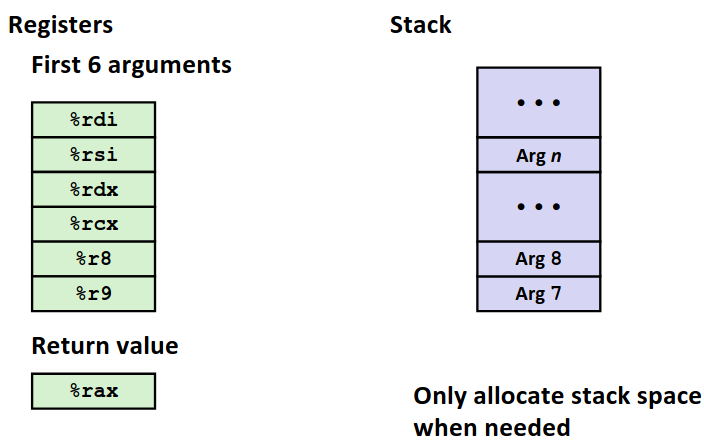
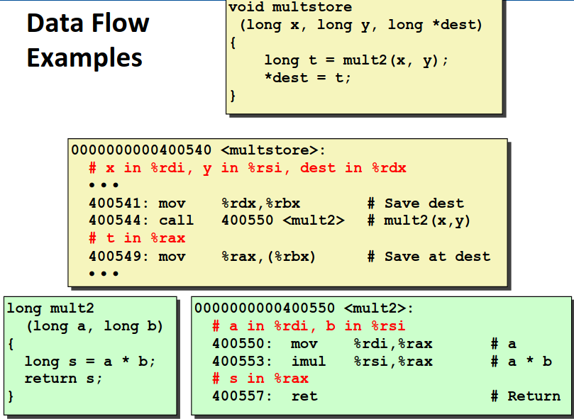
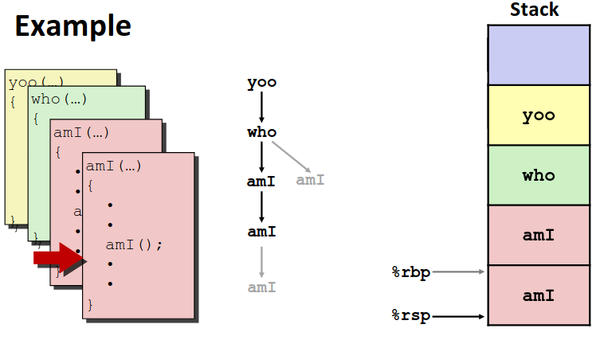
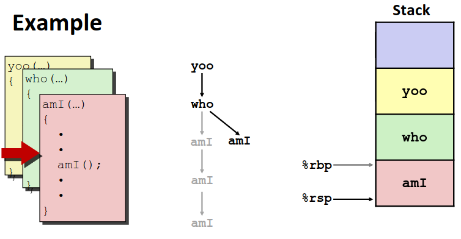
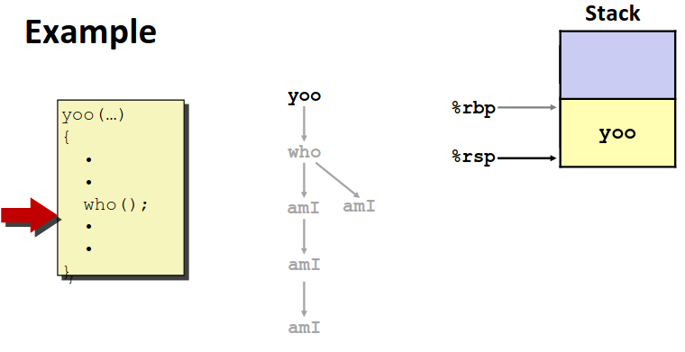
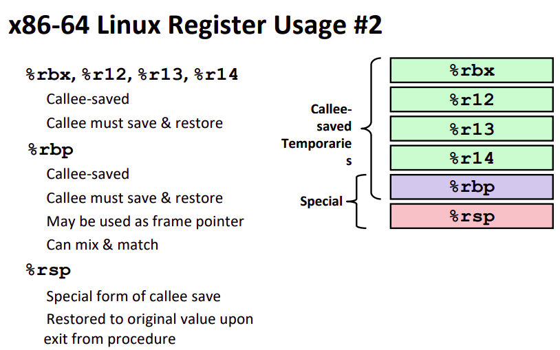

# Chapter 3.7 Procedures

在上一节中我们讨论了条件控制以及循环语句在机器级代码中的翻译，在这一节中我们将会进一步讨论 C 语言中另一个重要的组成部分：**函数**。

无论是**函数**还是说面向对象中的**方法**又或是汇编中的**过程**其实就是一段代码，一个代码块。研究机器级代码中函数调用机制，帮助我们更好的理解**运行栈**，可以显著提高我们代码运行效率😎

## Mechanisms in Procedures

我们先宏观的来思考一下，函数调用过程应当做些什么。总的来说应该有三个方面:

1. **Passing control**: 我们有先前的积累，已经能够理解代码翻译后在机器中只是一条一条指令。那么函数调用时，实际上就是要从一条待执行的指令的位置，跳转到去执行另一条指令的位置，并从那里开始执行一系列指令。函数结束时，我们需要返回到调用指令的位置，接着执行调用指令之后的指令。**PC(程序计数器)** 指令变更的过程我们需要研究。

2. **Passing data**: 函数调用过程还需要传递一些参数，这些参数该以怎样的形式传递？函数调用结束时需要向调用者返回一些返回值，返回值应当怎样传递？这些数据传递的问题需要讨论。

3. **Memory management**: C 语言中函数中可以定义局部变量，这些局部变量应当怎样分配存储空间？在函数结束时，为了避免空间浪费，我们需要释放这些空间，如何保证空间释放的合理？

接下来几个小节我们将分别深入去研究这些部分。但在开始研究这些问题以前，我们还要提一个重要的概念：**Application Binary Interface(ABI)**。

从计算机系统的角度，如果不考虑效率便捷性之类的问题，要实现函数调用时参数传递可以有很多方式，我可以存在内存里、存在运行栈里或者保存在特殊的寄存器中，但为了一个统一标准，人们提出了**ABI**来约束，机器指令的实现都会遵循这个标准，这个标准就是**ABI**。

甚至对于不同的操作系统会有不同的ABI，我们接下来讨论的内容都是基于 Linux 系统的 ABI。如果你在学完这节课后觉得你有更好的想法，欢迎你提出你的 ABI，并说服全世界计算机行业的人放弃以前的标准采取你的标准~~（先不考虑兼容性问题）~~😎

## Stack Structure

要研究函数调用绕不开**运行栈**这个概念，相信大家在初学递归的时候都有过一个经历：因为忘记写递归的退出条件，导致无限递归下去，最后程序被操作系统杀死并告诉你**栈溢出**了。那个时候你一定有疑问：我根本没有用到栈这个数据结构，溢出在哪？😭

如果没有学过 ics 课，你只会觉得操作系统又犯病了😅，事已至此先爬一把塔吧🤔。诶，别急着打开 steam， 我们这门课会给你一个答案。

这里因为大家应该都学过数据结构与算法这门课，栈这个基础的数据结构就不再过多介绍了，如果你有点记不清了，可以去问问 GPT or Deepseek ：“什么是栈？”

这里所谓的栈溢出实际上就是指运行栈溢出了。所谓的**运行栈是内存中一段特殊的位置**，位于虚拟内存中地址较大的位置。x86-64 中的栈是一个**倒置的栈**，栈底位于内存很高的一个地址，这个栈的起始地址会是一个随机数~~(你问为什么要随机，这你可能要问一下黑客们了，问问他们干了什么好事)~~ 然后向下“生长”，每当我向其中存元素时栈就向下延伸。

在前文我们介绍寄存器的时候我们经常提到 **%rsp** 这个寄存器的特殊性，这一节我们终于能讲清楚特殊在哪里。%rsp 始终保存的是**当前栈顶**的位置，也就是一根指针便于我们维护栈。

提到栈离不开两个操作：**入栈(push)**和**出栈(pop)**。由于这两个操作用的太多了，x86 指令集将这两个操作单独抽出来做成了两条指令~~（尽管他们都能被其他指令代替）~~。

1. **Push**:```pushq Src```，将```Src```写入当前 %rsp 指向的内存位置，并将 %rsp 下移。

2. **Pop**: ```popq Dest```，将 %rsp 指向内存的位置写入```Dest```中。

有了栈的知识，我们可以开始研究在第一小节中提到的几个问题了。

## Passing Control

我们通过运行栈来帮助我们完成过程的调用与返回。我们约定返回位置位于**调用指令的后一条**~~（返回在前面或者返回在调用处不就一直反复调用了吗）~~

函数调用指令 **Call**，**```call label```** ，将**返回的位置存入栈中**，并跳转到```label```标记的代码块。

返回指令 **ret**，**```ret```** ，将返回指令的地址从栈中 ```pop``` 出来，并跳转到那条指令去。

控制的转移实际上就这么简单，调用的时候存一下返回地址然后调用，返回的时候返回到预先存好的目的地就可以了。

## Passing Data

API约定函数调用**前六个参数保存在指定寄存器中**，多于六个的参数保存在栈中~~（真会用到吗？）~~。返回值始终保存在 **```%rax```** 中。下面一张图片指明了寄存器的传参的顺序。

<div align="center">

</div>

举一个简单的例子熟悉一下数据的转移:

<div align="center">

</div>

可以看到在这个例子中 ```multstore```调用了```mult2```，```mult2```直接将 ```%rdi and %rsi```中的值作为参数使用，并且计算返回的结果在```%rax```中。

## Managing local data

在函数调用的过程，我们不止需要传递参数，还需要管理保存数据。当 A 调用 B 的时候 A 应当妥善保管自己的数据，告诉 B 哪些数据是可以动的，哪些是 A 还需要的。对于 B 来说，他需要知道他可以使用哪些数据，他新定义的变量数据存在哪里。

机器级代码通过**栈帧(Stack Frames)**这个概念来实现数据的管理，简单来讲就是对于每个调用的过程，会在**栈中开辟一段属于自己的空间**，栈帧中保存应当返回的位置，函数的局部变量需要时也存在自己的栈帧中。一个函数不应当去篡改其他函数栈帧中的内容，那里面有其他函数需要的重要数据。

在函数结束时，函数所属的栈帧中的数据内容已经不再有用，当返回回去以后，这个栈帧就可以被**释放**了，这一段栈空间供其他函数使用以节省内存空间。

我们举一个简单的例子来理解一下这个过程。如图是一个函数调用的路径。

<div align="center">

</div>

不难看到从```yoo -> who -> amI -> amI```的调用路径中，越早调用的函数栈帧在越上面（别忘了栈是倒序排列的）。而栈先进后出的性质，退栈时显然是相反的顺序。

<div align="center">

</div>

可以看到退栈的时候，后调用的栈按顺序退出，只留下先调用的函数栈帧。这时候如果再有函数调用，位置位于先前退掉的位置。

<div align="center">

</div>

然后所有调用都结束了，退会最初的调用栈帧 ```yoo``` 中，这时候如果 ```yoo```中还有数据处理要做，就接着在```yoo```的栈帧中处理，直到退回主函数。

这时候就可以回答这一小节开始时的问题了，无限递归时我都没有用到栈这种数据结构这么会栈溢出呢？

无限递归是不断创建栈帧却没有返回，就算函数中什么都没做，也需要栈帧来存返回地址，不断创建栈帧，直到把操作系统分配给你这个进程的栈空间用完了，栈就溢出了，操作系统无情的杀死你的程序，并冷血的清空了剩余宝贵~~（完全没用）~~ 的数据😭

那么函数调用时存在栈中的数据得到了妥善的管理，那么寄存器呢？一个寄存器既需要被调用者使用，也需要被被调用者使用。

诶，我们怎么给过程分类的，分为**调用者(caller)**和**被调用者(callee)**。同样我们也将保存寄存器的职责划分给两者。寄存器分为 **caller-saved** 与 **callee-saved** 两类。

对于调用者，如果一个寄存器的值你认为很重要并且是 caller-saved，并且你在调用结束以后还需要用到这个寄存器，你就应当保存这个寄存器的值到你的栈帧中。在调用结束的时候调用者会将这些值从栈中取出还原回寄存器中。具体来讲 caller-saved 寄存器有如图这些：

<div align="center">

</div>

对被调用者有同样的职责，如果有些寄存器你需要使用并且是 callee-saved，不管调用者是否需要，那么你就应当将这些寄存器的值保存在你的栈帧中，并且在将控制还给 caller 时，你应当现将寄存器的值取出并还原。具体来讲 callee-saved 寄存器有如图这些：

<div align="center">

</div>

那么关于函数过程调用这个话题我们就讨论就到此为止了，关于递归之类的话题，我们也在本节中间穿插的提到了一些，甚至中间举的一个例子就是递归调用，不难意识到**所谓的递归调用和一般的函数调用没有任何区别**，本文就不再额外去说明这一点了。希望对你有帮助🌹。

------

© 2026. ICS Team. All rights reserved.