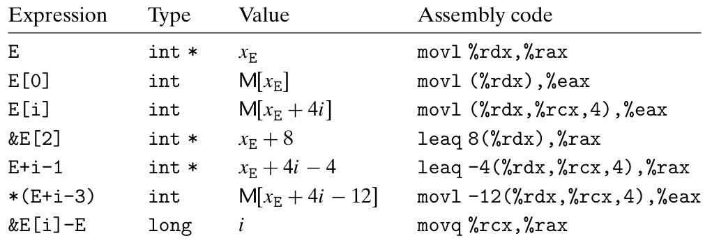
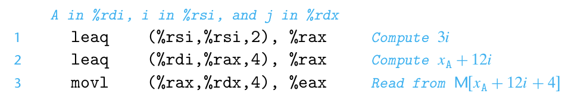
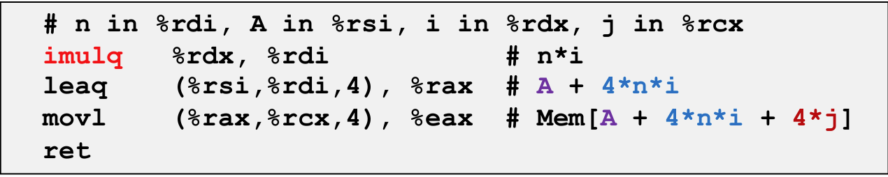

# Chapter 3.8 Array Allocation and Access

C语言中的数组是一种将标量数据聚集成更大数据类型的方式。C语言可以产生指向数组中元素的指针，并对这些指针进行运算。在机器代码中，这些指针会被翻译成地址计算。（别忘了，机器代码在使用内存时是不区分数据类型的。）

## Basic Principles

对于数据类型Type和整型常数Length，声明如下：

```C
Type name[Length];
```

起始位置表示为\\(x_{name}\\)。这个声明有两个效果：

* 首先，它在内存中分配了一个大小为 \\(Length * sizeof(Type)\\)字节的连续区域。

* 其次，它引入了标识符name，作为指向数组首地址的指针，该指针的值为\\(x_{name}\\)。

因此，我们可以用0~Length-1的整数索引来访问数组元素。

数组元素i的地址为\\(x_{name}+sizeof(Type)*i\\)。

x86-64的内存引用指令可以简化数组访问。例如，假设E是一个int型的数组，我们现在希望计算E[i]。其中，E的地址存放在%rdx寄存器中，i存放在%rcx寄存器中。那么，指令`movl (%rdx,%rcx,4),%eax`就会执行地址计算\\(x_{E}+4i\\)，读取这个内存位置的值，并将结果存放到%eax寄存器中。

## Pointer Arithmetic

C语言允许对指针进行运算，而计算出来的值会根据该指针引用的数据类型的大小进行伸缩。也就是说：若p是一个指向类型为T的数据的指针，p的值为\\(x_{p}\\)，那么表达式\\(p+i\\)的值为\\(x_{p}+L*i\\)。（L为数据类型T的大小）

通过指针运算，我们可以扩展一下前面的例子，对整型数组E[i]做一些指针运算：

<div align="center">

</div>

其中，整型数组E的起始地址和整数索引i分别存放在寄存器%rdx和%rcx中。可以看出，返回数组值的操作类型为int，因而使用4字节操作`movl`，并将结果存放在%eax中。而返回指针的操作类型为int *，因此使用8字节操作`leaq`等，结果存放在%rax中。

## Nested Arrays

嵌套数组可以理解为数组的数组。如果我们声明：

```C
int A[5][3];
```

它等价于下面的声明：

```C
typedef int row3_t[3];
row3_t A[5];
```

这里的操作实际上把数据类型`row3_t`定义为一个有三个整数的数组，数组A包含5个这样的元素，即每个元素都是有三个整数的数组。因此每个元素的大小是12个字节，那么整个数组A的大小就是60个字节。

我们也可以把数组A看成一个5行3列的二维数组，用`A[0][0]`到`A[4][2]`来引用。数组元素在内存中按照**行优先**的顺序排列，这正是我们上面描述的嵌套声明的结果，所以第0行的所有元素可以写作`A[0][i](i<3)`，以此类推。

访问多维数组的元素和一维数组类似，编译器会以数组起始为基地址，偏移量为索引（可能需要经过伸缩）来访问期望元素。通常来说，对于一个声明如下的数组：

```C
T A[R][C];
```

它的数组元素A[i][j]的内存地址为\\(x_{A}+sizeof(T)(C*i+j)\\)。

仍然考虑前面定义的数组A[5][3]，其寻址方式在机器代码中表示如下：

<div align="center">

</div>

可以看到，访问二维数组中的元素，必须执行两次内存读取：首先获取指向行数组的指针，然后访问行数组内的元素。计算所得的元素地址为\\(x_{A}+12i+4j=x_{A}+4(3i+j)\\)，使用了x86-64地址运算的伸缩和加法特性。

## N X N Matrix Code

对于n维矩阵，在C语言中有三种类型：

1. 固定维度

```C
#define N 16
 typedef int fix_matrix[N][N];
 /* Get element A[i][j] */
 int fix_ele(fix_matrix A, size_t i, size_t j)
 {
   return A[i][j];
 }
```

2. 可变维度，显式索引( Traditional way to implement dynamic arrays)

```C
#define IDX(n, i, j) ((i)*(n)+(j))
 /* Get element A[i][j] */
 int vec_ele(size_t n, int *A, size_t i, size_t j)
 {
   return A[IDX(n,i,j)];
 }
```

3. 可变维度，隐式索引( Added to language in 1999)

```C
 /* Get element A[i][j] */
 int var_ele(size_t n, int A[n][n], size_t i, size_t j) 
 {
   return A[i][j];
 }
```

> btw，`#define N`声明是一个很好的编程习惯，当我们要在程序中使用常数时（如作为数组的维度），最好通过`#define`声明将该常数与一个名字联系起来，然后在使用时以这个名字替换常数的值。这样一来，如果想要修改这个值，只需简单地修改`#define`声明即可，同时也能提升代码的可读性。

访问可变维度的n维矩阵的元素的机器代码如下：

<div align="center">

</div>

可以看到，在访问可变维度矩阵的元素时，编译器使用了乘法操作`imulq`来获取行数组指针。在前面的章节中，我们知道编译器为了提升程序运行的速度会尽量避免使用乘法，但在可变维度矩阵中，由于n是未知的，因此乘法运算是无法避免的。这是机器代码实现变长数组访问时与定长数组的区别。

------

© 2025. ICS Team. All rights reserved.