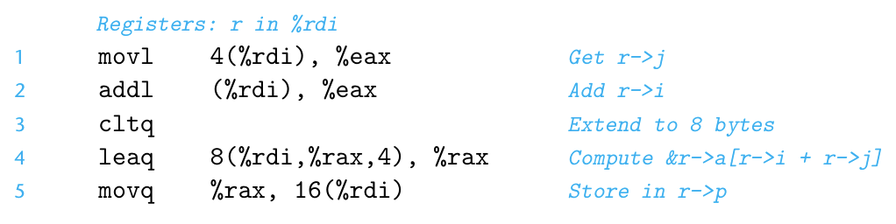
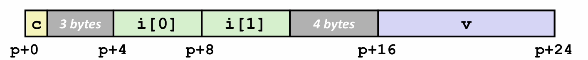
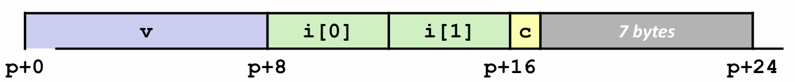
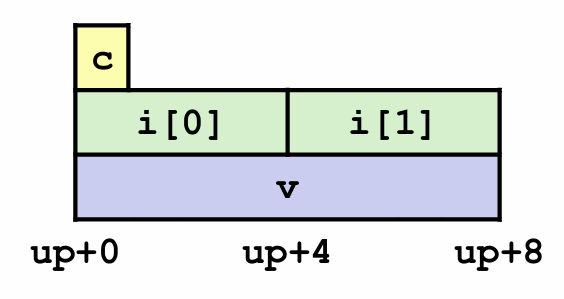

# Chapter 3.9 Heterogeneous Data Structures

C语言提供了两种将不同类型的对象组合到一起创建数据类型的机制：

* **结构**（structure）：用关键字**struct**来声明，将多个对象集合到一个单位中。
* **联合**（union）：用关键字**union**来声明，允许用几种不同的类型来引用一个对象。

## Structures

### Allocation

结构体的声明示例如下：

```C
struct rec {
 int i;
 int j;
 int a[4];
};
```

结构体在内存中表现为一块足够大以容纳所有字段的内存块，其中的字段按声明的顺序排序，并由编译器确定字段的大小和位置。

### Access

仍然考虑上面声明的结构体，若要访问结构体里的字段，编译器产生的代码要将结构体的地址加上适当的偏移。例如，要访问y，由于字段x的偏移量是0，这个字段的地址就是r的值（r是struct rec*类型的变量）。为了存储到字段y，代码要将r的地址加上偏移量4。

若要访问结构体内部的数组a[4]，需要产生一个指向该数组的指针。在本例中，我们只需将结构的地址加上偏移量\\(8+4*i\\)就可以得到指针&(r->a[i])。

我们通过一个具体的指令来看看机器代码中获取结构体内元素地址的操作：

```C
r->p=&r->a[r->i+r->j];
```

对应汇编指令：

<div align="center">

</div>

从中我们可以看到，结构的每个字段的选取完全是在编译时处理的。机器代码不包含关于字段声明或字段名称的信息。所以我们在汇编代码中只能看到偏移量，而看不到字段名称。

### Alignment

许多计算机系统对基本数据类型的合法地址做出了一些限制，要求某种类型对象的地址必须是某个值（通常是2、4或8）的倍数。这种**对齐限制**简化了形成处理器和内存系统之间接口的硬件设计。如果没有字节对齐，我们就可能需要多次内存访问来获取一个对象的地址，这无疑降低了运行效率。

**对齐原则是：任何K字节的基本对象的地址必须是K的倍数。（指原始数据类型，如int a[3]应以int的大小为基准）**

具体如下：

| K | Types               |
|:-:|:-------------------:|
| 1 | char                |
| 2 | short               |
| 4 | int, float          |
| 8 | long, double, char* |

在结构体内部，为了保证每个结构体元素都满足它的对齐要求，编译器可能需要在字段的分配中插入间隙。

例如，考虑下面的结构体声明：

```C
struct S1 {
 char c;
 int i[2];
 long v;
 } *p;
```
它的偏移内容如下：

<div align="center">

</div>

可以看到，为了满足字段i[2]的4字节对齐要求和字段v的8字节对齐要求，编译器在字段c后面插入了3字节的间隙，在字段i[2]后面插入了4字节的间隙。

同时，为了使所有结构体都满足对齐要求，编译器还可能在结构体的末尾加入多余字节。

例如，考虑下面的结构体声明：

```C
struct S2 {
 long v;
 int i[2];
 char c;
} *p;
```

<div align="center">

</div>

可以看到，编译器为结构体S2分配了24个字节，这是为了保证整体的字节对齐要求。

## Unions

联合提供了一种方式，能够规避C语言的类型系统，允许以多种类型来引用一个对象。联合声明的语法和结构体一样，但是语义相差很大。它们是用不同的字段来引用相同的内存块。

我们一一个例子来说明：

```C
union U1 {
 char c;
 int i[2];
 long v;
} *up;
```

<div align="center">

</div>

可以观察到，一个联合的总大小等于它最大子段的大小，这是因为它内部的不同字段引用的是相同的内存。这就是联合与结构的最大区别。

------

© 2026. ICS Team. All rights reserved.