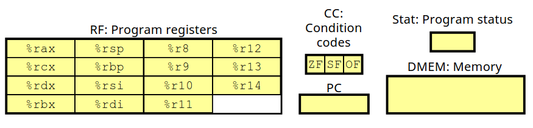
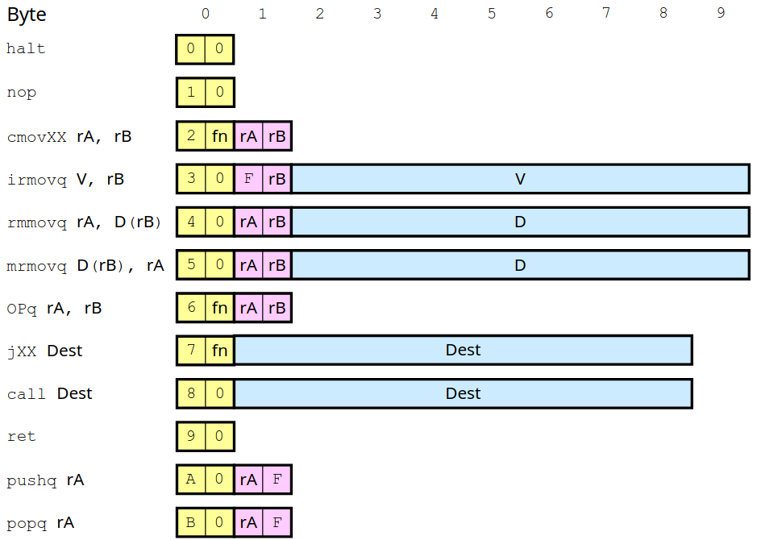
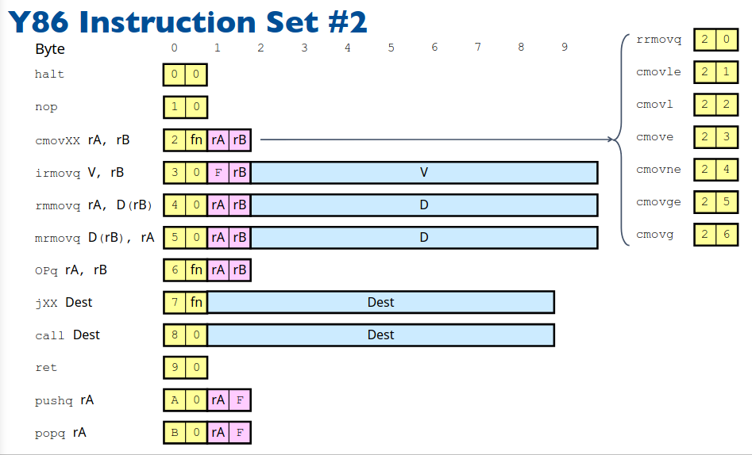
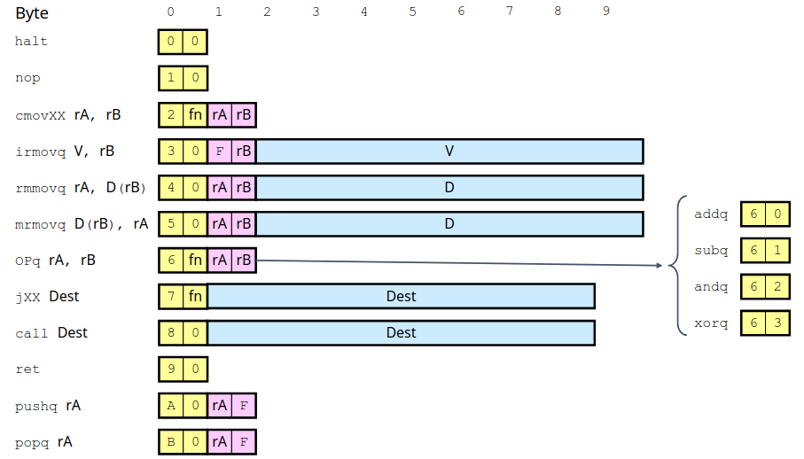
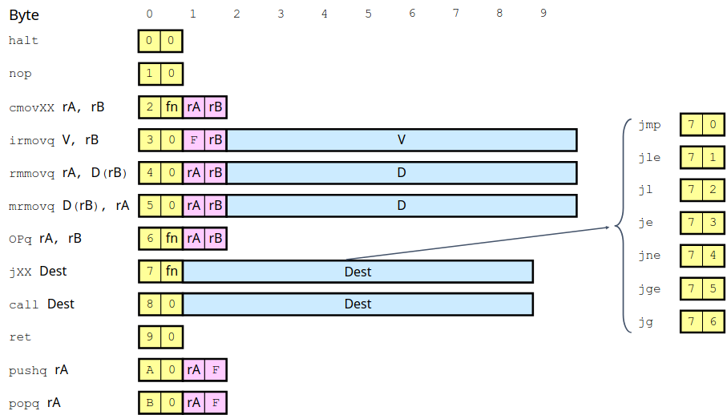

# Chapter 4.1 The Y86-64 Instruction Set Architecture

要定义一个指令集体系架构，包括定义各种状态单元、指令集以及它们的编码。这一章我们将简要介绍自创的 Y86 指令集并根据这个指令集设计处理器。

从名字上就可以看出来 Y86 指令集体系集架构是一个‘山寨’版的 X86 指令集体系集架构，为了方便学习与简单的处理器设计，对 X86 指令集做了一些简化。

## Processor State

要构建一个指令集，我们需要仿照 X86 预先设计一套处理器的状态，包含寄存器、条件码与程序计数器等等。

我们为 Y86 指令集设计的处理器包含 15 个寄存器，每个 64 位，用十六进制数 0~E 表示。为什么是 15 这个奇怪的数字呢？显然 \\(16=2^4\\) 刚好用 0~F 来表示一个寄存器不是恰到好处吗？这里我们预留了一个类似数据结构中超尾元素的概念，其中 F 就表示**没有寄存器**，在后面硬件设计中有用处。

## Instruction Set

完成了对处理器状态设计，我们开始设计指令集。和 X86 类似，我们仍采用变长指令集，即每个指令的长度不一定相同，变长指令集一个核心要求在于任何指令不能为另一指令的前缀，否者无法区分指令，大体的设计如下图：

可以看到指令数量非常少，只保留了最为常用的指令，由于表示寄存器占用四位，所以两个寄存器占用一个字节。接下来我们选择一些指令介绍一下。

### MOV

可以看到我们为 MOV 指令根据源和目的的类型提供了 4 种不同的形式。X86 指令集中 MOV 只有一种形式，为了方便后续硬件设计我们这里做了区别。

其中 CMOV 即条件转移我们只支持从寄存器到寄存器，对于指令第二个字节的 fn 代表不同类型的条件转移具体如下图：

观察 rmmovq 可以发现我们对内存访问只支持一种格式，即基址+偏移量。X86 内存访问可以简单的记忆为对结构体数组的访问，还有什么比例因子之类的便于实现数组的访问，那 Y86 无法实现数组访问吗？显然不是，只要简单的现将访问数组元素地址先计算完毕存储在寄存器中，再调用 MOV 指令就可以实现数组访问了。

### OP and JUMP

OP 代表算数运算，操作数只支持寄存器，同理 fn 代表不同的运算种类。而对于 JUMP 跳转指令根据跳转的条件不同同样通过 fn 来区分。

其余的指令大致上和 X86 中指令的意思完全一致，根据表中格式很容易对照理解，不再过多赘述。

由此我们就完成了一套非常简单的指令集的设计，我们会在接下来的内容中根据 Y86 指令集设计对应的硬件。

------

© 2026. ICS Team. All rights reserved.