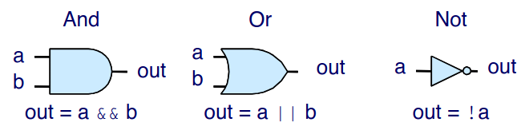
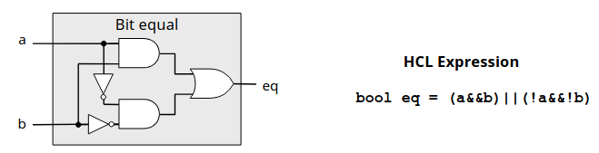
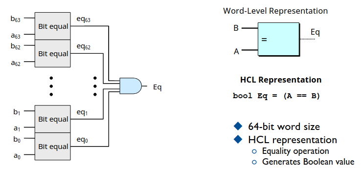
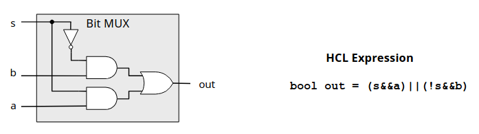
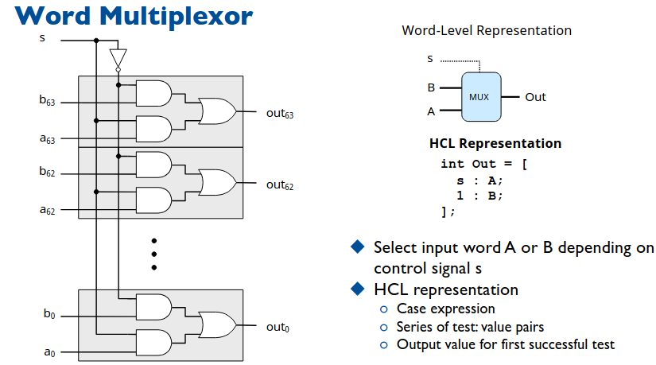
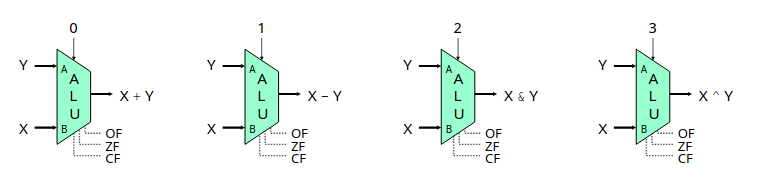
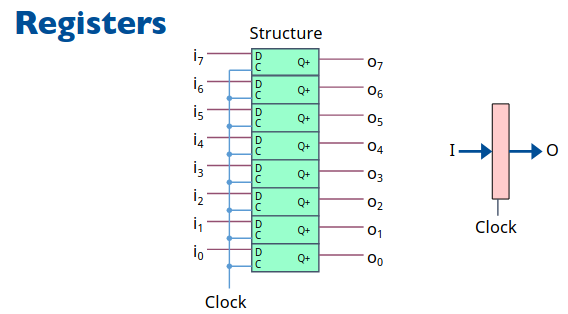

# Chapter 4.2 Logic Design and the Hardware Control Language HCL

在上一节我们完成了 Y86 指令集的设计，在这一节中我们将简要介绍逻辑设计以及硬件描述语言。

要硬件上实现 CPU 的功能，最直接的应当分为两个功能，运算与临时存储。运算包含基本的位运算、加减乘除算数运算等等，这些包含在组合逻辑电路中；二要实现临时存储则需要实现寄存器等功能包含在时序逻辑电路中。

这一节的内容与数字逻辑电路中的知识高度重合，我们会假定你具有数电的一些基础，在介绍时不会非常详细的解释电路原理，会简要的复习数电内容，并着重关注硬件提供的抽象逻辑功能，如果你希望加深这些内容的理解，或许在数电课上你会找到答案。

## HCL: the Hardware Control Language

在开始电路知识以前我们会先简要介绍**硬件控制语言(HCL)**，正如其名是接近底层描述硬件的一种语言。大部分同学应该都接触过 Verilog 或者 VHDL(hardware description language)，HCL 是相对这两种语言更为接近底层硬件的语言。

我们不会长篇累牍的介绍 HCL 的语法，也不需要对这门语言有多么深入的了解。有过编程背景的同学可以通过我们给出的例子快速理解语言的意思，能够看懂语言表达的逻辑功能就可以了。

## Logic Gatas and Combinational Circuits

我们跳过了数字01对应电平高低这些小学二年级内容，直接来到逻辑门电路。

<div align="center">

</div>

与或非三种基本逻辑门电路构成 **组合逻辑电路(Combinational Circuits)** 是实现运算的基础利用模块化自底向上的思想，构建出需要的组合逻辑电路。

### Equality

比如我们现在要实现比较两个 64 位数是否相等的电路，那么我们应当先构建一个判断一位是否相等的电路，其实就是同或门。

<div align="center">

</div>

可以看到我们给出了电路实现以及 HCL 表达式，与 C语言表达式完全一致。

有了一位同或门，构建 64 位相等比较器就非常简单了。只需要按位比较，再将所有的结果与在一起。

<div align="center">

</div>

或许你们中有少数人有疑问哪有 64 位与门这种东西，这里根据所拥有的硬件不同来采用不同的实现，比如只有二输入与门，可以采用效率较低可拓展性强的串行电路，也可以采用兼顾效率的树形结构 63 个二输入与门构成。由于我们不是数电课，后续不会再深入探究此类问题，这里只是为组建 CPU 介绍需要的硬件实现，理解成一个个 API 接口，调用就可以了。

### Multiplexor

在计算机中常常会有选择的问题，if...else...，在硬件中我们称之为**多路选择器MUX**，即要从多路电路输入中选择一路输出，我们还是从一位看起。

<div align="center">

</div>

可以看到 s 就是一位段选信号，对于 \\(2^n\\) 路选择一路就需要 \\(n\\) 位段选信号。进一步可以搭建 64 位 1 路多路选择器。

<div align="center">

</div>

电路很好理解，可以看到 HCL 表达式狰狞了起来，这是条件选择表达式，类似 switch...case...。其中 1 一般写在最后一条，因为其 always true，代表 default。这种语句要求**必须条件完备**，即包含所有情况，判断时从上往下，一旦一条条件为真，跳出。举几个简单的例子。

```C
int Min3 = [
    A < B && A < C : A;
    B < A && B < C : B;
    1              : C; 
];
// 在三个数中选择最小的
```

```C
int Out4 = [
    !s1 && !s0 : D0;
    !s1        : D1;
    !s0        : D2;
    1          : D3; 
];
// 4 路选择器
```

### Arithmetic Logic Unit: ALU

有了数据选择器，我们就可以整合各种算数运算单元成一个**算术逻辑单元 ALU**。具体而言 ALU 有三个输入，分别输入二元运算的两个运算数以及一个片选信号表示运算种类。输出则是运算的结果，以及各种状态位（正溢出,负溢出等等）。至于 ALU 内部加法器、乘法器、字与等等功能的实现，我们不做讨论。

<div align="center">

</div>

完成了 ALU 之后，我们基本上完成了 CPU 算术逻辑功能硬件的实现，当然现实的实现会比我们简单的实现更为复杂，包含各种异常处理以及避免险象的机制，我们这里不再深入介绍。

在本文的开头我们提到过，要实现 CPU 不只要算术逻辑，还需要寄存器来存储计算的结果之类的数据。寄存器说到底不过是一个存储硬件，在数字逻辑电路中有固定的实现方式。

### Register

要实现 64 位**寄存器**先实现一位的存储器件，如果培养方案没有大的变动，那么本课程同时进行的还有数字逻辑电路课程，在那里面详细介绍了锁存器、触发器等不同的一位存储元器件以及它们的操作方式。

一个重要的概念是**时钟信号**，在电路图中常常以 CLK 表示。对于常用的触发器，无论是上升沿还是下降沿总归是在时钟信号发生特定变化的时候才会从输入端读入数据进行存储。简单的理解即是我们的存储器只有在**有时钟信号时存储输入的内容**，其余时候保持存储内容不变。

具体的实现机制较为复杂，课堂上老师的电路实现也很奇特和数电的实现不同。而数电中 D 触发器的经典实现也较为复杂，各种阻塞线信号的配合，此处我们不再深入探究，在数电课上你会找到答案。

现在寄存器就是个封装好的函数，直接供你调用就好了，毕竟从课程的开始我们就告诉你在计算机中抽象的重要意义，就在这时候体现出来了，就像你也不会想去知道怎么由三极管搭建成与或非门。

<div align="center">

</div>

在完成寄存器的设计后，我们完成了所有 CPU 所需要的功能硬件，在下一节中我们会通过提供这些功能的硬件设计搭建一个完整的 CPU。


------

© 2025. ICS Team. All rights reserved.