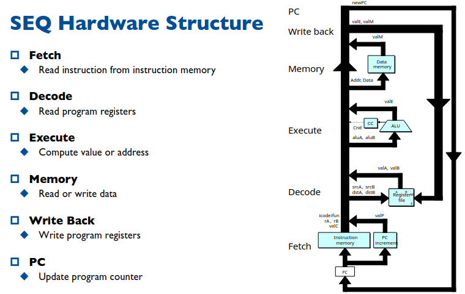
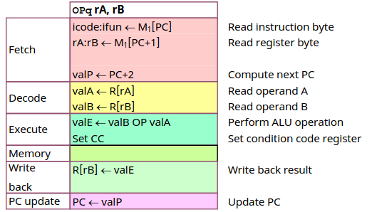
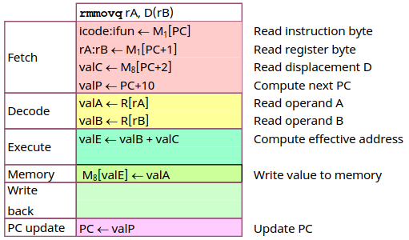
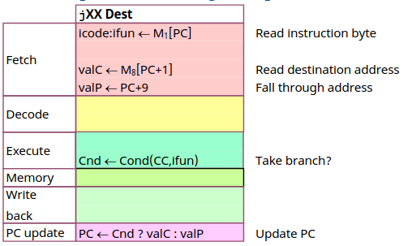

# Chapter  4.3 Sequential Y86-64 Implementations

这一节我们将根据第一节中介绍的 Y86 以及第二节中的硬件实现一个简单的顺序执行的 CPU。

## SEQ Hardware Structure

对于 CPU 实现核心在与拆解实现每一条指令，把每一条指令都分解为若干个直接调用硬件的步骤，并且不同的指令步骤流程应大致相同，这样才能高效的实现指令并且有一定的可拓展性。那么如何去划分步骤流程就是一门学问了。

执行一条抽象的指令可能需要哪些步骤呢？

首当其冲的当然是从内存中把这条指令读出来，然后做必要的解码，根据指令计算出目标值。部分指令还需要与内存进行交互，读或者写，这一步骤必须安排在计算之后，因为我们支持地址偏移需要先计算出地址。然后根据指令更改寄存器的状态，执行完后修改 PC 便于执行吓一跳指令。

流程图如下图所示：

这里强调一个问题是我们所约定的执行步骤是基于我们设计的指令集定制的，并不具有普适性，比如 X86 指令集，支持直接用内存读出数据在进行算术运算，显然在我们的流程中无法实现这样的操作，到这里就可以明白为什么我们的运算只允许寄存器参与了，明显简化了 CPU 的设计。

这样拆解之后，指令的执行便有迹可循了，所有的步骤都可以简单的调用硬件实现，接下来我们会举出一些典型的例子。

## Stage Computation

### Arith/Log.Ops

由于 ALU 封装的设计，所有的算数逻辑的执行流程完全一致，可以大致用下表表示。

可以看到按照我们的步骤划分后，每一步内都是简单的在寄存器间移动值或者调用 ALU，浅显易懂。一个令人困惑的点在与 ValP 的设置显得冗余，这个值用在在后续 JUMP 等指令中，保持设计的统一性是设计者的美德。

### rmmovq

内存 mov 的指令也是完全同理。

### Jumps

在先前我们提到 ValP 的设计是为 Jumps 所预留的设计，这里也展示一下 Jumps 的步骤分解。注意一下条件跳转的写法。

这些步骤的分解举一反三非常容易，都是重复机械性质的工作，本文对于这些步骤的分解就不再过多赘述，感兴趣可以根据教材以及课件进一步了解。

总结下来 CPU 的设计无非就是**状态+组合逻辑**这一套从图灵机起就有的思想，状态无非就是 PC, reg, Cond.Code reg, mem...这些状态的更新通过统一的时钟信号上升沿控制，在通过组合逻辑完成必要的计算。

基本的方法思想固然简单，然而这样简单的设计却有一个致命的问题：**慢**，太慢了，进一步可以用流水线超标量的思想来进一步优化，本课程不再进一步深入介绍这些内容，只是希望您在了解了顺序执行的处理器设计后能够一点的理解处理器设计的思想，不再把硬件当做洪水猛兽无法理解的克苏鲁，启发你进一步了解，希望这对你帮助🌹

------

© 2026. ICS Team. All rights reserved.