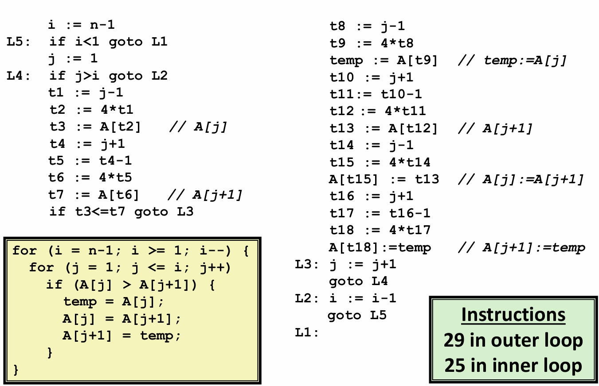
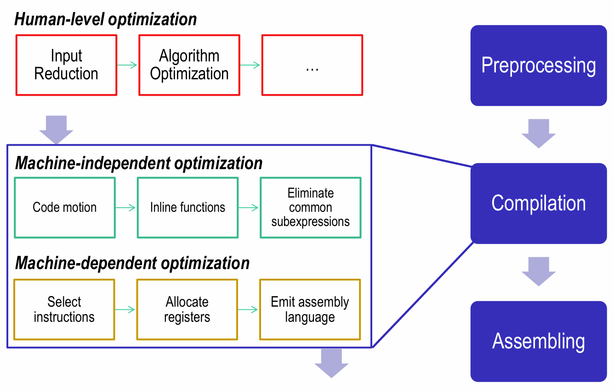

# Chapter  5.1 Capabilities and Limitations of Optimizing Compilers

## Introduction

一个好的程序不仅要保证正确和具有良好的可读性，在很多情况下，让程序运行得快也是一个重要的考虑因素。本章我们将探讨如何使用几种不同类型的程序优化技术，使程序运行得更快。这意味着我们要理解优化编译器的能力和局限性，从而编写出编译器能够有效优化以转换成高效可执行代码的源代码。

## Goals and Capabilities of compiler optimization

一般来说，编译器优化的目的有：**使指令数达到最小**，**避免等待内存**和**避免产生分支**。

大多数编译器向用户提供了一些对它们所使用的优化的控制，如指定优化级别。在GCC中，以命令行选项“-Og”调用GCC是让其使用一组基本的优化，以选项“-O1”或更高的“-O2”和“-O3”会让它使用更大量的优化。这样做可以进一步提高程序的性能，但也可能增加程序的规模。

现代编译器会运用复杂精细的算法来确定一个程序中计算的是什么值，以及它们是如何被使用的。然后会利用一些机会来简化表达式，如在几个不同的地方使用同一个计算，以及降低一个给定的计算必须被执行的次数。接下来我们举例说明编译器都能为我们做出哪些优化。

### Constant Folding

任何常数表达式都可以被编译器直接计算出来，有时甚至不需要调用库函数。

例如：

```C
int f(int num) 
{
    return num + 4337651 * 2;
}

int mul_twice(int num) 
{
    return f(f(num));
}
```

上面这段代码在“-O1”优化下产生的汇编代码如下：
```C
f:
        lea     eax, [rdi+8675302]
        ret
mul_twice:
        lea     eax, [rdi+17350604]
        ret
```
可见有关常数的计算，编译器会直接将其优化为具体值。

甚至对于一些调用了库函数的常数计算指令，编译器仍然可以优化，例如：

```C
int length(int namelen)
{
    namelen = strlen("Harry Bovik");
    return namelen;
}
```
“-O1”优化结果如下；

```C
length:
        mov     eax, 11
        ret
```

本质上，常量字符串的长度就是一个常数，因此仍然可以采用常量折叠的方法优化。

###  Share Common Subexpressions

当函数中存在一些相同的计算时，编译器会将其优化为只计算一次，然后将所得结果在各表达式中共享，以减少计算次数。下面是一个简单的例子：

```C
int CSE (int num)
{
    return num * num + num * num;
}
```
“-O1”优化结果如下：

```C
CSE:
        imul    edi, edi
        lea     eax, [rdi+rdi]
        ret
```

很明显，在上面的函数体中有两次完全相同的乘法运算num*num，而编译器将其优化为只计算一次，然后把计算结果共享。

### Optimization Example: Bubblesort

了解了编译器优化的主要方式，下面我们以冒泡排序程序为例来看看编译器的优化能力。

```C
void bubbleSort(int *A,int n,int i,int j)
{
    
    for (i = n-1; i >= 1; i--) 
    {
        for (j = 1; j <= i; j++)
        if (A[j] > A[j+1]) 
        {
            int temp = A[j];
            A[j] = A[j+1];
            A[j+1] = temp;
        }
    }
}
```

用伪代码表述的原始的汇编代码如下：

<div align="center">

</div>

下面就是编译器大展身手的时刻，仅仅通过我们上面讲的减少冗余的方法，此程序最终优化的结果如下：

```C
    i := n-1
L5: if i<1 goto L1
    t2 := 0
    t6 := 4
    t19 := i << 2
L4: if t6>t19 goto L2
    t3 := A[t2]
    t7 := A[t6] 
    if t3<=t7 goto L3
    A[t2] := t7
    A[t6] := t3
L3: t2 := t2+4
    t6 := t6+4
    goto L4
L2: i := i-1
    goto L5
L1:
```

可以看到，程序优化后，外层循环指令数从29减少到15，内层循环指令数由25减少到9，效果显著。


## Limits to compiler optimization

编译器优化也有很多局限性。

* 编译器优化无法改变算法的渐进复杂度。（只能优化常数，不过常数也可以产生很大的影响！）

* 编译器必须很小心地对程序只使用安全的优化，禁止对程序行为做出改变。所以在不确定程序员意图的情况下，编译器只能**保守**地优化。

* 每次只能分析一个函数（除非使用内联）。

* 无法预料运行时的输入情况。

## Multiple Levels of Optimizations

下图展示了不同层面的程序优化：

<div align="center">

</div>

编译器对程序进行的优化分为机器无关优化（Machine-independent optimizations）和机器相关优化（Machine-dependent optimizations）。我们前面介绍的都属于机器无关优化，主要优化在中间代码。由于编译器优化的局限性，程序员在编写程序的过程中也要进行代码优化。我们将在下一节详细介绍编译器优化受限情况下的代码优化方法。

------

© 2025. ICS Team. All rights reserved.