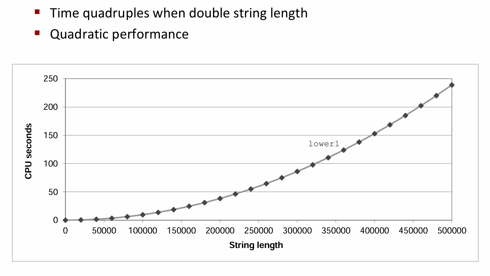
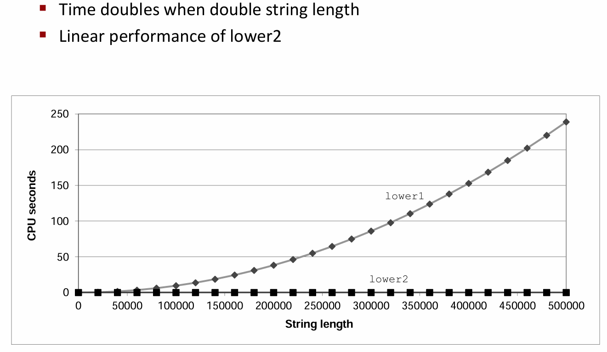

# Chapter  5.2 Optimization Blocker

前面我们提到，当编译器不确定程序员的意图时，它会十分保守地进行优化。所以为了使程序性能更优，程序员自己也需要显式地对程序进行优化。

## Procedure Calls

程序中的过程调用会带来意想不到的巨大开销，而且由于编译器的“保守性”，过程调用往往会妨碍大多数形式的程序优化。因此在编写程序的过程中，要减少不必要的过程调用。

下面以一个具体例子来说明，该代码实现了把字符串中所有大写字母变为小写字母：
```C
void lower(char *s)
{
 size_t i;
 for (i = 0; i < strlen(s); i++)
 if (s[i] >= 'A' && s[i] <= 'Z')
 s[i] -= ('A' - 'a');
}
```
下图展示了随着字符串长度的增加，该函数运行时间的变化。

<div align="center">

</div>

很明显，lower函数曲线图随字符串长度的增加上升地很陡峭，它的算法复杂度是\\(O(n^{2})\\)。这显然是不可接受的。

问题在于，我们实际上每一次循环都调用了strlen这个函数，所以产生了二次的运行时间。但事实上，字符串的长度是固定的，我们只需要在进入循环前算一次就可以了。因此改进代码如下：

```C
void lower(char *s)
{
 size_t i;
 size_t len = strlen(s);
 for (i = 0; i < len; i++)
 if (s[i] >= 'A' && s[i] <= 'Z')
 s[i] -= ('A' - 'a');
}
```
对比一下改进前后的算法性能：

<div align="center">

</div>

这样一来，我们仅仅只是做了这么一个小小的改变，算法的运行时间就变成了线性的，性能得到了显著改进。

##  Memory Aliasing

**内存别名使用**（memory aliasing）是指两个指针可能指向同一个内存位置的情况，尽管程序员的本来意图并非如此，但是在保证安全优化的前提下，编译器必须假设不同的指针可能会指向内存中同一个位置。这使得编译器无法做出一些我们期望的优化。此时便又需要程序员显式地优化代码，以提高程序性能。

考虑下面这段代码，它实现了将矩阵a的每一行元素求和存储到向量b中：

```C
void sum_rows1(double *a, double *b, long n) 
{
  long i, j;
  for (i = 0; i < n; i++) 
  {
    b[i] = 0;
    for (j = 0; j < n; j++)
      b[i] += a[i*n + j];
  }
}
```

对应汇编代码如下：

```C
 # sum_rows1 inner loop
 .L4:
        movsd   (%rsi,%rax,8), %xmm0   # FP load
        addsd   (%rdi), %xmm0          # FP add
        movsd   %xmm0, (%rsi,%rax,8)   # FP store
        addq    $8, %rdi
        cmpq    %rcx, %rdi
        jne     .L4
```

从汇编中我们可以看出，编译器对b[i]的操作是每次循环都要访问内存进行更新，这是我们非常不想看到的，因为内存操作很慢。产生这个结果的原因就是内存别名使用，编译器必须考虑对b[i]的修改可能对整个程序的内存产生的影响。

因此，当我们去掉内存别名使用，用一个临时变量来替代直接赋值后：

```C
void sum_rows2(double *a, double *b, long n) 
{
  long i, j;
  for (i = 0; i < n; i++) 
  {
    double val = 0;
    for (j = 0; j < n; j++)
      val += a[i*n + j];
    b[i] = val;
  }
}
```

汇编代码变成了下面的样子：

```C
 # sum_rows2 inner loop
 .L10:
        addsd   (%rdi), %xmm0 # FP load + add
        addq    $8, %rdi
        cmpq    %rax, %rdi
        jne     .L10
```

是不是清爽多了！现在就不用再存储每一次的值到内存了。因此，在程序中避免内存别名使用也是一个提升程序性能的好方法。


------

© 2025. ICS Team. All rights reserved.