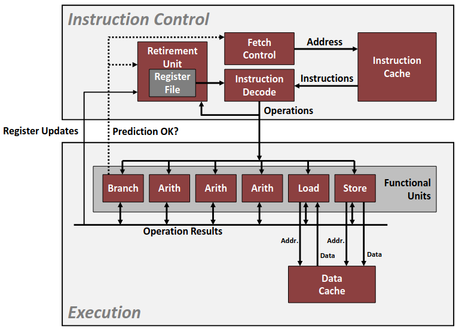
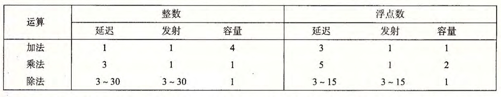
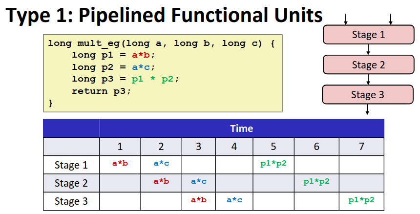

# Chapter  5.3 Understanding Modern Processors

在前面两节我们介绍了一些通用的优化手段，这些手段不依赖与机器处理器具体的指令实现。为了进一步优化程序性能，了解处理器的一些基本知识十分重要。

## Modern CPU Design

<div align="center">

</div>

如图所示是一个简化现代 CPU 的概念图，但足以让我们对 CPU 有一个基本的了解。这其中的大部分部件我们在以前已经介绍过了，寄存器、高速缓存等等。

其中的**功能单元**就是执行 CPU 算数运算等等功能的单元，想要优化程序性能，那么我们希望在相同时间类执行更多的加法乘法等等，就势必要压榨有限的功能单元。

为了衡量一些功能单元的运行效率，我们通过每个操作所需要的**CPE**值来衡量每个运算所需要的时间，下图展示了参考机操作的延迟，发射时间以及容量。延迟是指完成运算所需要的总时间；发射时间表示两个同类型的运算之间需要的最小间隔时钟周期数；容量是指能够执行该运算的动能单元数。

<div align="center">

</div>

## Pipelined Functional Units

由于延迟而产生的延迟界限给出了任何必须按照严格顺序完成合并运算的函数所需要的最小的 CPE。然而并不是所有指令必须严格按照顺序执行，部分运算指令可以**并行**，这就给了我们优化空间。

**流水线技术**：一个相对复杂的运算（如乘法）需要多个时钟周期，如果将这个运算划分为多个阶段，在功能单元中也分阶段处理，那么对于多个没有数据依赖的运算，我们不必等到上一个运算延迟时间结束，而是在上一个运算第一个阶段结束，就可以把下一个运算加入功能单元进行第一阶段运算。这个优化方法就是流水线技术。

<div align="center">

</div>

可以看到由于 ```p1=a*b p2=a*c``` 由于两个乘法没有数据的依赖可以并行，本来需要六个 CPE来执行的两个乘法指令，在外部看来仅用了四个 CPE 就完成了。然而 ```p3=p1*p2``` 必须等到前两个乘法得到结果后才可以进行，无法并行。

## Throughput Bound

通过流水线技术我们可以突破延迟界限，但仍有界限在我们面前：**吞吐量界限**。由于每个指令都有发射时间，所以无论怎样并行都会受到数据读取与存储速度的限制，这个限制就被称为吞吐量界限。


------

© 2025. ICS Team. All rights reserved.