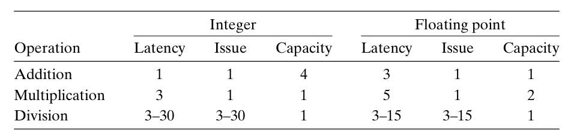

# Chapter  5.3 Understanding Modern Processors

我们前面两小节介绍的都是不依赖于目标机器特性的优化（Machine-independent Optimization），这些优化只是简单地降低了过程调用的开销，以及消除了一些重大的妨碍优化的因素。要想进一步提高性能，我们必须考虑利用处理器微体系结构的优化。我们接下来介绍的基于处理器底层设计的代码优化方法（Machine-dependent Optimization）在很大一类处理器上都能实现整体性能提高，虽然具体性能结果不一定完全相同，但操作和优化的通用原则对各种各样的机器都适用。

现代处理器复杂而精妙的微体系结构使得在实际操作中，处理器是同时对多条指令求值的，这种现象称为**指令级并行**（Instruction-level Parallelism）。相对应的，我们发现存在两种下界描述了程序的最大性能。当一系列操作必须按照严格顺序执行时，就会遇到**延迟界限**（Latency Bound），当代码中的数据相关限制了处理器利用指令级并行的能力时，延迟界限就成为程序性能的限制。而**吞吐量界限**（Throughput Bound）则刻画了处理器功能单元的原始计算能力，它是程序性能的终极限制。

本课程不涉及现代微处理器的详细设计，但大致了解这些微处理器运行的原则就可以理解它们如何实现指令级并行，以便我们更好的利用指令级并行优化程序性能。

## Modern CPU Design

下图是现代微处理器的一个简化示意图：

这种类型的处理器可以在每个时钟周期执行多个操作，称为**超标量**（superscalar），且执行是乱序的，即指令执行的顺序不一定与它们在机器级程序中的顺序一致。

从图中我们可以看到，整个设计有两个主要部分：

* **指令控制单元**（Instruction Control Unit, ICU）：负责从内存中读取指令序列，并根据这些指令序列生成一组针对程序数据的基本操作。

* **执行单元**（Execution Unit, EU）：负责执行这些操作。

通常情况下，ICU会在当前正在执行的指令很早之前从指令高速缓存（instruction cache）中读取指令，这样它才有足够的时间对指令译码，并把操作发送到EU。而EU通常每个时钟周期会接收多个操作，它们会被分派到一组**功能单元**中去执行。这些功能单元专门用来处理不同类型的操作。而通过利用功能单元的一些特性就可以实现指令级并行。

## Functional Unit

以Intel Core i7 Haswell参考机为例，它有8个功能单元（其中整数运算指的是加法、位级操作和移位等基本操作）：

0. 整数运算、浮点乘、整数和浮点数除法、分支 
1. 整数运算、浮点加、整数乘、浮点乘 
2. 加载、地址计算 
3. 加载、地址计算 
4. 存储 
5. 整数运算 
6. 整数运算、分支 
7. 存储、地址计算

从中我们可以发现，功能单元的各种组合具有同时执行多个同类型操作的潜力：它有4个单元能执行整数操作，2个单元能执行加载操作，2个单元能执行浮点乘法。这种特性意味着我们可以实现多条同类型指令并行处理。

同时，各种类型的操作有不同的性能，下图提供了参考机各操作的延迟、发射时间和容量特性。

> 注：
>
> **延迟**（latency）表示完成运算所需要的总时间。
> **发射时间**（issue time）表示两个连续的同类型的运算之间需要的最小时钟周期数。
> **容量**（capacity）表示能够执行该运算的功能单元的数量。

我们看到，从整数运算到浮点运算，延迟增加。同时，加法和乘法运算的发射时间都为1，即在每个时钟周期，处理器都可以开始一条新的这样的运算。这种很短的发射时间是通过使用**流水线**实现的。流水线化的功能单元实现为一系列的阶段，每个阶段完成一部分的运算。但只有当要执行的运算是连续的、逻辑上独立的时候才能利用这种功能。

利用功能单元的流水线化和同类型操作指令并行的特性，我们就能够突破延迟界限，实现更进一步的程序性能优化。

------

© 2025. ICS Team. All rights reserved.