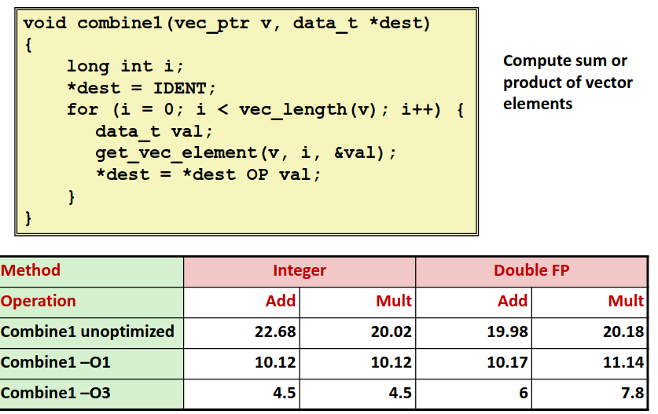
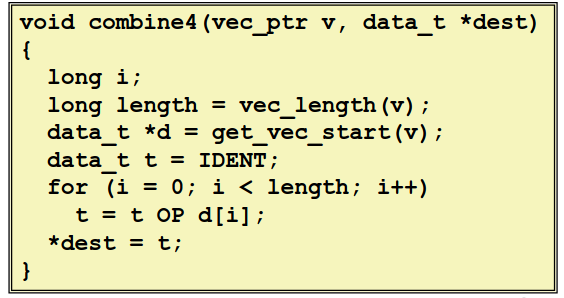
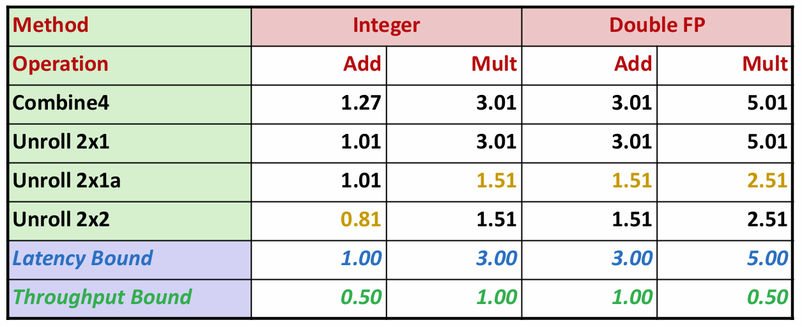
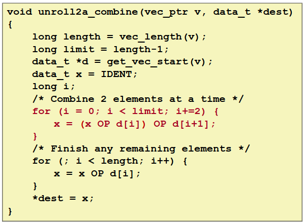
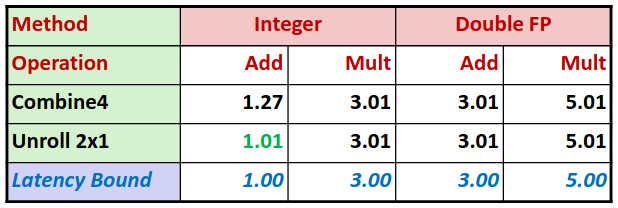
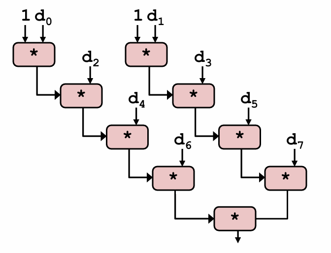
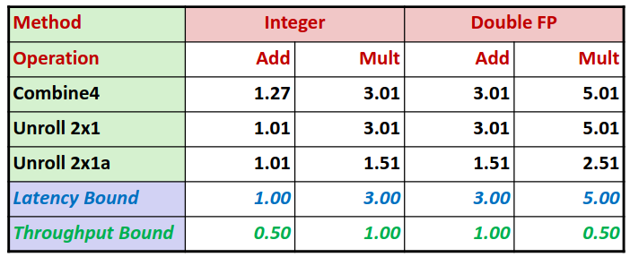
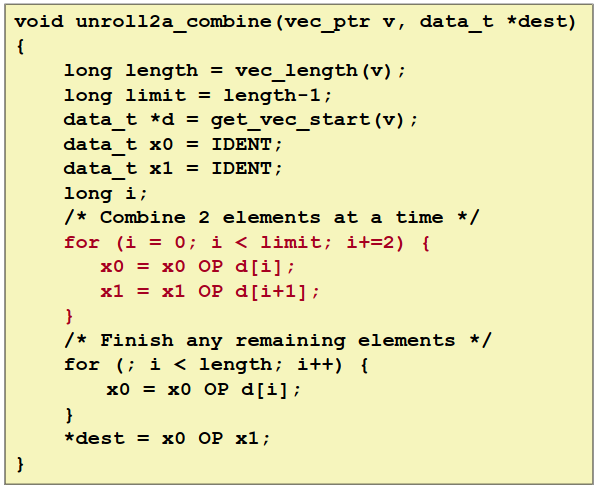
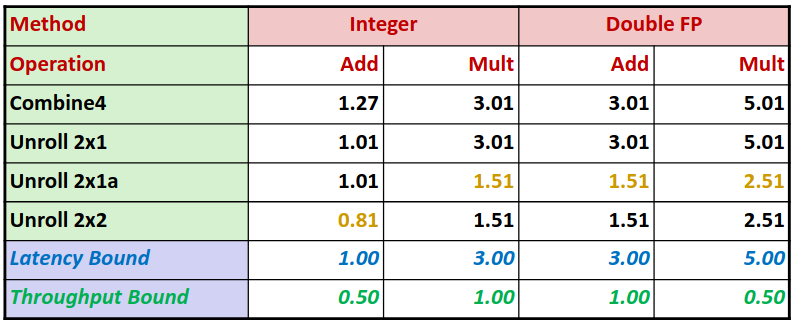
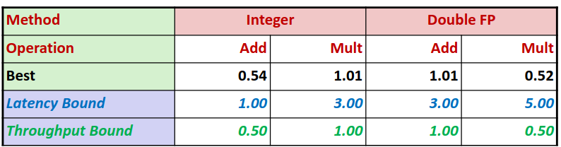

# Chapter  5.4 Loop Unrolling

在上一节中我们介绍了现代 CPU 的一些优化手段。在这一节中我们将利用上一节学习的知识优化一个简单的代码。

我们先来看未经过优化的初始版本。其中的 OP 代表程序测试的一种运算，data_t 代表一种类型，我们分别测试整型与浮点数在加法与乘法运算下的 CPE，衡量运行速度。

可以看到没有经过优化的程序 CPE 非常大，通过编译器的优化选项就可以大幅优化程序性能，但编译器的优化选项人人都会开，我们还要更进一步。

可以看到利用第二节中机器无关的优化，有些明显的优化点。

可以看到我们做了简单的代码移动以及减少函数调用以后，整个程序性能大幅优化！甚至逼近了延迟界限。但为什么整数加法仍和延迟界限有一定差距呢？

这个答案也很简单，我们**循环过程本身也有开销**，而对于整数乘法以及浮点数运算由于运算本身的开销远大于循环的开销，而整数加法的开销本身较小，循环本身的开销就更为突出了。

那么优化方法很简单，既然循环有开销，我就减少循环的次数，在一次循环做更多的事，我们做一次最为简单的**循环展开**(2*1)

可以看到在循环展开之后，我们的 CPE 几乎就等于延迟界限，那么我们能打破延迟界限吗？

显然是可以的，其实在上一节中我们已经有所提及，利用**指令集并行，流水线技术**。那么为什么我们先前的代码受制于延迟界限了呢？核心在于运算有数据依赖，即下一步参与运算的数据是上一步的结果，我们消除这个依赖性。

可以看到通过并行的手段我们进一步加快了运行效率。如果我们进一步消除依赖性，将算式拆分为两个部分。

通过进一步循环展开，我们突破了延迟界限。这里只是 2*2 的展开，我们可以进一步到 K\*K 的展开，得到极致的性能。

几乎等同于吞吐量界限的执行效率！我们还能进一步优化吗？受到吞吐量界限的限制，那么我能不能一次性读入更多数据呢？利用 CPU 中的**浮点数寄存器**，**"Programming with AVX2"**。在一些游戏引擎、高性能计算中会用到这种技术，本文不再过多的介绍。

------

© 2025. ICS Team. All rights reserved.
