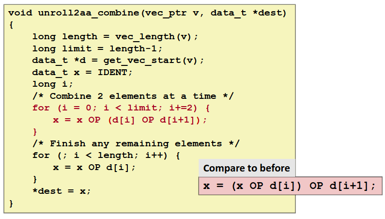
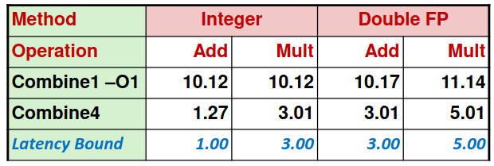

# Chapter  5.4  Instruction-Level Parallelism

本节我们会基于一个合并运算的代码，使用不同的方法对其进行一系列的优化，并使用**每元素的周期数**（Cycles Per Element, CPE）作为表示程序性能的度量标准。

该代码使用某种运算，将一个向量中所有的元素合并为一个值，其初始实现如下：

```C
void combine1(vec_ptr v, data_t *dest)
{
    long i;
    *dest = IDENT;
    for (i = 0; i < vec_length(v); i++) 
    {
        data_t val;
        get_vec_element(v, i, &val);
        *dest = *dest OP val;
    }
}
```

其中常数IDENT和操作OP由编译时的不同定义来决定：

* `#define IDENT 0`和`#define OP +`表示对向量元素求和。

* `#define IDENT 1`和`#define OP *`表示计算向量元素的乘积。

通过进行我们前面介绍的最基础的机器无关优化，包括编译器自行优化，消除循环的低效率（代码移动）和减少内存引用，我们可以很轻松地将代码优化为下面这个版本：

```C
void combine4(vec_ptr v, data_t *dest)
{
  long i;
  long length = vec_length(v);
  data_t *d = get_vec_start(v);
  data_t acc = IDENT;
  for (i = 0; i < length; i++)
      acc = acc OP d[i];
  *dest = acc;
}
```

程序性能的变化如下：

<div align="center">

</div>

事实上，经过基础优化的代码已经接近延迟界限，参考上一节我们介绍的参考机各操作的延迟：

Integer Add  |Integer Multiply     |Single/Double FP Add|Single/Double FP Multiply
:-----------:|:-------------------:|:------------------:|:------------------------:
1            |3                    |3                   |5   

对比之下，细心的你可能会产生一个疑问：为什么整数乘法（3.01 vs 3）、浮点数加法（3.01 vs 3）和乘法（5.01 vs 5）都逼近延迟界限，但整数加法（1.27 vs 1）似乎还留有余地呢？这和循环开销有关，一般来说，循环次数越多，开销越大。由于整数乘法和浮点数运算循环本身开销较大，循环带来的额外开销对它们影响并不明显；但由于整数加法本身开销小，所以循环的额外开销就会显著地影响到整数加法的性能。因此我们采用循环展开的方法进行优化。

## Loop Unrolling

循环展开是一种程序变换，通过增加每次迭代计算的元素的数量，减少循环的迭代次数。

针对前例，我们可以使用2x1循环展开，即每次循环处理两个元素。

```C
void combine5(vec_ptr v, data_t *dest)
{
    long length = vec_length(v);
    long limit = length-1;
    data_t *d = get_vec_start(v);
    data_t acc = IDENT;
    long i;
    /* Combine 2 elements at a time */
    for (i = 0; i < limit; i+=2) 
    {
        acc = (acc OP d[i]) OP d[i+1];
    }
    /* Finish any remaining elements */
    for (; i < length; i++) 
    {
        acc = acc OP d[i];
    }
    *dest = acc;
}
```

让我们再看一看程序性能：

<div align="center">

</div>

现在所有的操作都达到了延迟界限！

但是这还不够，我们的目标是突破延迟界限，达到吞吐量界限。循环展开无法突破延迟界限的原因是，在每次迭代中存在必须顺序执行的两个乘法。因此要想突破此界限，必须要突破顺序相关，提高并行性。

## Reassociation Transformation

**重新结合变换**是一种打破顺序相关从而使性能提高到延迟界限之外的方法。

在本例中，我们仅将combine5中的语句`acc = (acc OP d[i]) OP d[i+1];`修改为`acc = acc OP (d[i] OP d[i+1]);`。即改变了括号的位置，如下：

```C
void combine6(vec_ptr v, data_t *dest)
{
    long length = vec_length(v);
    long limit = length-1;
    data_t *d = get_vec_start(v);
    data_t acc = IDENT;
    long i;
    /* Combine 2 elements at a time */
    for (i = 0; i < limit; i+=2) 
        acc = acc OP (d[i] OP d[i+1]);
    /* Finish any remaining elements */
    for (; i < length; i++)
        acc = acc OP d[i];
    *dest = acc;
}
```

你可能想问，只是括号的位置变了一下，这能有什么影响？但是当我们测量CPE时，得到令人吃惊的结果：

<div align="center">

</div>

采用2x1a展开的combine6中，整数加的性能和采用2x1展开的combine5性能相同，而其他三种情况达到了2x1展开的两倍，突破了延迟界限！

下图说明了产生该巨大影响的原因：

<div align="center">

</div>

括号位置变化后，下一次迭代中`(d[i] OP d[i+1])`可以提前进行，不需要等待前一次迭代的累积值，即突破了顺序相关性。因此，最小可能的CPE减少为原来的一半。

可以看到，重新结合变换能够减少计算中关键路径上操作的数量，通过更好地利用功能单元的流水线能力得到更好的性能。


## Multiple Accumulators

另一种方式是引入多个累积变量。由于执行加法和乘法的功能单元是完全流水线化的，理论上它们可以每个时钟周期开始一个新操作。但是在combine5中，由于我们将累积值放在一个单独的变量acc中，在前面的计算完成之前，都无法计算acc的新值。虽然计算acc新值的功能单元能够每个时钟周期开始一个新的操作，但是由于这种顺序依赖，它只能每L个周期开始一条新操作（L是合并操作的延迟）。

在本例中，我们引入两个累积变量来打破这种顺序相关，将一组合并运算分割成两个部分，并在最后合并结果，并称之为2x2展开。

```C
void combine7(vec_ptrv,data_t*dest)
{
  long i;
  long length=vec_length(v);
  long limit=length-1;
  data_t* data=get_vec_start(v);
  data_t acc0=IDENT;
  data_t acc1=IDENT;
 
  /*Combine 2 elements at a time*/
  for(i=0;i<limit;i+=2)
  {
     acc0=acc0 OP data[i];
     acc1=acc1 OP data[i+1];
  }
 
  /*Finish any remaining elements*/
  for(;i<length;i++)
     acc0=acc0 OP data[i];
  *dest=acc0 OP acc1;
}
```

采用2x2展开的combine7版本的实际运行过程如下：

<div align="center">

</div>

我们引入的两个累积变量使它能够同时利用两个加载功能单元，处理器不再需要延迟一个加法或乘法操作以等待前一个操作完成。这实际上形成了两条独立的操作流，一条处理偶数索引的计算，一条处理奇数索引的计算。

我们的程序性能也因此得到了更进一步的提升：

<div align="center">

</div>

这一次，除了整数乘、浮点数加乘和2x1a展开的combine6版本性能相同外，整数加法性能又得到了提升。

重复实验结果表明，采用上述两种方法，我们的合并函数最终能达到下面的性能：

<div align="center">

</div>

即使用以上优化技术，程序的CPE已经接近于吞吐量界限。

------

© 2026. ICS Team. All rights reserved.
