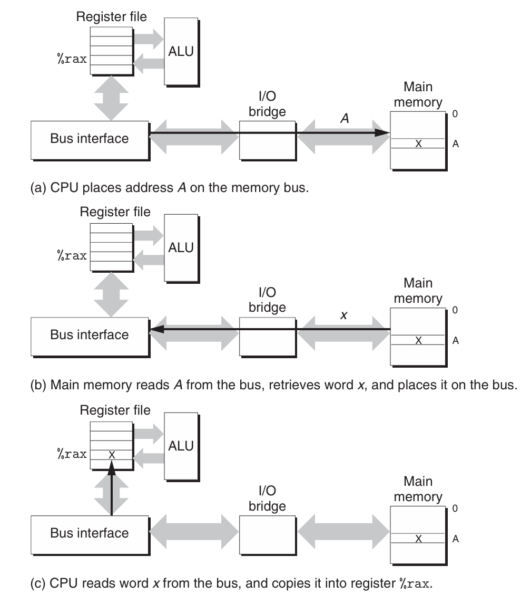
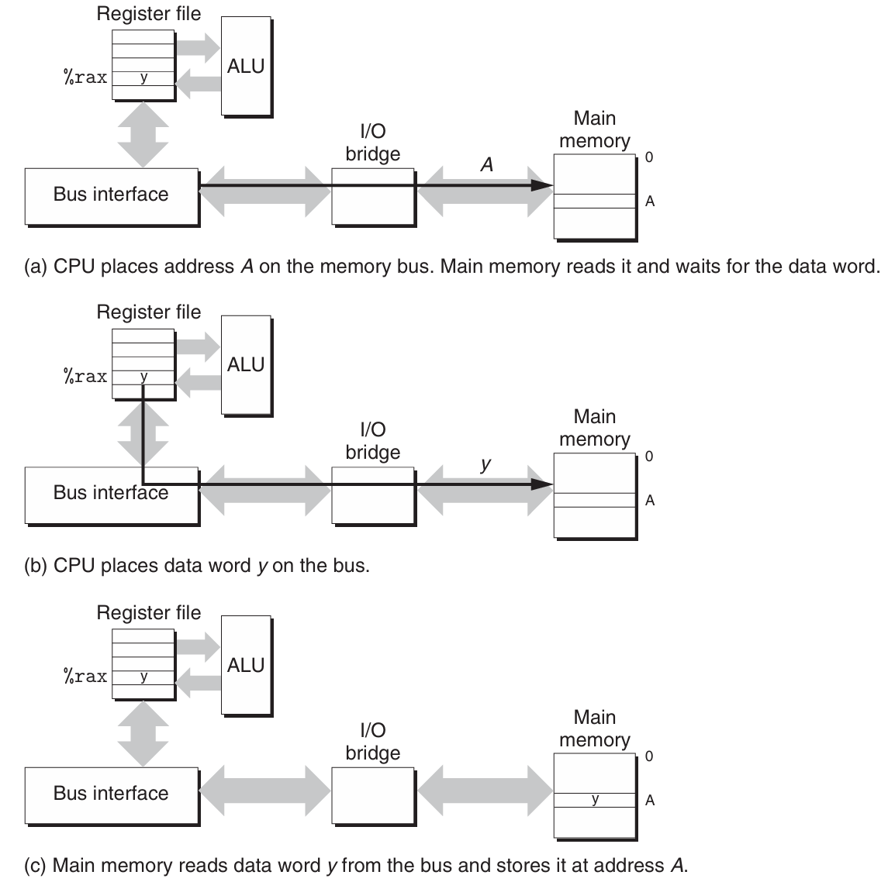
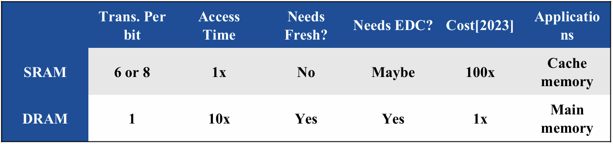
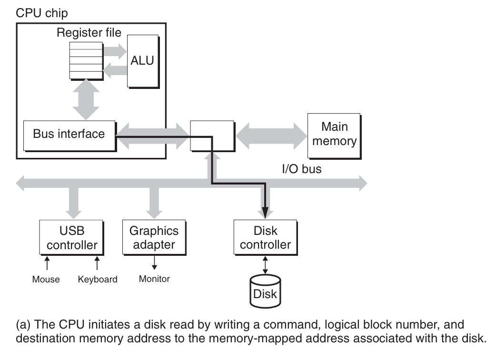
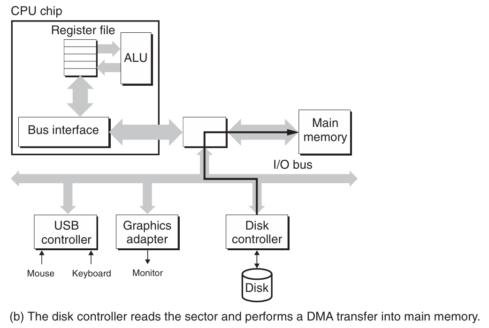
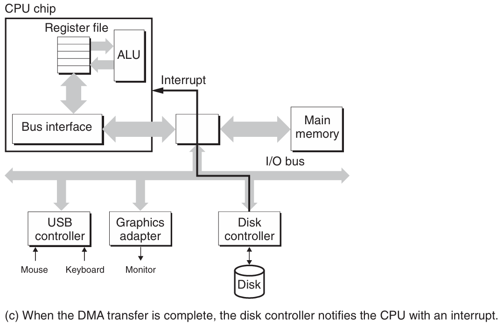
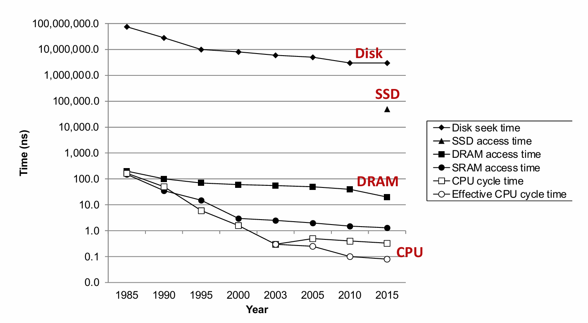

# Chapter 6.1 Storage Technologies

## Introduction

到目前为止，在对系统的研究中，我们都是依赖一个简单的计算机系统模型，即存储器系统是一个线性的字节数组，而CPU能够在常数时间内访问每个存储器位置。虽然它迄今为止似乎仍然有效，但它并不能反映现代系统实际工作的方式。

实际上，存储器系统是一个具有不同容量、成本和访问时间的存储器设备的层次结构。它的整体效果是一个大的存储器池，其成本与层次结构底层最便宜的存储设备相当，但是却以接近于层次结构顶部存储设备的高速率向程序提供数据。

本章将带领大家进入到存储器层次结构的世界，深入了解相应的存储技术、分析程序的局部性，以及学习如何改进你的程序性能。随着学习的深入，你将体会到存储器层次结构的设计是多么的优美与精妙，它突破了物理结构的限制，~~从而导致物理学家失业。😏~~


##  The Memory Abstraction

数据流通过称为**总线**（bus，是一组并行的导线，能携带地址、数据和控制信号）的共享电子电路在处理器和DRAM主存之间来来回回。每次CPU和主存之间的数据传送都是通过一系列步骤来完成的，这些步骤称为**总线事务**（bus transaction）。读事务（read transaction）从主存传送数据到CPU，写事务（write transaction）从CPU传送数据到主存。

### Read Transaction

当CPU执行一个如下加载操作时：

```C
movq A,%rax
```

这里，地址A的内容被加载到寄存器%rax中。CPU芯片上的**总线接口**（bus interface）的电路在总线上发起读事务。

读事务由三个步骤组成：

1. CPU将地址A放在系统总线上，I/O桥将信号传递到内存总线。

2. 主存从内存总线读出地址，从DRAM取出数据字，并将数据写到内存总线。I/O桥将内存总线信号翻译成系统总线信号，然后沿着系统总线传递。

3. CPU从总线上读数据，并将数据复制到寄存器%rax。

该过程如下图所示：

<div align="center">

</div>

### Write Transaction

反过来，当CPU执行如下的存储操作时：

```C
movq %rax,A
```

这里，寄存器%rax的内容被写到地址A，CPU发起写事务。同样由三个基本步骤，如下图所示：

<div align="center">

</div>

## Random-Access Memory

**随机访问存储器**（Random-Access Memory, RAM）分为两类，静态RAM（SRAM）和动态RAM（DRAM）。

* SRAM将每个位存储在一个双稳态的（bistable）存储器单元里，每个单元用一个六晶体管电路来实现。由于其双稳态特性，只要有电，它就会永远保持它的值。即使有干扰来扰乱电压，当干扰消除时，电路就会恢复到稳定值。

* DRAM将每个位存储为对一个电容的充电。它的每个单元由一个电容和一个访问晶体管组成，所以可以制造得很密集，但是DRAM存储器单元对干扰非常敏感，当电容的电压被扰乱后，它就永远不能恢复了。

<div align="center">

</div>

总的来说，SRAM比DRAM更快，但也更贵。SRAM用来作为高速缓存存储器，既可以在CPU芯片上，也可以在片外。DRAM用来作为主存以及图形系统的帧缓冲区。

```admonish info
DRAM有许多种增强版，它们都是基于传统的DRAM单元，进行一些接口逻辑和I/O的优化，提高访问DRAM基本单元的速度。如同步DRAM（SDRAM），双倍数据速率同步DRAM（DDR SDRAM）等。
```

## Disk Storage

磁盘是广为应用的保存大量数据的存储设备，它存储数据的数量级可达几百到几千GB（gigabyte），不过，从磁盘上读信息的时间比DRAM慢了10万倍，比SRAM慢了100万倍。

* 磁盘构造：磁盘是由**盘片**（platter）构成的。每个盘片有两面，称为**表面**（surface），表面覆盖着磁性记录材料。盘片中央有一个可以旋转的**主轴**（spindle），它使得盘片以固定的旋转速率旋转。磁盘包含一个或多个这样的盘片，并封装在一个密封容器内。典型的磁盘表面是由一组称为**磁道**（track）的同心圆组成的，每个磁道被划分为一组**扇区**（sector）。每个扇区包含相等数量的数据位。

* 磁盘容量：磁盘容量由以下技术因素决定：记录密度（recording density），磁道密度（track density）和面密度（areal density）。

* 磁盘操作：磁盘用**读/写头**（read/write head）来读写存储在磁性表面的位，而读写头连接到一个**传动臂**（actuator arm）一端。通过沿着半径轴前后移动这个传动臂，驱动器可以将读/写头定位在盘面的任何磁道上。这样的机械运动称为**寻道**（seek）。一旦读/写头定位到了期望的磁道上，那么当磁道上的每个位通过它的下面时，读/写头可以感知到这个位的值（读该位），也可以修改这个位的值（写该位）。磁盘以扇区大小的块来读写数据。对扇区的访问时间（access time）有三个主要的部分，分别是寻道时间（seek time），旋转时间（rotational latency）和传送时间（transfer time）。

* 访问磁盘：CPU使用一种称为**内存映射I/O**（memory-mapped I/O）的技术来向I/O设备发射命令。在使用内存映射I/O的系统中，地址空间中有一块地址是为与I/O设备通信保留的。每个这样的地址称为一个I/O端口（I/O port）。当一个设备连接到总线时，它与一个或多个端口相关联。当磁盘控制器收到来自CPU的读指令后，它将逻辑块号翻译为一个扇区地址，读该扇区的内容，然后将这些内容直接传送到主存，不需要CPU的干涉，即**直接内存访问下的数据传送**（DMA transfer）。在DMA传送完成，磁盘扇区的内容被安全地储存在主存中以后，磁盘控制器通过给CPU发送一个中断信号来通知CPU。这使得CPU暂停它当前正在做的工作，跳转到一个操作系统例程。这个程序会记录下I/O已经完成，然后将控制返回的CPU被中断的地方。

磁盘访问过程如下图所示：

<div align="center">

</div>

<div align="center">

</div>

<div align="center">

</div>

## Solid State Disks

**固态硬盘**（SSD）是一种基于**闪存**（flash memory，一类非易失性存储器）的存储技术，在某些情况下成为传统旋转磁盘的替代产品。

一个SSD封装由一个或多个闪存芯片和**闪存翻译层**（flash translation layer）组成，闪存芯片替代传统旋转磁盘中的机械驱动器，而闪存翻译层是一个硬件设备，扮演与磁盘控制器相同的角色，将对逻辑块的请求翻译成对底层物理设备的访问。

比起旋转磁盘，SSD有很多优点。它的随机访问时间比旋转磁盘更快，能耗更低，同时也更结实。（现在的电脑可再也不会晃着晃着就晃坏了🤣）但是，SSD的缺点是在反复写之后容易磨损（但其实要很多年才会磨损坏……），并且它的价格也较贵（不过现在SSD和旋转磁盘的价格差越来越小了……）。

这么看来，SSD优点还是远大于缺点的。如今，SSD在便携音乐设备中已经完全取代了旋转磁盘，在笔记本电脑中也越来越多地作为硬盘的替代品，甚至在台式机和服务器中也开始出现了。

##  Storage Technology Trends

从以上我们对存储技术的讨论中，可以总结出几个重要的思想：

* 不同的存储技术有不同的价格和性能折中。

* 不同存储技术的价格和性能属性以截然不同的速率变化着。

* DRAM和磁盘的性能滞后于CPU的性能。

从下图我们可以清楚地看出磁盘、DRAM和CPU速度之间逐渐增大的差距：

<div align="center">

</div>

不过，办法总比困难多！现代计算机频繁地使用基于SRAM的高速缓存来弥补处理器-内存之间的差距，这种方法之所以可行是因为应用程序的一个称为**局部性**（locality）的基本属性，我们将在下一节讨论这个问题。

------
© 2025. ICS Team. All rights reserved.
