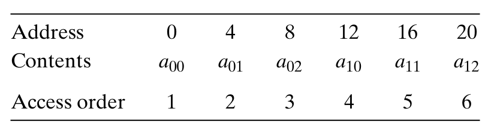
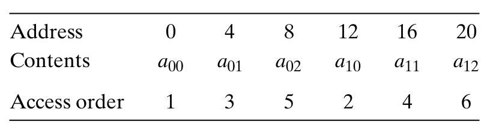

# Chapter 6.2 Locality

一个编写良好的计算机程序常常具有良好的**局部性**（locality）。也就是说，它们倾向于引用邻近于其他最近引用过的数据项的数据项，或者最近引用过的数据项本身。这种倾向性称为**局部性原理**（principle of locality）。

局部性通常有两种不同的形式：**时间局部性**（temporal locality）和**空间局部性**（spatial locality）。

* 时间局部性：被引用过一次的内存位置很可能在不久的将来再被多次访问。

* 空间局部性：如果一个内存位置被引用了一次，那么程序很可能在不久的将来引用附近的一个内存位置。

## Locality of References to Program Data

考虑下面的一个简单函数：
```C
int sumvec(int v[N])
{
   int i,sum=0;
   for(i=0;i<N;i++)
   {
      sum+=v[i];
   }
   return sum;
}
```
这是向量v的引用模式：

<div align="center">

</div>

可以看到，向量v的元素是被顺序读取的。因此，对于变量v，函数有很好的空间局部性，但是时间局部性很差，因为每个向量元素只被访问一次。（因为对于循环体中的每个变量，这个函数要么有很好的时间局部性，要么有很好的空间局部性）所以我们可以说，sumvec函数有良好的局部性。

像sumvec这样顺序访问一个向量每个元素的函数，称其具有**步长为1的引用模式**（stride-1 reference pattern）（相对于元素的大小）。在一个连续向量中，每隔k个元素进行访问，就称为**步长为k的引用模式**。一般而言，步长越大，空间局部性越差。

下面是一个例子：

```C
int sumarrayrows(int a[M][N])
{
   int i,j,sum=0;
   for(i=0;i<M;i++)
   {
      for(j=0;j<N;j++)
      {
         sum+=a[i][j];
      }
   }
   return sum;
}
```

它的数组a的引用模式：

<div align="center">

</div>

该函数具有步长为1的引用模式，显然具有良好的空间局部性。

如果我们稍加改动，例如：

```C
int sumarrayrows(int a[M][N])
{
   int i,j,sum=0;
   for(j=0;j<N;j++)
   {
      for(i=0;i<M;i++)
      {
         sum+=a[i][j];
      }
   }
   return sum;
}
```

它的数组a的引用模式变成了：

<div align="center">

</div>

显然函数的空间局部性变得很差。虽然我们只是交换了i和j的循环，但是这却导致函数按照**列顺序**来扫描数组，由于C数组在内存中是按照**行顺序**来存放的，结果就得到了步长为N的引用模式。

## Locality of Instruction Fetches

因为程序指令是存放在内存中的，CPU必须取出这些指令。所以我们也能够评价一个程序关于取指令的局部性。例如，上例sumvec函数for循环体里的指令是按照连续的内存顺序执行的，因此循环具有良好的空间局部性。同时，因为循环体会被执行多次，所以它也具有良好的时间局部性。

------

© 2026. ICS Team. All rights reserved.