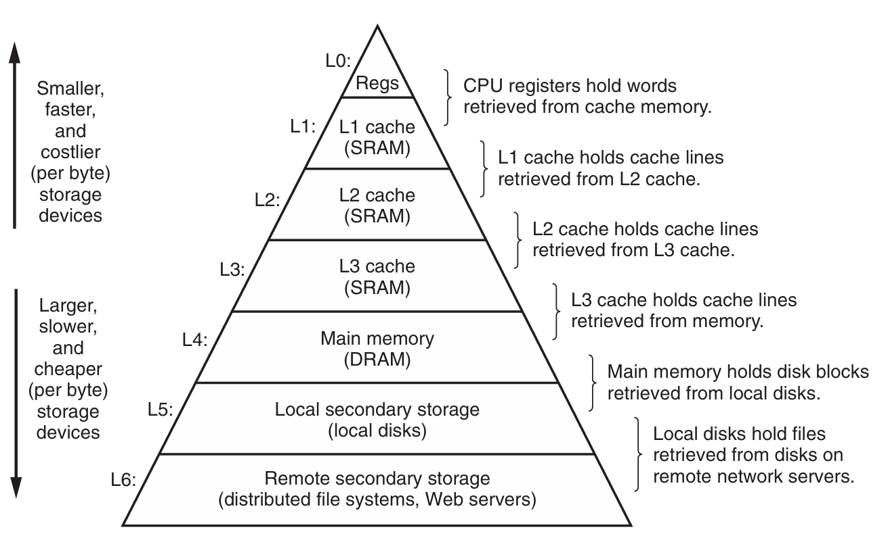

# Chapter 6.3 The Memory Hierarchy

我们在前面的两节中分别讨论了存储技术和计算机软件的一些基本属性：

* 存储技术：不同存储技术的访问时间差异很大。速度较快的技术每字节的成本要比速度较慢的技术高，而且容量较小。CPU和主存之间的速度差距在增大。

* 计算机软件：一个编写良好的程序倾向于展示出良好的局部性。

在计算机中，硬件和软件的这些基本属性互相补充地很完美，这得益于一种组织存储器系统的方法，称为**存储器层次结构**（memory hierarchy），所有的现代计算机系统中都使用了这种方法。

下图展示了一个典型的存储器层次结构：

一般而言，从高层往底层走，存储设备变得更慢、更大、更便宜。

##  Caching in the Memory Hierarchy

**高速缓存**（cache）是一个小而快速的存储设备，它作为存储在更大、也更慢的设备中的数据对象的缓冲区域。使用高速缓存的过程称为**缓存**（caching）。

存储器层次结构的中心思想是：对于每个k，位于k层的更快更小的存储设备作为位于k+1层的更大更慢的存储设备的缓存。每一层的存储器都被划分成连续的数据对象组块，称为**块**（block）。数据总是以块大小为**传送单元**（transfer unit）在第k层和第k+1层来回复制的。存储器层次结构能够成功就是因为程序具有局部性。

下面介绍几个关于缓存的概念：

### Cache Hits

当程序需要第k+1层的某个数据对象d时，它首先到当前存储在第k层的一个块中查找d。如果d刚好缓存在第k层中，这就是**缓存命中**（cache hit）。该程序直接从第k层读取d即可。

### Cache Misses

如果第k层没有缓存数据对象d，那就是**缓存不命中**（cache miss）。当发生缓存不命中时，第k层的缓存从第k+1层缓存中取出包含d的那个块，如果第k层的缓存已经满了，可能就会覆盖现存的一个块，称为**替换**（replacing）或**驱逐**（evicting）这个块，被驱逐的块被称为**牺牲块**（victim block）。决定替换哪个块是由缓存的**替换策略**（replacement policy）来控制的。

### Types of Cache Misses

* 强制性不命中（compulsory miss）/冷不命中（cold miss）：如果第k层的缓存是空的，那么对任何数据对象的访问都不会命中。它们通常是短暂的事件，不会在反复访问存储器使得**缓存暖身**（warmed up）之后的稳定状态中出现。

* 冲突不命中（conflict miss）：它是由于限制性的放置策略引起的，在这种情况中，缓存足够大，能够保存被引用的数据对象，但是因为这些对象会映射到同一个缓存块，缓存会一直不命中。

* 容量不命中（capacity miss）：这是由于**工作集**（working set，一个阶段访问缓存块的集合）的大小超过了缓存的大小而产生的。也就是说，缓存太小了，无法处理该工作集。

------

© 2025. ICS Team. All rights reserved.