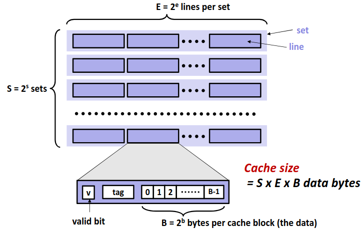
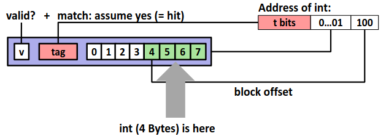
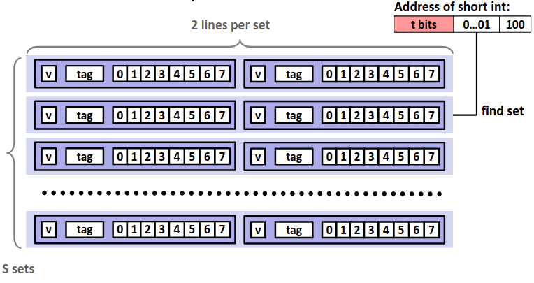
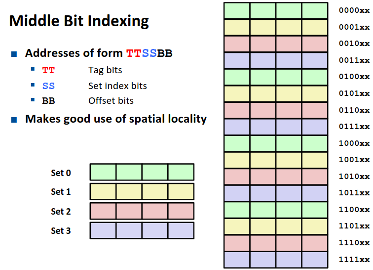
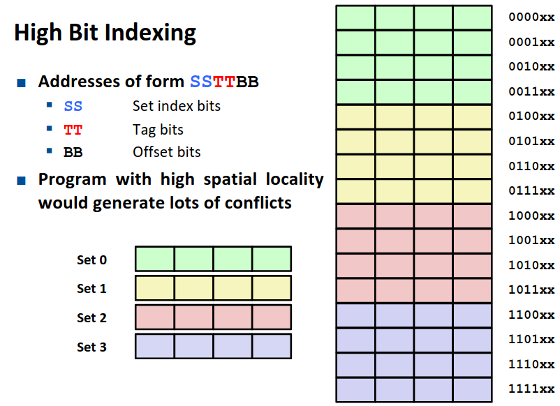
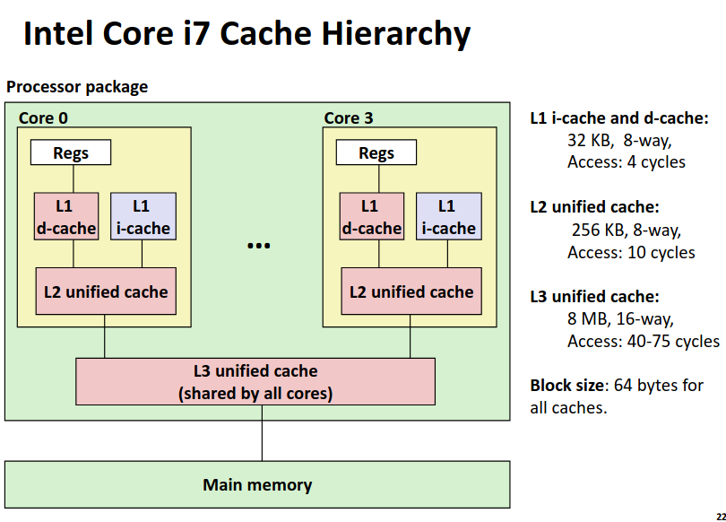

# Chapter 6.4 Cache Memories

在上一节中我们为大家介绍了存储器的层次结构，其中提及了 Cache 与一些关于高速缓存的基本概念。广义上来讲，任何更为高级的存储器都作为更第一级的存储器的高速缓存。狭义上的高速缓存特指计算机体系体系结构中 CPU 中的 SRAM 存储器: L1, L2, L3 Cache。本一节将更为详细的介绍狭义上的高速缓存。

## Generic Cache Memory Organization (S,E,B)

在现代处理器中，高速缓存通常以**高速缓存组**的形式组织在一起，一个高速缓存器有 \\(S=2^s\\) 个高速缓存组。其中每个组包含 \\(E\\) 个**高速缓存行**。每个行是由一个 \\(B=2^b\\) 字节的数据块组成。每个行中还包含一个**有效位**指明这个行是否包含有意义的信息。

那么对于一个已知的高速缓存和地址长度，我们可以根据高速缓存的特性划分地址，来确定从内存地址到高速缓存中的映射。

其中 set index 指明地址对应的组编号，而 block offset 指明数据位于块中的偏移量。而剩下的位数作为 tag 标识与组中每个行比较来指明一个组中是否有目标内存块。

## Direct-Mapped Caches (E=1)

我们先来看一个比较简单的组织方式，**直接映射**，即每个组中只有一个行。对于每次访问，我们只需要根据地址计算出组编号，比较对应高速缓存组的标识位与目标地址，如果相等那么恭喜我们缓存命中不再需要去访问内存，但如果不相等，那么我们只能去内存中并将目标地址的块取出替换掉高速缓存中的块。

显然这种方式极其容易发生冲突不命中（conflict miss）。

## Set Associative Caches

相较于直接映射，每一组不再仅有一个行，而是有多个行。这样可以有效减少 conflict miss 的次数，但是对于每次访问，我需要将目标地址的 tag 值顺序比较各个行的 tag 值，增加了电路实现的成本。

下图是一个 E=2 的高速缓存的示意图。

## Issues with Writes

每当我们向内存写入的时候，由于高速缓存的存在，我们有不同的写入策略。

如果缓存命中，我们有两种策略：

1. **Write-through**: 直接写入内存当中。

2. **Write-back**: 我们只在缓存中进行更改，当我们需要替换掉缓存中这个块时，再将这更改写入内存。这种方式需要额外的 dirty bit 去指示块是否受到更改。

如果缓存不命中，我们同样有两种策略：

1. **Write-allocate**: 我们将修改内存对应的块加载到缓存中，再在缓存中修改。

2. **No-write-allocate**: 直接对内存修改，不将块加载到缓存中。

现代处理器通常采用 **Write-back + Write-allocate** 的策略组合。

## Why Index Using Middle Bits

对于一个地址的划分，为什么我们采用中间的位作为组索引呢？由于空间局部性的存在，如果我们将中间的位作为组索引，有利于我们将一个更大的内存整体放在缓存中。

如图是我们组索引放在中间位与放在高位的对比，显然前一种方式更优。

## Anatomy of a Real Cache Hierarchy

我们展示一个典型的现代处理器中高速缓存的组织。

可以看到数据和指令在第一级缓存中是分别存储的，而第二级缓存为每个核独有并且不再区分数据与指令。第三级缓存则是所有核共有了。

------

© 2026. ICS Team. All rights reserved.