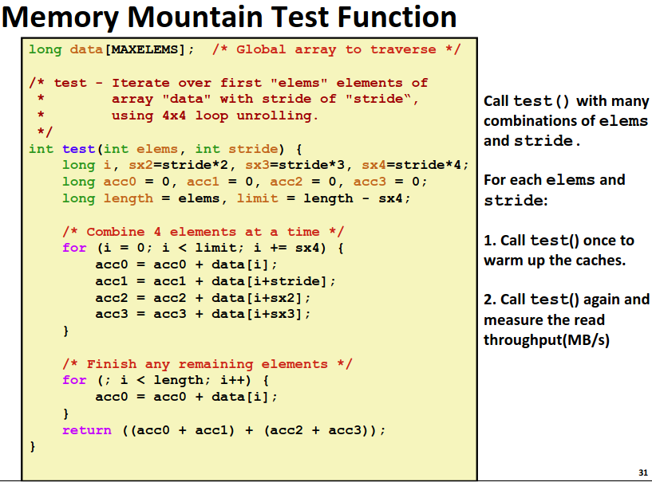
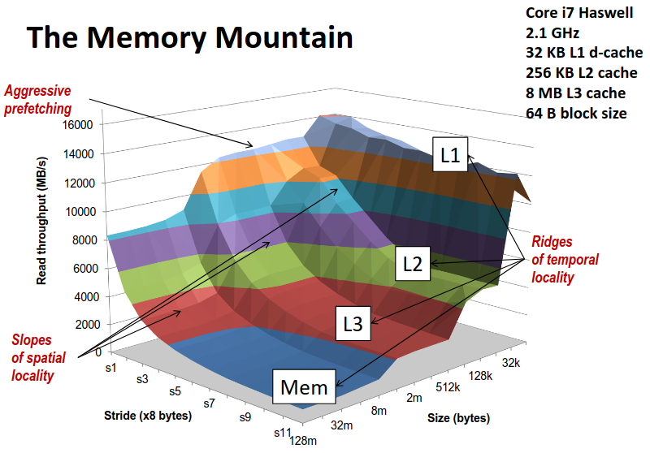
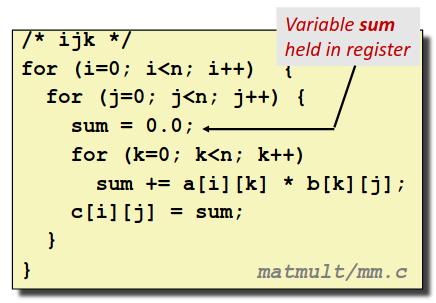
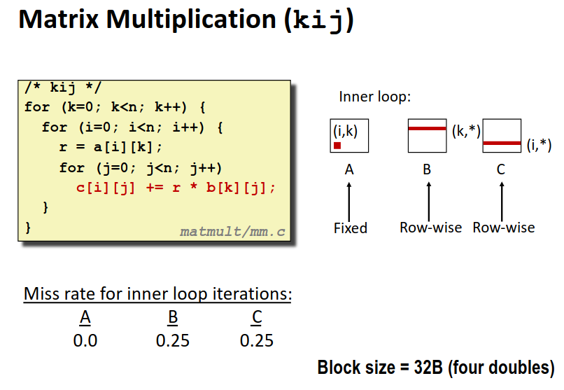
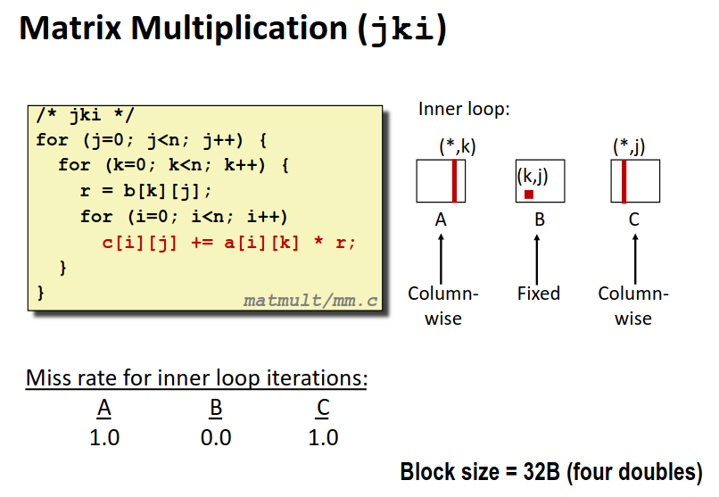
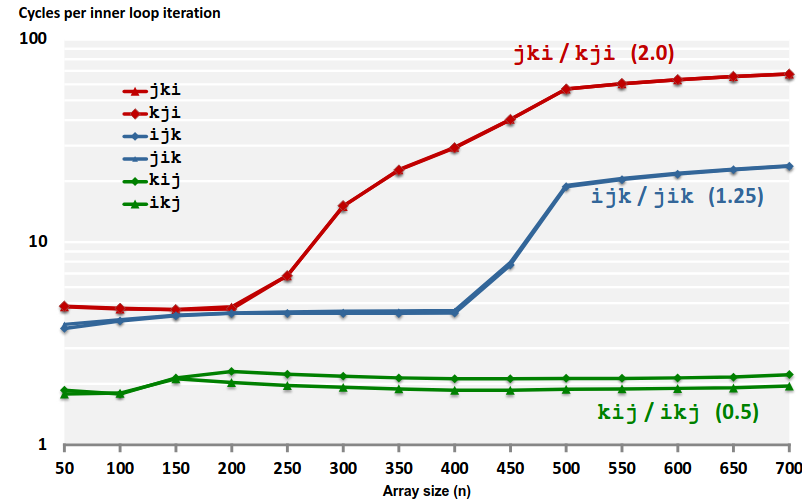

# Chapter 6.5 The Impact of Caches on Program Performance

我们前文不断强调高速缓存以及程序局部性的重要性，在这一节中，我们会先通过一个简单的图表验证局部性以及缓存对程序性能的影响，然后举一个简单的例子来说明我们应当怎样提高程序局部性，更好的利用缓存。

## The Memory Mountain

我们通过一个简单的程序，改变程序的一些参数，测试程序内存吞吐量来衡量程序读写性能。

我们通过改变数组访问的步长以及数组的大小，然后测试程序内存吞吐量，得到了下图。

整个测试数据输出集排布在坐标系下，就像一座山一样，所以我们称呼它为内存山(The Memory Mountain)。

越往山的上方走去，有更小的步长以及数组大小，对应程序更好的空间局部性、更高的缓存命中率以及对缓存更好的利用，我们得到了更高的程序性能。而越往山的下方走也对应了更差的程序性能。

通过 ics 课程的学习，我们在写程序时也应当有意的提高程序的局部性，让自己的程序在内存山的较高点，而不是山底。

## Rearranging Loops to Increase Spatical Locality

矩阵乘法在计算机程序中极为常见，广泛应用在图像渲染处理与机器学习等领域。我们今天不讨论从数学与算法的角度怎样乘会更优，我们就应用 \\(O(n^3)\\) 的算法，在计算机体系结构的角度下我们讨论怎样的乘法次序是最优的。

我们先来看一种最典型的写法: ijk

那么对于内层循环的访问，我们通过为命中率计算公式: \\(miss\space rate=sizeof(a_{ij})/B\\) 。我们假定 Block size = 32B (four double)。

我们可以计算得到未命中率如下图:

同理我们看另两种写法: kij 与 jki，并计算 miss rate。

显然根据理论计算 kij 是最优的访问次序。我们在处理器上试验一下 

最优的访问方式远远优于最差的访问方式！这就是计算机体系结构的力量。

我们可以通过 blocking 的技术进一步优化矩阵乘法，在此处也就不再进一步介绍了，感兴趣的同学可以查询一些资料以了解。

------

© 2025. ICS Team. All rights reserved.