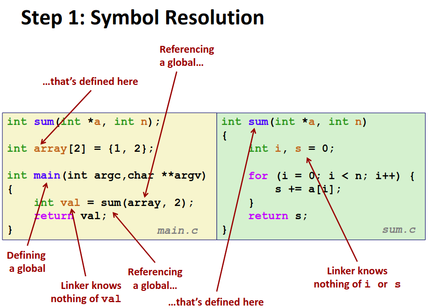

# Chapter 7.2 Procedures

在上一节中我们讨论了关于链接的基本知识，并简要介绍了链接的步骤，在这一节中我们将更为详细的介绍链接的步骤。

## Symbol Resolution

<div align="center">

</div>

上图是一个简单的程序的实例，可以看到即便在如此简单的程序当中也有大量的符号以及引用关系。为了解析程序中的所有符号，为符号分类是必须的。

因为我们做符号解析的最终目的是将符号引用绑定到符号的定义上。对于函数而言，定义和引用的区别十分明显：有函数体的是定义，反之为引用。而对于变量由于 extern 等语法的存在，定义与引用不太容易区别，我们引入下面的分类标准。

我们大体上将符号分为两种：**强符号与弱符号**。

强符号包含**函数的定义以及初始化过的全局变量**。弱符号包含**未初始化的全局变量或者被 ```extern```修饰的变量**。可以看到我们只关注了全局变量，对于局部变量在其作用域内解析是十分轻松的，无需额外关注。

有了这个分类标准，我们便可以以此进行符号绑定，有以下三条规则。

1. 同名强符号只允许有一个。显然多个同名强符号相互冲突。
2. 当同时有同名强符号以及弱符号时，符号绑定到强符号上。
3. 如果有多个同名弱符号并且没有强符号时，随机选择一个作为符号的定义。

这三条规则形成了我们符号解析的基本逻辑，有了三条规则符号解析变得相对清晰。值得注意的是规则三，虽然编译器不会报错，但随机选择一个无疑是一个糟糕的结果，可能引发错误。现有的部分编译器链接器在触发规则三时会有显示的警告或报错。

三条完备的规则足以让我们避免链接过程中所有错误吗？其实不然。看下面这样一个例子。

```C
// a.c
int x=7;
int y=5;
p1(){}

// b.c
double x;
p2(){}

```

在这个例子中 b.c 中的 x 为弱符号绑定到 a.c 中的强符号 x 上。然而 b.c 在编译时并不知道 x 最终的绑定结果是一个 int，符号绑定时又不会做任何类型检查。故在 b.c 中对 x 的修改仍是对 double 类型 8 个字节进行操作，不仅会让 a.c 中 x 无法得到预期的值，甚至会覆盖掉 y 的值。可以说是非常糟糕了。

这种情况下，编译时编译器无法得知 x 的绑定结果，没有类型检查连一个警告都没有，而链接器在链接时根本不做类型检查，导致出错也难以修改，可以说是必须有程序员把关了。

可以说全局变量是一切灾难的根源，它使得程序模块之间耦合度增加，不仅使得开发过程困难，更使得维护调试困难。所以，avoid if you can！如果实在无法避免，尽可能的用 ```static or extern``` 去修饰限制它，并为它初始化。

## Relocation

完成符号解析之后，我们就可以进行重定位了，在上一节中我们介绍了由于分别编译的缘故，为什么需要重定位？这一节中我们将不再赘述而是直接讲解如何进行重定位。

对于每一个符号引用，我们都需要为它进行一次重定位。而对于每个符号引用的是什么以及在 ELF 文件中的位置是什么，编译器在单个文件编译时已经整理好储存在 ELF 中，也就是我们上一节介绍 ELF 时提到的 .rel.text 以及 .rel.data 区中。

其中的每一个需要重定位的引用我们称为**重定位实体(Relocation entries)**。链接器只需要遍历重定位实体，根据符号绑定关系，在对应地址上填上恰当的值即可。

然而对于每个重定位实体在表中所对应的地址值是编译时单个文件产生的地址，需要根据链接器对文件排布作出相应的修改。而填入值，即对应绑定符号的位置也是同理。

由于计算值涉及到相对地址等本课程没有介绍的内容，此处只是提供一个大致介绍，详细计算不再过多赘述。

在完成对每一个重定位实体完成重定位后重定位就结束了，那么链接的工作也就大致完成了。

------

© 2026. ICS Team. All rights reserved.