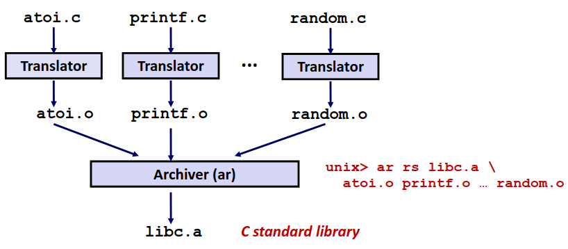
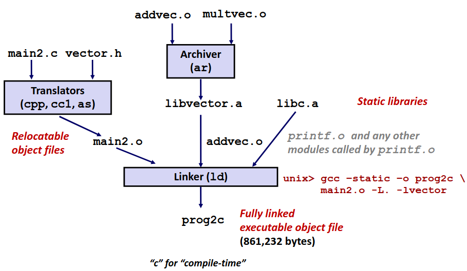
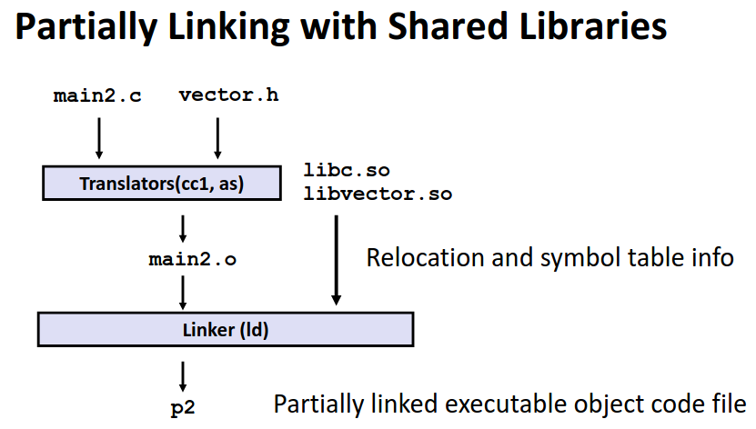
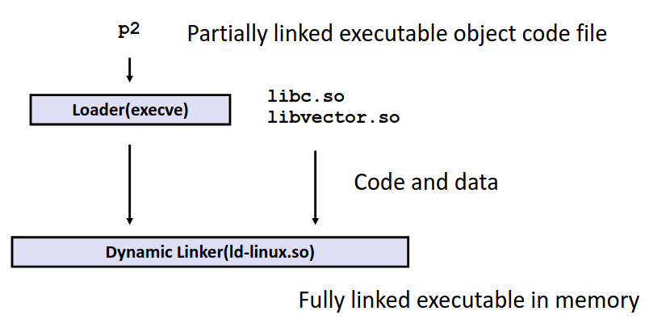

# Chapter 7.3 Library 

在这一节我们会讨论通过链接实现的重要技术：**库**。

## Libraries and Static Linking

**库(Libraries)**，就是打包好的函数集合。任何实用的 C 程序都离不开库，无论是 I/O ```printf and scanf...```、还是 math ```sqrt and log... ```。

通过先前对链接的知识，库这种技术的实现离不开链接。调用库的过程就是将库函数文件与你的 C 代码文件链接在一起的过程。但怎样链接在一起值得探讨。

一种暴力的做法是，将库文件整个链接进程序当中。当我需要用到 ```sqrt``` 时，不管三七二十一直接将指数对数三角什么的全部链接进程序。这种方法毫无疑问可行，但过于低效。

另一种做法是对于每一个函数单独列成一个文件，当我需要```sqrt```时，我将其对应的文件加入到链接当中。这种做法显然会让库函数的引用变得相当繁琐，而且考虑到很多函数的实现有依赖关系，单个文件实现一个函数也会十分低效。

在过去十分流行的解决方案是**静态库(Static Libraries)**。静态库在 linux 下通常以 .a(archive files) 结尾。

将许多函数编译成可重定位目标文件，打包进入一个静态库文件中，并为他们添加索引。通过改进链接器当其在做符号解析时**会到静态库中去搜寻特定的符号**。当一个待解析的符号匹配了库中的符号时，仅仅将符号对应的函数以及其依赖的函数链接进程序中。

这种方法不仅提高了效率，仅仅链接了需要的部分，同时也简化了编程以及库的编写。

下图展示了一个静态库打包的过程。

<div align="center">

</div>

举一个简单的例子来帮助大家理解静态库链接的过程。

```C
// vector.h

void addvec(int *x,int *y,int *z,int n);
void multvec(int *x,int *y,int *z,int n);


// main2.c

#include<stdio.h>
#include<vector.h>

int x[2] = {1,2};
int y[2] = {3,4};
int z[2];

int main()
{
    addvec(x,y,z,2);
    printf("z=[%d %d]\n",z[0],z[1]);
    return 0;
}

// libvector.a

void addvec(int *x,int *y,int *z,int n){...}
void multvec(int *x,int *y,int *z,int n){...}

```

可以看到在这个简单的程序中，我们自己定义了一个向量静态库，其中包含向量加和向量乘函数的实现。而 vector.h 文件中实际上**只包含了函数的声明**，然后我们在编译时刻意去包含libvector.a 才提供了函数的定义。

这是极为容易误解的一点，很容易误解为当我引用 stdio.h 这个文件时我就引用了这个库，其中包含了函数的实现，其实并不是。.h 文件中只会提供函数的声明，让你在编译时不会报错，而实际上对库的引用是在链接过程中。

那你就会问了：我在编译时也没有可以去链接 lib.c 库啊？对于这种标准库，编译器会默认去链接它们。

<div align="center">

</div>


## Dynamic Linking

在介绍静态库时我们提到，这是老式十分流行的实现方法，而现在更为流行的方法是**共享库(Shared Libraries)+动态链接(Dynamic Linkng)**。

为什么要用新的技术呢，静态库有什么不好吗？静态库有几个缺点：
1. **重复**：几乎每个文件都会用到 libc，每个文件中都有 ```printf or scanf```，那么对于静态链接，每个程序中都包含了一份库的代码，重复存储。并且现在计算机同时执行上百个进程，而每个进程的代码中同样也包含重复的库，重复消耗主存。
2. 灵活性差：如果我库函数发现了 bug ，或者有一些改进，那么如果想要让已经链接好的程序用上新的库函数，唯一的方法是重新链接。但是对于那些广为流传的库函数，包含了它的程序成千上万，让这些程序都重新链接显然是一个不可能的事。

那么现在的解决方案**共享库(Shared Libraries)**，linux 下通常以 .so 结尾，windows下常见后缀是 .dll。对于库我在程序**加载甚至运行时**在链接进程序当中。

正如其名，共享库，我的 libc 在计算机硬盘上仅有一份，对于每个包含了这个库的程序我并不会复制这个库，而是当我在运行时再将库链接进程序中。甚至对于同时执行的进程我也同样共享一个库，即在主存中也同样只包含一份库的代码。

在对程序打包时我只会部分的链接。

<div align="center">

</div>

当开始加载入内存时我再完全链接。

<div align="center">

</div>


动态库更为强大的点在于其甚至可以再运行时再链接，本文不再过多介绍。

动态库完美解决了静态库的所有缺点，节省了资源，对于库函数有改动时我重新分发库就好了，反正运行时再链接。

但极高的灵活性也必然伴随着代价，一个显而易见的代价就是由于运行时需要额外链接，无疑降低了程序启动的速度。同时在一些对稳定性与安全性要求较高的场合，动态库往往也不是一个合适的选择。

------

© 2025. ICS Team. All rights reserved.