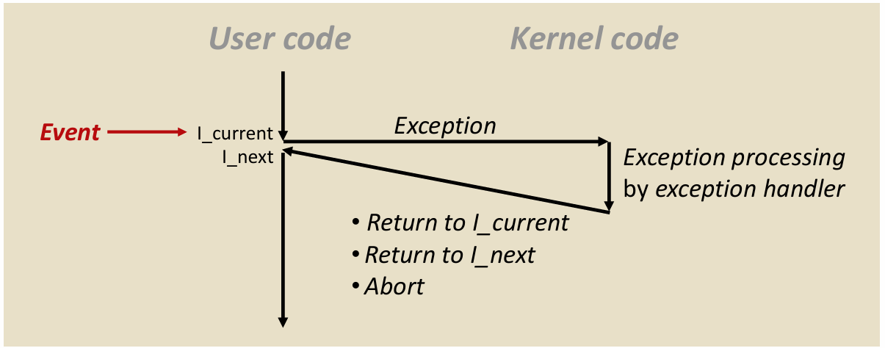
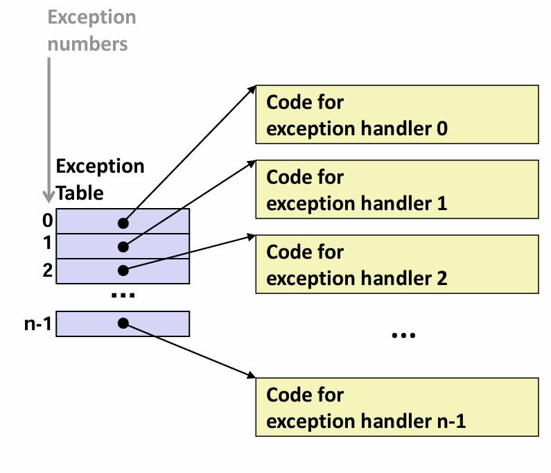
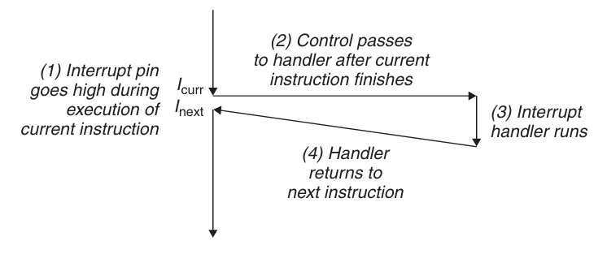
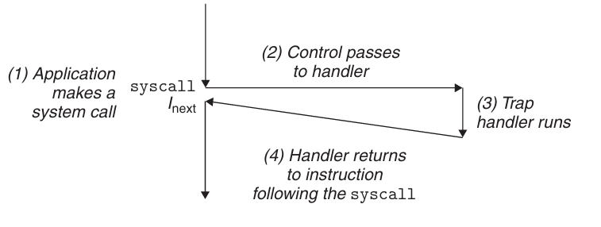
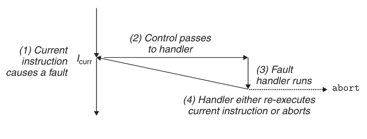
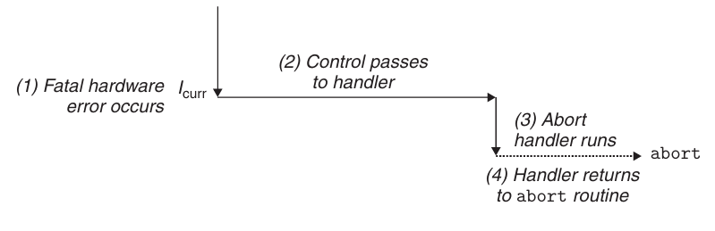

# Chapter 8.1 Exceptions

## Introduction

从给处理器加电开始，程序计数器假设一个值的序列\\(a_{0}\\),\\(a_{1}\\),...,\\(a_{n-1}\\)。其中每个\\(a_{k}\\)是某个相应的指令\\(I_{k}\\)的地址。每次从\\(a_{k}\\)到\\(a_{k+1}\\)的过渡称为**控制转移**（control transfer）。这样的控制转移序列叫做处理器的**控制流**（control flow）。

最简单的一种控制流是一个“平滑的”序列，这种平滑流的突变通常是由诸如跳转、调用和返回这样一些指令造成的，这些都是使程序能够对由程序变量表示的内部程序状态变化作出反应的必要机制。

但同时系统也要对系统状态变化做出反应，而这些系统状态不是被内部程序变量捕获的，也不一定与程序的执行相关。那么现代系统就通过使控制流发生突变来对这些情况做出反应，即**异常控制流**（Exceptional Control Flow,ECF）。

异常控制流发生在计算机系统的各个层次。本章将介绍存在于一个计算机系统中所有层次上的各种形式的ECF。我们将由低层到高层进行讲解，涵盖异常、系统调用、进程和信号，以及非本地跳转等内容。

## Exceptions

异常是异常控制流的的一种形式，简单来说就是控制流中的突变，用来响应处理器状态中的某些变化。它位于硬件和操作系统交界的部分，因而一部分由硬件实现，一部分由操作系统实现。

下图展示了异常的基本思想：

在图中，处理器正在执行某个当前指令I_current，此时处理器状态中发生一个重要变化，这种状态变化称为**事件**（event）。当处理器检测到有事件发生时，它会通过一张叫做**异常表**（exception table）的跳转表，进行一个间接过程调用（即异常）到一个专门设计用来处理这类事件的操作系统子程序——**异常处理程序**（exception handler，它运行在内核模式下）。完成处理后，根据引起异常的事件类型，会发生以下三种情况中的一种：
1. 处理程序将控制返回给当前指令I_current；

2. 处理程序将控制返回给I_next（即没有发生异常时将会执行的下一条指令）；

3. 处理程序终止被中断的程序。

## Exception Handling

系统中可能的每种类型的异常都分配了一个唯一的非负整数的**异常号**（exception number）。在系统启动时，操作系统分配和初始化一张异常表，使得表目k包含异常号为k的处理程序的地址。异常表格式如下图所示：

当系统在执行某个程序时，处理器检测到发生了一个事件，并确定了相应的异常号k。随后处理器触发异常（执行间接过程调用），通过异常表的表目k，转到相应的处理程序。

一旦硬件触发了异常，剩下的工作就是由异常处理程序在软件中完成。事件处理完之后，处理程序通过执行一条“从中断返回”指令可选地返回到被中断的程序，并将适当的状态弹回到处理器的控制和数据寄存器中。

## Classes of Exceptions

异常可以分为四类：**中断**（interrupt）、**陷阱**（trap）、**故障**（fault）和**终止**（abort）。下表是对这些类别属性的小结：

Class       |Cause                         |Async/sync|Return behavior
:----------:|:----------------------------:|:--------:|:--------------:
 Interrupt  |Signal from I/O device        |Async     |Always returns to next instruction
 Trap       |Intentional exception         |Sync      |Always returns to next instruction
 Fault      |Potentially recoverable error |Sync      |Might return to current instruction
 Abort      |Nonrecoverable error          |Sync      |Never returns

 ### Interrupts

 中断是**异步**发生的，它不是由任何一条专门的指令造成的，是来自处理器外部I/O设备的信号的结果。I/O设备（如网络适配器、磁盘控制器等）通过向处理器芯片上的一个引脚发信号，并将异常号放到系统总线上来触发中断。下图概述了一个中断的处理：

 
 从图中可以看到，中断处理程序返回时，是将控制返回给下一条指令。结果是程序继续执行，就好像没有发生过中断一样。

 剩下的异常类型都是**同步**发生的，是执行当前指令的结果，我们把这类指令称为**故障指令**（faulting instruction）。
 
 ### Traps and System Calls

 陷阱是有意的异常，是执行一条指令的结果，陷阱处理程序也将控制返回到下一条指令。它最重要的用途是在用户程序和内核之间提供一个像过程一样的接口，即**系统调用**。

 用户程序经常需要向内和请求服务，如读文件（read）、创建新进程（fork）、加载新程序（execve）、终止当前进程（exit）等。为了允许对这些内核服务的受控的访问，处理器提供了一条特殊的“syscall n”指令，当用户程序想要请求服务n时，可以执行这条指令，结果就会导致一个到异常处理程序的陷阱。陷阱处理流程如下图所示：
 

 
> 注：在程序员眼中，系统调用和普通的函数调用是一样的。然而它们的实现非常不同。普通的函数运行在**用户模式**中，函数可执行的指令的类型是受限的，且只能访问与调用函数相同的栈。
>而系统调用运行在**内核模式**中，允许执行特权指令，并访问定义在内核中的栈。

### Faults

故障由错误情况引起，它可能能够被故障处理程序修正。故障发生时，处理器将控制转移给故障处理程序。如果故障处理程序能够修正该错误，它就将控制返回到引起故障的指令，从而重新执行它。否则返回到内核中的abort例程，abort例程会终止引起故障的应用程序。如下图所示：

一个典型的例子是缺页异常。当指令引用一个虚拟地址，而与该地址相对应的物理页面不在内存中，必须从磁盘中取出时，就会发生故障。缺页处理程序从磁盘加载适当的页面，然后将控制返回给引起故障的指令。当指令再次执行时，因为相应的物理页面已经驻留在内存中了，此时指令就可以没有故障地运行完成了。

### Abort

终止是不可恢复的致命错误造成的结果，通常是一些硬件错误。终止程序从不将控制返回给应用程序，如下图所示，处理程序将控制返回给一个abort例程，该例程会终止这个应用程序。

 
------
© 2026. ICS Team. All rights reserved.
