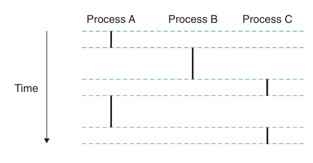
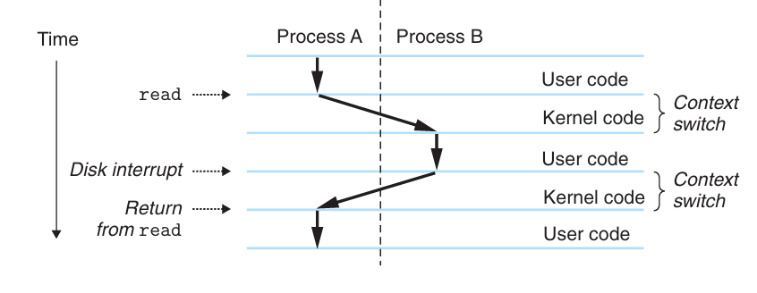

# Chapter 8.2 Processes

异常是允许操作系统内核提供**进程**（process）概念的基本构造块，而进程是计算机科学中最深刻、最成功的概念之一。

在现代系统上运行一个程序时，我们会得到一系列的假象：我们的程序好像是系统中当前运行的唯一程序；它好像是独占地使用处理器和内存；处理器好像无间断地一条条执行我们程序中的指令；我们程序中的代码和数据好像是系统内存中唯一的对象。其实，这些假象都是通过进程的概念提供给我们的。

**进程是一个执行中程序的实例**。系统中的每个程序都运行在某个进程的**上下文**（context）中。上下文是由程序正确运行所需的状态组成的，包括存放在内存中的代码和数据、它的栈、通用目的寄存器的内容、程序计数器等。

每次用户通过向shell输入一个可执行目标文件的名字，运行程序时，shell就会创建一个新进程，然后在这个新进程的上下文中运行该可执行文件。应用程序也能创建新进程，并在新进程的上下文中运行它们自己的代码或其它应用程序。

本节我们将关注进程提供给应用程序的关键抽象：

* 一个独立的逻辑控制流：提供程序独占使用处理器的假象。

* 一个私有的地址空间：提供程序独占使用内存系统的假象。

## Logical Control Flow

如果我们用调试器单步执行程序，就会看到一系列程序计数器（PC）的值，这些值唯一地对应于包含在程序的可执行目标文件中的指令，或是包含在运行时动态链接到程序的共享对象中的指令。这个PC值的序列叫做**逻辑控制流**，简称逻辑流。

举个例子，假如一个系统运行着三个进程，如下图所示，处理器的一个物理控制流被分成了三个逻辑流，每个进程一个。每条竖线代表了一个进程的逻辑流的一部分。这三个逻辑流的执行是交错的，过程是A->B->C->A->C，三个进程轮流使用处理器，直到三个进程都执行完毕。而对于一个运行在这些进程之一的上下文中的程序，它看上去就像是在独占地使用处理器。

## Concurrent Flows

一个逻辑流的执行在时间上与另一个流重叠，称为**并发流**（concurrent flow），这两个流被称为并发地运行。例如在上例中，A和B并发运行，A和C并发运行，但B和C没有并发运行。

应当注意的是，并发流的思想与流运行的处理器核数或者计算机数无关。如果两个流在时间上有重叠，那它们就是并发的，即使它们是在同一个处理器上。而针对运行在不同处理器核或计算机上的两个并发运行的流，我们称之为**并行流**（parallel flow）。

## Private Address Space

前面提到，进程为每个程序提供一种假象，好像它独占地使用系统地址空间。下图展示了一个x86-64 Linux进程的地址空间的组织结构。

地址空间底部是保留给用户程序的，包括通常的代码、数据、堆和栈段。代码段总是从0x400000开始，地址空间顶部保留给内核，该部分包含内核在代表进程执行指令时使用的代码、数据和栈。

## User and Kernel Modes

用户模式和内核模式限制了一个应用可以执行的指令和可以访问的地址空间范围。

处理器通常用某个控制寄存器的一个模式位（mode bit）来提供这种功能，该寄存器描述了进程当前享有的特权。当设置了模式位时，进程就运行在内核模式中，可以执行指令集的任何命令，访问系统中的任何内存位置。而没有设置模式位时，进程运行在用户模式中，不允许执行特权指令，比如停止处理器，发起一个I/O操作等，也不允许直接引用地址空间中内核区内的代码和数据，必须通过系统调用接口间接访问内核代码和数据。

运行应用程序代码的进程初始时在用户模式中。进程从用户模式变为内核模式的唯一方法是通过中断、故障或陷入系统调用等异常。异常发生时，控制传到异常处理程序，处理器将模式从用户模式变为内核模式。处理程序运行在内核模式中，当他返回到应用程序代码时，处理器就把模式从内核模式改回到用户模式。

## Context Switches

操作系统内核使用一种称为**上下文切换**（context switch）的较高层形式的异常控制流来实现多任务，这种机制是建立在我们前面介绍的较低层异常机制之上的。

内核为每个进程维护一个上下文（context），它是内核重新启动一个被抢占的进程所需的状态，由一些对象的值组成，包括通用目的寄存器、程序计数器、用户栈和各种数据结构等。

在进程执行的某些时刻，内核可以决定抢占当前进程，并重新开始一个先前被抢占了的进程，这种决策叫做**调度**（scheduling）。当内核选择一个新的进程时，我们说内核调度了这个进程。在内核调度了一个新的进程运行后，它就抢占当前进程，并使用上下文切换的机制来将控制转移到新进程。上下文切换的功能如下：

1. 保存当前进程的上下文。

2. 恢复某个先前被抢占的进程被保存的上下文。

3. 将控制传递给这个新恢复的进程。

下图展示了一对进程A和B之间上下文切换的示例。进程A初始在用户模式，直到它通过执行系统调用read陷入到内核，此时内核中的陷阱处理程序请求来自磁盘控制器的DMA传输。由于磁盘取数据要用一段相对较长的时间，所以内核执行从进程A到进程B的上下文切换。随后，进程B在用户模式下运行直到磁盘发出一个中断信号，表示数据已经从磁盘传到了内存。内核因此执行一个从进程B到进程A的上下文切换，将控制返回给进程A中紧随在系统调用read之后的那条指令，进程A继续运行。

------

© 2025. ICS Team. All rights reserved.