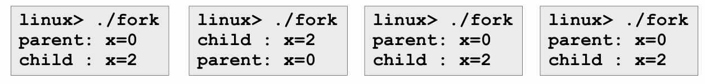
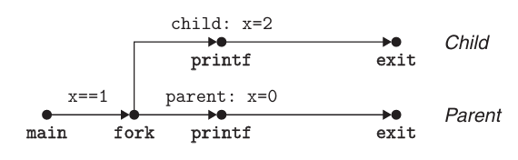
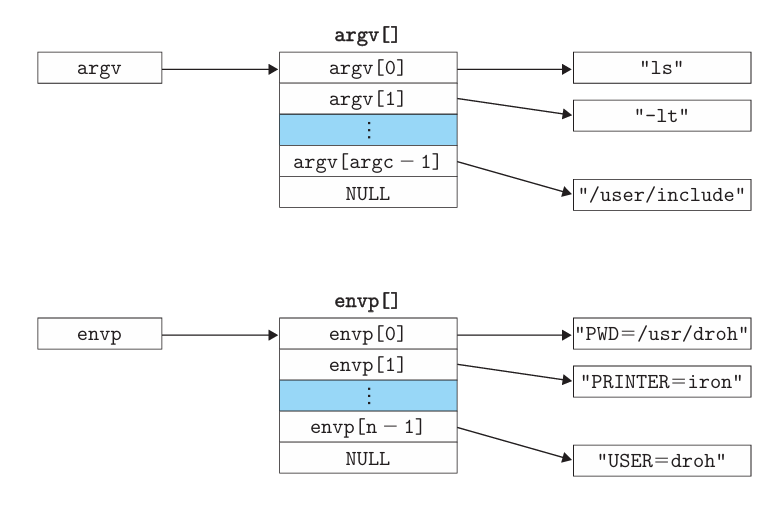
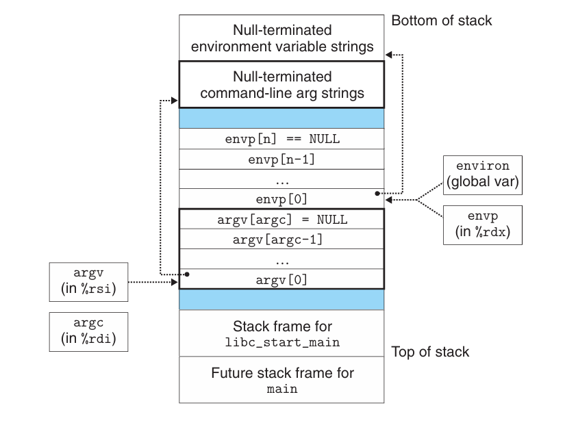

# Chapter 8.3 Process Control

本节将描述一些从C程序中操作进程的系统调用函数，并举例说明如何使用它们。

## Obtaining Process IDs

每个进程都有一个唯一的进程ID（PID），它总是大于零的。`getpid`函数返回调用进程的PID，而`getppid`函数返回它的父进程的PID。

这两个函数的声明如下：

```C
 #include <sys/types.h>
 #include <unistd.h>
 pid_t getpid(void);
 pid_t getppid(void);
```

## Creating and Terminating Processes

在任何时候，进程总是处于以下四种状态之一：

* Running：进程要么在CPU上执行，要么在等待被执行且最终会被内核调度。

* Blocked/Sleeping：进程在发生某些外部事件（通常是 I/O）之前无法执行更多指令。

* Stopped：进程的执行被挂起（suspended），且不会调度。（用户行为引起）

* Terminated/Zombie：进程永远地停止了。（zombie状态是指一个终止了还未被回收的进程）

调用`exit`函数可以终止进程，它以`status`退出状态来终止进程：

```C
#include <stdlib.h>
void exit(int status);
```

父进程通过调用`fork`函数创建一个新的运行的子进程：

```C
#include <sys/types.h>
#include <unistd.h>
pid_t fork(void);
```

新创建的子进程得到与父进程用户级虚拟地址空间相同但独立的一份副本，包括代码和数据段、堆、共享库以及用户栈。子进程还获得与父进程任何打开文件描述符相同的副本，这意味着父进程调用`fork`时，子进程可以读写父进程中打开的任何文件。父进程和子进程最大的区别在于它们有不同的PID。

`fork`函数的特点是：**只调用一次，但返回两次**。一次在调用进程中，一次在新创建的子进程中。在父进程中，`fork`返回子进程的PID（非零）；在子进程中，`fork`返回0。因此可以通过返回值分辨程序是在父进程还是子进程中执行。

下面展示了一个使用`fork`创建子进程的示例。当`fork`调用返回时，父进程和子进程中的x的值都为1.子进程执行x+1并输出，父进程执行x-1并输出。（注：`Fork`是`fork`的错误处理包装函数）

```C
int main(int argc, char** argv)
{
 pid_t pid;
 int x = 1;
 pid = Fork(); 
 if (pid == 0) {  /* Child */
     printf("child : x=%d\n", ++x); 
     return 0;
 }
 /* Parent */
 printf("parent: x=%d\n", --x); 
 return 0;
}
```

而当我们运行这个程序时，每次运行结果都不一定一样：

<div align="center">

</div>

这个例子能够展现`fork`的一些微妙之处：

* 调用一次，返回两次。

* 子进程和父进程是并发运行的独立进程。内核能够以任意方式交替执行它们的逻辑控制流中的指令。如上图所示，父进程和子进程完成`printf`语句的先后顺序并不固定，我们无法对不同进程中指令的交替执行做任何假设。

* 相同但独立的地址空间。本例中，当`fork`函数返回时，本地变量x在父进程和子进程中都为1.而父进程和子进程对x所做的任何改变都是独立的，不会反映到另一个进程的内存中。因此它们各自的`printf`语句输出结果不同。

* 共享文件。子进程继承了父进程所有的打开文件。当父进程调用`fork`时，`stdout`文件是打开的，且指向屏幕。因此子进程的输出也指向屏幕。

画进程图可以很好的帮助我们理解`fork`函数。**进程图**是刻画程序语句的偏序的一种简单的前趋图。每个顶点a对应于一条程序语句的执行，有向边a->b表示语句a发生在语句b之前。边上可以标注一些信息，如变量的当前值和输出内容。

下图为上例的进程图：

<div align="center">

</div>

在进程图中，由有向边相连的两个语句在执行时有严格的先后顺序，比如`fork`一定在`printf`前执行，而没有有向边相连的语句在执行时的先后顺序是不定的，比如父进程和子进程的`printf`语句。从中我们也可以很容易地观察出子进程与父进程的并行性。

## Reaping Child Processes

当一个进程终止时，由它的父进程负责回收。当父进程回收已终止的子进程时，内核将子进程的退出状态传递给父进程，然后抛弃已终止的进程，从此时开始，该进程就不存在了。一个终止了但还未被回收的进程称为**僵死进程**（zombie）。

如果一个父进程终止了，内核会安排init进程成为它孤儿进程的养父。init进程的PID为1，是在系统启动时由内核创建的，它不会终止，是所有进程的祖先。

一个进程可以通过调用`waitpid`函数来等待它的子进程终止或停止。

```C
#include<sys/types.h>
#include<sys/wait.h>
pid_t waitpid(pid_t pid,int *statusp,int options);
```

默认情况下（当options=0时），`waitpid`挂起调用进程的执行，直到它的等待集合（wait set）中的一个子进程终止。如果等待集合中的一个进程在刚调用的时候就已经终止了，那么`waitpid`就立即返回。在这两种情况中，`waitpid`返回导致它返回的已终止子进程的PID。`waitpid`函数可以选择等待某个指定的子进程或所有子进程。

`wait`函数是`waitpid`函数的简单版本：

```C
 #include<sys/types.h>
 #include<sys/wait.h>
 pid_t wait(int *statusp);
```

如果成功，`wait`函数返回子进程的PID；如果出错，则返回-1。

> 注：如果等待的是多个子进程，程序不会按照特定的顺序回收子进程。

## Putting Processes to Sleep

`sleep`函数将一个进程挂起一段指定的时间。

```C
 #include<unistd.h>
 unsigned int sleep(unsigned int secs);
```

如果请求的时间到了，`sleep`会返回0，否则返回剩下的休眠秒数。

另一个很有用的函数是`pause`，该函数让调用函数休眠，直到该进程收到一个信号。

```C
 #include <unistd.h>
 int pause(void);
```

## Loading and Running Programs

`execve`函数在当前进程的上下文加载并运行一个新程序。

```C
 #include <unistd.h>
 int execve(const char *filename, const char *argv[], const char *envp[]);
```

`execve`函数加载并运行可执行文件`filename`，且带参数列表`argv`和环境变量`envp`。只有当出现错误时（例如找不到`filename`），`execve`才会返回到调用程序。所以，`execve`的特点是：**调用一次并从不返回**。

`execve`函数的参数列表和环境变量列表是由结构类似的数据结构表示的，如下图所示。

参数列表中，`argv`变量指向一个以`null`结尾的指针数组，其中每个指针都指向一个参数字符串。按照惯例，`argv[0]`是可执行目标文件的名字。

类似地，在环境变量列表中，`envp`变量指向一个以`null`结尾的指针数组，其中每个指针指向一个环境变量字符串，每个串都是形如`name=value`的名字—值对。

<div align="center">

</div>

在`execve`加载了`filename`之后，它会调用启动代码，启动代码设置栈，并将控制传递给新程序的`main`函数，`main`函数原型为
```C
int main(int argc,char **argv,char **envp);
```
或等价的
```C
int main(int argc,char *argv[],char *envp[]);
```

当`main`开始执行时，用户栈的组织结构如下图所示。从栈底（高地址）到栈顶（低地址），首先是环境变量字符串和命令行字符串。之后是以`null`结尾的指针数组，其中每个指针都指向栈中的一个环境变量字符串，全局变量`environ`指向这些指针中的第一个`envp[0]`。环境变量数组之后是以`null`结尾的`argv[]`指针数组，其中每个指针都指向栈中的一个参数字符串。栈顶则是系统启动函数`libc_start_man`的栈帧。

<div align="center">

</div>

> 注：在`main`函数中，参数`argc`表示`argv[]`数组中非空指针的数量。

## Simple Shell Example

shell是一个交互型的应用级程序，它代表用户运行其他程序。shell的基本操作就是执行一系列的**读/求值**（read/evaluate）步骤，然后终止。读步骤读取来自用户的一个命令行；求值步骤解析命令行，并代表用户运行程序。

Unix shell中大量使用了`fork`和`execve`函数，下面我们以一个简单的shell程序为例，学习shell工作的基本原理以及如何利用`fork`和`execve`运行程序。

首先是一个简单shell的`main`函数架构：

```C
int main(int argc, char** argv)
{
    char cmdline[MAXLINE]; /* command line */
    while (1) {
        /* read */
        printf("> ");
        fgets(cmdline, MAXLINE, stdin);
        if (feof(stdin))
            exit(0);
        /* evaluate */
        eval(cmdline);
    }
}
```

我们可以看到shell的基本结构就是一个简单的循环。在每次循环中，它会先打印出一个命令行提示符，等待用户在`stdin`上输入命令行，然后调用`eval`对该命令行求值。

下面是对命令行求值的`eval`函数的核心部分：

```C
void eval(char *cmdline)
 {
    char *argv[MAXARGS]; /* Argument list execve() */
    char buf[MAXLINE];   /* Holds modified command line */
    int bg;              /* Should the job run in bg or fg? */
    pid_t pid;           /* Process id */
 
    strcpy(buf, cmdline);
    bg= parseline(buf, argv);
    if (argv[0] == NULL)
        return;   /* Ignore empty lines */
    
    if (!builtin_command(argv)) {
        if ((pid = fork()) == 0) {   /* Child runs user job */
            execve(argv[0], argv, environ);
            // If we get here, execve failed.
            printf("%s: %s\n", argv[0], strerror(errno));
            exit(127);
        }
        
        /* Parent waits for foreground job to terminate */
        if (!bg) {
            int status;
            if (waitpid(pid, &status, 0) < 0)
                unix_error("waitfg: waitpid error");
        }
        else
            printf("%d%s", pid, cmdline);
    }
    return;
}
```

`eval`函数的结构大致可分为以下几个部分：

1. 首先是调用`parseline`函数，其作用是解析以空格分隔的命令行参数，并构造最终传递给`execve`的`argv`向量。如果最后一个参数是`&`，那么`parseline`返回1，表示在后台执行该程序，即shell不会等待它完成；否则返回0，表示应在前台执行完此程序。

2. 完成命令行解析后，`eval`接着调用`builtin_command`函数，检查第一个命令行参数是否为一个内置的shell命令（在我们这个简单shell中，只有一个内置命令`quit`，该命令会终止shell）。如果是，它就会立即解释该命令，并返回1；否则返回0。

3. 如果`builtin_command`返回0，shell就会创建一个子进程，并在子进程中执行所请求的程序。如果用户要求在后台运行该程序，shell就会打印该进程的PID，然后返回到循环的顶部，等待下一个命令行。否则，使用`waitpid`函数等待作业终止。当作业终止时，shell就开始下一轮迭代。

> 注：Unix shell用作业（job）这个抽象概念来表示为对一条命令行求值而创建的进程。


上面的Simple Shell Example看起来已经实现了必要的功能，但是它却存在一个巨大的缺陷：它没有回收后台运行的子进程。这就会导致这些子进程终止时，它们会成为僵死进程（zombies），而它们永远也不会被回收，因为shell一般情况下是不会终止的。

要解决这样一个问题，就需要使用信号。我们将在下一节详细讲述它。


------

© 2025. ICS Team. All rights reserved.