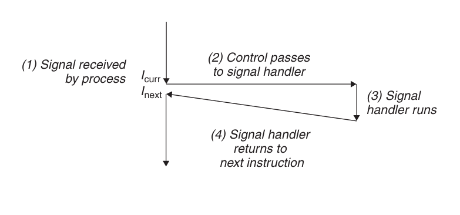
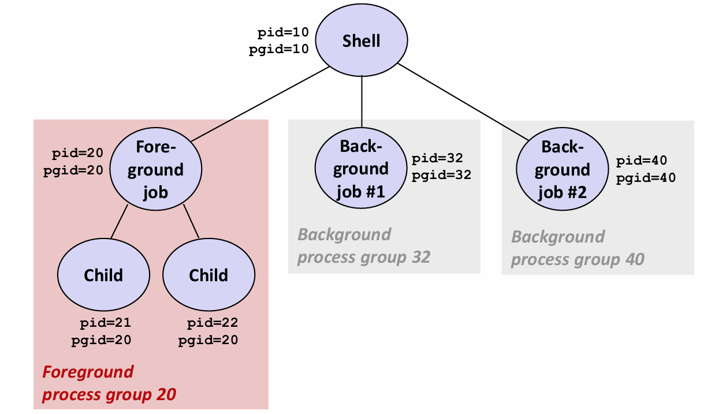

# Chapter 8.4 Signals

到目前为止，我们已经看到了硬件和软件是如何合作以提供基本的低层异常机制的，以及操作系统如何利用异常来支持进程上下文切换的异常控制流形式。在本节中，我们将研究一种更高层的软件形式的异常，称为Linux信号，它允许进程和内核中断其他进程。

一个**信号**就是一条小信息，用于通知进程系统中发生了一个某种类型的事件。下面列举了几种常用的Linux信号。

<div align="center">

</div>

每个信号类型都对应于某种系统事件。低层的硬件异常是由内核异常处理程序处理的，所以在正常情况下对用户进程不可见。而信号就提供了这样一种机制，通知用户进程发生了这些异常。比如我们熟悉的SIGSEGV信号，就是内核在进程进行非法内存引用时发送给进程的。

## Signal Concepts

传送一个信号到目的进程是由两个不同步骤组成的：

1. **发送信号**（Sending a Signal）。内核通过更新目的进程上下文中的某个状态，发送一个信号给目的进程。发送信号可以有如下两种原因：(1) 内核检测到一个系统事件，比如除零错误或子进程终止。(2) 一个进程调用了`kill`函数，显式地要求内核发送一个信号给目的进程。一个进程也可以发送信号给它自己。
2. **接收信号**（Receiving a Signal）。当目的进程被内核强迫以某种方式对信号的发送做出反应时，它就接收了信号。进程对该信号的反应可以是**忽略**（Ignore），**终止**（Terminate）或者通过执行信号处理程序（signal handler）的用户层函数来**捕获**（Catch）该信号。下图展示了捕获信号的基本思想：

<div align="center">

</div>

基本流程是：接收到信号会触发控制转移到信号处理程序，在信号处理程序完成处理后，它将控制返回给被中断的程序。

一个发出而没有被接收的信号叫做**待处理信号**（pending signal）。在任何时刻，一种类型至多只有一个待处理信号。如果一个进程有一个类型为k的待处理信号，那么任何接下来发送到这个进程的类型为k的信号都不会排队等待，而是被简单地丢弃。

一个进程可以有选择地**阻塞**（block）接收某种信号。当一种信号被阻塞时，它仍然可以发送，但是产生的待处理信号不会被接收。

一个待处理信号最多只能被接收一次。

## Sending a Signal

每个进程都只属于一个**进程组**（process group），进程组由一个进程组ID（正整数）来标识。默认情况下，一个子进程和它的父进程同属于一个进程组。

### Sending Signals with /bin/kill Program

/bin/kill程序可以向另外的进程发送任意信号。比如，命令
```C
/bin/kill –9 24818
```

会发送信号9（SIGKILL）给进程24818。而一个负的PID会导致信号被发送到进程组PID中的每个进程，所以如果将上面的命令改为
```C
/bin/kill –9 -24818
```

就会发送一个SIGKILL信号给进程组24818中的每个进程。

###  Sending Signals from the Keyboard

在Unix shell中，任何时刻至多有一个前台作业和0个或多个后台作业。shell会为每个作业创建一个独立的进程组，进程组ID通常取自作业中父进程中的一个。下图展示了有一个前台作业和两个后台作业的shell。

<div align="center">

</div>

在键盘上输入Ctrl+C会导致内核发送一个SIGINT信号到前台进程组中的每个进程。默认情况下，结果是终止前台作业。类似地，输入Ctrl+Z会发送一个SIGTSTP信号到前台进程组中的每个进程。默认情况下，结果是停止（挂起）前台作业。

### Sending Signals with kill Function

进程通过调用`kill`函数发送信号给其他程序（包括它们自己）。

```C
 #include<sys/types.h>
 #include<signal.h>
 int kill(pid_t pid,int sig);
```

* 如果pid大于零，那么kill发送信号sig给进程pid。
* 如果pid等于零，那么kill发送信号sig给调用进程所在进程组中的每个进程，包括调用进程自己。
* 如果pid小于零，kill发送信号sig给进组中的每个进程。

## Receiving a Signal

当内核把进程p从内核模式切换到用户模式时（比如我们前面讲的context switch），它会检查进程p的未被阻塞的待处理信号的集合（pnb = pending & ~blocked）。如果集合为空，那么内核将控制传递到p的逻辑控制流中的下一条指令；如果集合非空，那么内核选择集合中的最小的非零信号k，并强制p接收信号k。收到这个信号会触发进程采取某种行为。一旦进程完成了这个行为，那么控制就传递回p的逻辑控制流中的下一条指令。

每个信号类型都有一个预定义的默认行为：
* 进程终止。
* 进程终止并转储内存。
* 进程停止（挂起）直到被SIGCONT信号重启。
* 进程忽略该信号。 

进程可以通过使用`signal`函数修改和信号相关联的默认行为（除了SIGSTOP和SIGKILL）：

```C
 #include <signal.h>
 typedef void (*sighandler_t)(int);
 sighandler_t signal(int signum, sighandler_t handler);
```

`signal`函数可以通过下列三种方法之一来改变和信号signum相关联的行为：
* 如果handler是SIG_IGN，那么忽略类型为signum的信号。
* 如果handler是SIG_DFL，那么类型为signum的信号行为恢复为默认行为。
* 否则，handler就是用户定义的函数的地址，这个函数被称为信号处理程序，只要进程接收到一个类型为signum的信号，就会调用这个程序。通过把处理程序的地址传递到`signal`函数从而改变默认行为，这叫做**设置信号处理程序**（installing the handler）。调用信号处理程序被称为**捕获信号**。执行信号处理程序被称为**处理信号**。

## Blocking and Unblocking Signals

Linux提供阻塞信号的隐式和显式机制：

**隐式阻塞机制**。内核默认阻塞任何当前处理程序正在处理信号类型的待处理信号。例如，一个SIGINT处理程序不能被另一个SIGINT信号中断。

**显式阻塞机制**。应用程序可以使用`sigprocmask`函数和它的辅助函数，明确地阻塞和解除阻塞选定的信号。

`sigprocmask`函数原型如下：

```C
#include<signal.h>
 int sigprocmask(int how,const sigset_t *set,sigset_t *oldset);
```
下述辅助函数用于对set集合进行操作：

```C
 #include<signal.h>
 int sigemptyset(sigset_t *set);//初始化set为空集合
 int sigfillset(sigset_t *set);//把每个信号都添加到set中
 int sigaddset(sigset_t *set,int signum);//把signum添加到set
 int sigdelset(sigset_t *set,int signum);//从set中删除signum
 int sigismember(const sigset_t *set,int signum);//如果signum是set的成员，返回1，否则返回0
```

## Writing Signal Handlers

信号处理程序的一些属性使得程序员很难对它们进行推理分析：

1. 处理程序与主程序并发运行，共享同样的全局变量，因此可能与主程序和其他的处理程序互相干扰。
2. 如何以及何时接收信号的规则常常有违人的直觉。
3. 不同的系统有不同的信号处理语义。

接下来我们将讲述这些问题，介绍如何编写安全、正确、可移植的信号处理程序。

###  Safe Signal Handling

由于信号处理程序和主程序以及其他信号处理程序并发运行，所以我们应该遵守一些较为保守的编写原则，使得这些处理程序能安全地并发运行。

G0. **处理程序要尽可能简单**。e.g.简单地设置全局变量并立即返回。

G1. **在处理程序中只调用异步信号安全的函数**。原因是：异步信号安全的函数要么是可重入的（例如只访问局部变量），要么是不能被信号处理程序中断的。需要注意的是，许多我们常用的函数，如`printf`、`malloc`、`exit`都不是异步信号安全的！

G2. **保存和恢复errno**。

G3. **阻塞所有的信号，保护对共享全局数据结构的访问**。原因是从主程序访问一个数据结构d通常需要一系列指令，如果指令序列被访问d的处理程序中断，那么处理程序可能会发现d的状态不一致，得到不可预知的结果。而在访问d时暂时阻塞信号就保证了处理程序不会中断该指令序列。

G4. **用volatile声明全局变量**。用volatile类型限定符来定义一个变量，作用是告诉编译器不要缓存该变量。例如：`volatile int g;`所以每次在代码中引用g时，都要从内存中读取g的值。

G5. **用sig_atomic_t声明标志**。在常见的处理程序设计中，处理程序会写全局标志（flag）来记录收到了信号。主程序周期性地读这个标志，响应信号，再清除该标志。用sig_atomic_t数据类型声明变量，保证了对该变量的读和写都是原子的（不可中断的），所以无需暂时阻塞信号。


### Correct Signal Handling

信号的一个与直觉不符的方面是未处理的信号是不排队的。因为pending位向量中每种类型的信号只对应一位，所以每种类型最多只能有一个未处理的信号。这里面的关键思想是：如果存在一个未处理的信号，就表明至少有一个信号到达了。

基于此我们可以得到：不可以用信号来对其他进程中发生的事件计数。因为如果来自其他进程的两个类型k的信号发送给一个目的进程，而目的进程当前正在执行信号k的处理程序，那么信号k就会被阻塞，第二个信号k就简单地被丢弃了。

所以要解决信号不会排队等待这一问题，我们应该在处理程序的每次循环中加入wait/waitpid函数，回收僵死程序。

### Portable Signal Handling

Unix信号处理的另一个缺陷在于不同的系统有不同的信号处理语义。比如signal函数的语义各有不同，系统调用可以被中断等。

我们引入包装函数Signal来解决这些问题，它的信号处理语义如下：

* 只有这个处理程序当前正在处理的那种类型的信号被阻塞。
* 信号不会排队等待。
* 只要可能，被中断的系统调用会自动重启。
* 一旦设置了信号处理程序，它就会一直保持，直到Signal带着handler参数为SIG_IGN或SIG_DFL被调用。

## Synchronizing Flows to Avoid Races

如何编写读写相同存储位置的并发流程序是一个十分棘手的问题。一般而言，流可能交错的数量与指令的数量呈指数关系。这些交错中有些会产生正确结果，有些则不会。

下面展示了Unix shell的典型结构，作为**竞争**（race）的同步错误的示例：

```C
void handler(int sig)
{
    int olderrno = errno;
    sigset_t mask_all, prev_all;
    pid_t pid;
    sigfillset(&mask_all);
    while ((pid = waitpid(-1, NULL, 0)) > 0) { /* Reap child */
        sigprocmask(SIG_BLOCK, &mask_all, &prev_all);
        deletejob(pid); /* Delete the child from the job list */
        sigprocmask(SIG_SETMASK, &prev_all, NULL);
    }
    if (pid != 0 && errno != ECHILD)
        sio_error("waitpid error");
    errno = olderrno;
}

int main(int argc, char **argv)
{
 int pid;
 sigset_t mask_all, prev_all;
 int n = N;  /* N = 5 */
 sigfillset(&mask_all);
 signal(SIGCHLD, handler);
 initjobs(); /* Initialize the job list */
 while (n--) {
    if ((pid = fork()) == 0) { /* Child */
        execve("/bin/date", argv, NULL);
    }
    sigprocmask(SIG_BLOCK, &mask_all, &prev_all); /* Parent */
    addjob(pid);  /* Add the child to the job list */
    sigprocmask(SIG_SETMASK, &prev_all, NULL);
 }
 exit(0);
}
```

在这个程序中，由于它认为父进程比子进程先运行，导致main函数中调用addjob和处理程序中调用deletejob之间存在竞争。如果addjob赢得竞争，那么结果就是正确的；否则就是错误的。为了解决竞争问题，我们可以在调用fork之前，阻塞SIGCHLD信号，然后在调用addjob之后取消阻塞这些信号。这样就能保证子进程被添加到作业列表中之后回收该子进程。修改后的main函数如下：

```C
int main(int argc, char **argv)
 {
    int pid;
    sigset_t mask_all, mask_one, prev_one;
    int n = N; /* N = 5 */
    sigfillset(&mask_all);
    sigemptyset(&mask_one);
    sigaddset(&mask_one, SIGCHLD);
    signal(SIGCHLD, handler);
    initjobs(); /* Initialize the joblist */
    while (n--) {
        sigprocmask(SIG_BLOCK, &mask_one, &prev_one); /* Block SIGCHLD */
        if ((pid = fork()) == 0) { /* Child process */
            sigprocmask(SIG_SETMASK, &prev_one, NULL); /* Unblock SIGCHLD */
            execve("/bin/date", argv, NULL);
        }
        sigprocmask(SIG_BLOCK, &mask_all, NULL); /* Parent process */
        addjob(pid);  /* Add the child to the job list */
        sigprocmask(SIG_SETMASK, &prev_one, NULL);  /* Unblock SIGCHLD */
    }
    exit(0);
 }
```

## Explicitly Waiting for Signals

有时候主程序需要显式地等待某个信号处理程序运行。例如，当Linux shell创建一个前台作业时，在接收下一条用户指令之前，它必须等待作业终止，被SIGCHLD处理程序回收。

下面的代码展示了一个基本思路：父进程设置SIGINT和SIGCHLD的处理程序，然后进入一个无限循环，它阻塞SIGCHLD信号，避免产生竞争。创建子进程后，pid置为0，取消阻塞SIGCHLD，然后以循环的方式等待pid变为非零。子进程终止后，处理程序回收它，把它非零的PID赋给全局pid变量。这会终止循环，父进程继续其他工作，然后开始下一次迭代。

```C
 volatile sig_atomic_t pid;
 void sigchld_handler(int s)
 {
    int olderrno = errno;
    pid= waitpid(-1, NULL, 0); /* Main is waitingfor nonzeropid*/
    errno= olderrno;
 }
 void sigint_handler(ints)
 {
 }

 int main(int argc, char **argv) {
    sigset_t mask, prev;
    int n = N; /* N = 10 */
    signal(SIGCHLD, sigchld_handler);
    signal(SIGINT, sigint_handler);
    sigemptyset(&mask);
    sigaddset(&mask, SIGCHLD);
    while (n--) {
        sigprocmask(SIG_BLOCK, &mask, &prev); /* Block SIGCHLD */
        if (fork() == 0) /* Child */
            exit(0);
        /* Parent */
        pid= 0;
        sigprocmask(SIG_SETMASK, &prev, NULL); /* Unblock SIGCHLD */
        /* Waitfor SIGCHLD to bereceived (wasteful!) */
        while(!pid)
            ;
        /* Do some work after receiving SIGCHLD */
        printf(".");
    }
    printf("\n");
    exit(0);
 }
```

上面这段代码虽然正确无误，但是运行起来会非常慢。我们可能想到的解决办法是在循环体内插入pause：

```C
 while (!pid)  /* Race! */
 pause();
```

但是它会带来严重的竞争：如果在while测试后和pause之前收到SIGCHLD信号，pause会永远睡眠。

另一个选择是用sleep替换pause：

```C
while (!pid) /* Too slow! */
 sleep(1);
```

但是这样又太慢了，如果在while之后sleep之前收到信号，程序必须等相当长的一段时间才会再次检查循环的终止条件。

合适的解决方法是使用sigsuspend：

```C
#include<signal.h>
int sigsuspend(const sigset_t *mask);
```

sigsuspend函数暂时用mask替换当前的阻塞集合，然后挂起该进程，直到收到一个信号。如果该信号的行为是终止，那么该进程不从sigsuspend返回就直接终止；如果信号行为是运行一个处理程序，那么sigsuspend从处理程序返回，恢复调用sigsuspend时原有的阻塞集合。

使用sigsuspend修改减少了浪费，同时还避免了引入pause带来的竞争以及sleep的低效率。


------

© 2026. ICS Team. All rights reserved.