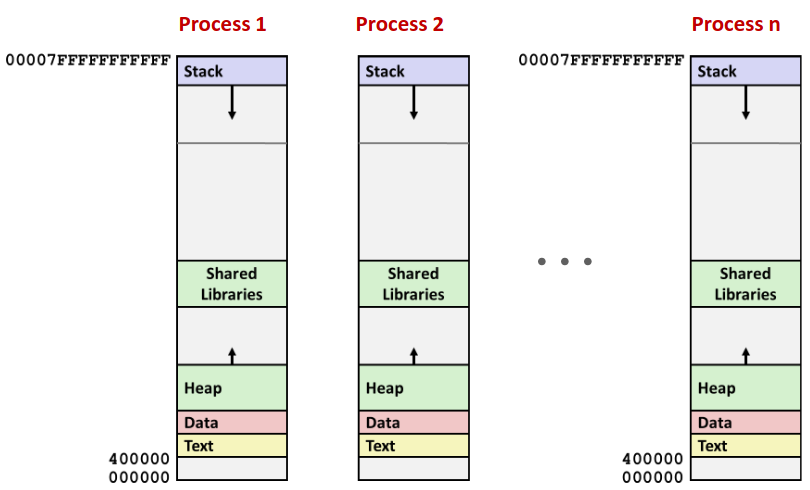
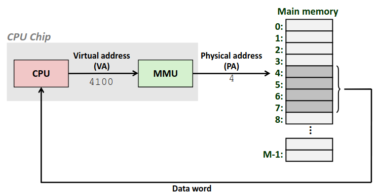
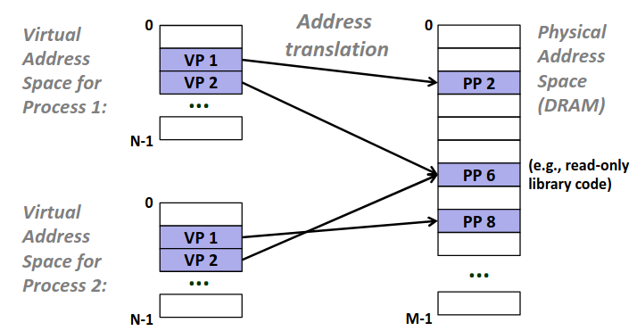
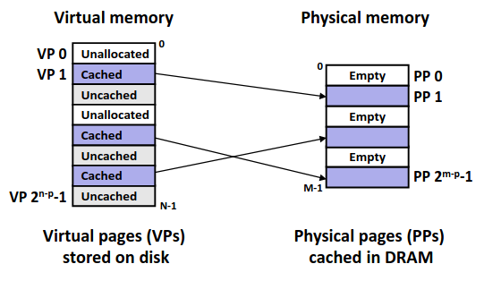
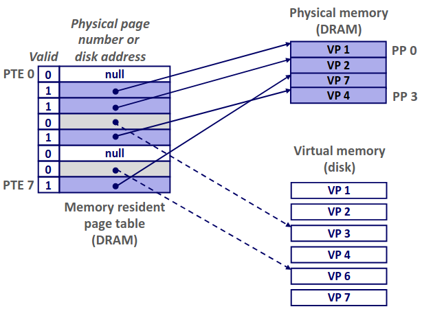
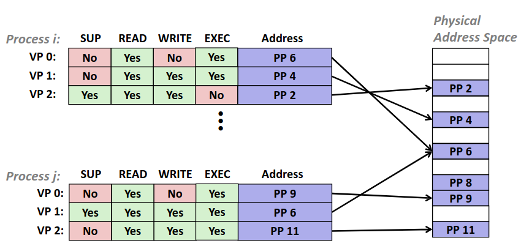

# Chapter 9.1 Concepts

虚拟内存，一个在前面章节中无数次提到的神秘概念，出没于程序的机器级表示、链接与异常控制流等等章节，这一章我们将正式介绍虚拟内存。
 
## Introduction

### Physical Address

现在给你一个机会，你将穿越回 50 年前由你来设计一套计算机内存管理的模式，很遗憾这时候的你还没有学过虚拟内存，所以你只能靠自己得小创意了。

内存就是一个个的位拼凑成一个个字节组成。显然每个内存的位置应当有个索引，不然无法访问到某块内存，你觉得给每个字节编一个编号是个好主意，毕竟给每个位都编一个号太多了。你决定把这个编号叫做内存的地址。

那么有了地址以后，我们可以拿着地址直接去访问内存了，这个地址直接对应了物理内存的地址，即**物理地址(Physical address, PA)**。

一个问题出现在你面前，对于每个物理地址，显然只能放一个数据，也就意味着程序的数据必须放在空的地址处，但是对于一个程序显然在编译时它并不知道运行时哪一块会是空的。这时候你想我们不是学过一种寻址方式叫**相对寻址(PC-relative)** 吗？这样在编译的时候就可以不用知道数据需要放在哪里了，只用在程序运行时，操作系统找块地方放着就好了！于是你大笔一挥，以后编译器都只准编译成相对寻址的模式！

这时候你意识到，计算机存储不只是主存，还有磁盘这个巨慢无比的设备，那么我的物理地址应该是表示磁盘上的数据还是主存上的呢？你想起学过的 cache，你觉得我们应该把**主存视为磁盘的缓存**，所以地址表示的是磁盘上的存储位置。然后每次内存访问到主存就像访问 cache 一样去找。

完成了这一套设计后你心满意足，你顺手编写了一个简单的操作系统，然后写了个小程序，一试系统直接崩了，你经过无数天的排查发现：小程序向一个未初始化的指针指向的地址写了一个奇怪的值，结果那个地址刚好是内核核心代码的位置，然后系统就挂了~~（为什么你都会写操作系统了还会犯这种错误）~~。

你意识到内存访问应当设置权限，不是每一块内存都可以让随便什么人访问。简单的解决办法是由操作系统管理一张表，里边记录分配的内存，并记录权限，这样程序访问每块内存时都由操作系统检测权限。

终于你完成了你的设计，但是由于在这个设计之中**内存管理混乱**，每个地址的分配位置完全取决于运行时的哪有空位置；不同进程间共享一个可见的物理地址空间，**隔离性极差**；并且由于相对寻址的影响，因为不同进程加载相对寻址很难映射到同一个库上，想要**共享一段库也成为了奢谈**，你的设计最终被市场抛弃了。你悲愤之中，穿越回了 ICS 的课堂，准备看一看是什么样的设计打败了你的物理地址。

但这种物理内存的简单设计并不是完全被抛弃了，由于其简单的特性，在一些嵌入式的微处理器中还有所应用，比如老式油车中的车载电脑。但是其他稍微复杂点的计算机系统都已经采用虚拟内存的设计了。

### Virtual Memory

虚拟内存，顾名思义**进程可见的内存空间是虚拟的**，当进程访问一块内存时，由操作系统配合硬件将**虚拟的内存地址翻译为实际的内存地址**。在这个模式下就形成了我们之前一直看到的内存假象，仿佛每一个进程都独有一个完整的地址空间。

其中执行内存翻译的在硬件上有专门的实现，称为**内存管理单元(Memory Management Unit, MMU)**，由于内存访问在程序中再常见不过了，故而 MMU 十分重要，其直接位于 CPU 的那块芯片上。

每当 CPU 执行一条内存访问指令时，其访问的都是**虚拟地址(Virtual Address, VA)**，将对应的地址发送给 MMU，然后 MMU 翻译出**物理地址(Physical Address, PA)**以后，再去访问内存，然后内存将数据发送给 CPU。可以发现在这种模式中，PA 已经对 CPU 不可见了。

### Address Space

为了便于后文讨论，我们引入地址空间的概念，分别为虚拟地址空间与物理地址空间。

虚拟地址空间(Virtual Address Space)用 n 位长的二进制数表示，那么地址空间总长度为 \\(N=2^n\\) 对应编号集合\\(\lbrace 0,1,2,3,...,N-1\rbrace\\)。虚拟地址空间为每个进程独立享有，这也是采用虚拟内存的一大优势。

物理地址空间(Physical Address Space)用 m 位长的二进制数表示，那么地址空间总长度为 \\(M=2^m\\) 对应编号集合\\(\lbrace 0,1,2,3,...,M-1\rbrace\\)。物理内存空间为所有进程共同享有，其对应硬件内存地址。

而所谓的内存翻译就是从虚拟地址空间向物理地址空间做映射。然而根据已有的知识我们知道现在 64 位机下 \\(N=2^{64}\\)，显然不可能有那么长的物理内存，所以 N 不等于 M，两个集合的势都不相等，必然不可能建立双射。然而如果单个进程的虚拟地址空间映射到物理地址空间要求单射(每个物理地址显然只能分配给一个虚拟地址)，故在物理地址空间中引入 \\(\emptyset\\)，对于没有分配的虚拟地址就是映射到了空集上。

## Why Virtual Memory

前文简要介绍了一下虚拟内存相关的知识，批判了直接用物理地址的方案，接下来会更为详细的介绍 VM 的知识，并引出 VM 的好处。

### VM as a tool for memory management

VM 一个最为直观重要的好处是**每个进程有了自己独有的虚拟地址空间**。这样程序编写编译时可以直接将内存视为一块线性的数组，而对于 VA 映射为 PA 的映射方式有操作系统与 MMU 把关，十分灵活。

不同进程的同一 VA 既可以映射为同一 PA，也可以不同；不同 VA 也可以映射位同一 PA。

### VM as a tool for caching

我们上文中提到主存是磁盘的一个缓存，那么我们可以认为 VM 就是一个存在在磁盘上的存储空间。虽然没有任何一个磁盘有虚拟内存那么大。

我们以**页(Page)**，作为管理磁盘的单位，如同我们将内存中数据放入 cache 中一样，我不会每次用哪个字节放哪个字节，而是把一块内存数据放入缓存。对于磁盘主存我们同样处理，每次我们都将一整个页放入主存当中。

那么 VM 有着跟磁盘的对应关系，将 VM 也按照页的大小划分，每次需要为某个 VA 分配 PA 时，就为对应 VM 的那个页分配一个磁盘上的对应的页。然后需要用某个 VA 时，就会将对应的页拿到主存中。由此我们可以将主存视为 VM 的一个缓存。

既然讨论了缓存就必然需要讨论映射模式，即怎么从磁盘映射到主存呢？对缓存熟悉的同学可能还记的几种映射模式：全相连、组相连...我们在第六章第四节中详细的讨论过不同映射模式的含义以及其优劣，在这里不再重复。

直接说结论的话内存采用的是全相连的模式，全相连的好处是不会有冲突不命中，但会增加硬件实现的成本，降低映射效率。但是考虑到磁盘慢的可怕，miss 的代价实在太高，与之相比在主存的额外花费变得可接受了。

有了这个认知我们即可建立起对虚拟内存的一套相对完整的认知，**即对于分配每个 VA 是按页映射到磁盘上，然后当调用到这个地址时，将磁盘中对应的数据载入到内存中**。

由于磁盘到内存的映射直接按照 cache 的方式即可，那么只用在关注 VP 向 PP，即**虚拟页向磁盘页**映射。

我们只需要建立维护一个简单的数据结构：**页表(Page Table)**。页表存储在内存中，由每个进程的内核代码维护，在页表中我们只需要记录每个分配的虚拟页对应的物理页即可。考虑到页通常是比较大的，所以说页表中条目不会过多，也就无需占用过大的内存。值得注意的是页表为**每个进程独有**。

页表可以类比为一个结构体数组，每个元素称为单个**页表实体(Page Table Entries, PTEs)**，对应记录一条 VP 向 PP 的映射。

可以看到在图片中，VP 被分配到了磁盘上，而内存则是充当了缓存。那么缓存就必然有命中与未命中，即 hit 与 miss，在内存中我们称为**页命中(Page hit)与页缺失(Page Fault)**。

Page Fault 这个概念我们在异常控制流中提到过，其实就是当访问某个你事先要求分配的内存，因为种种原因，可能是因为你分配的太大，可能是太久没用了，操作系统只在磁盘上给你分了一个页，而在内存中没用，当你后续用到这块内存时，操作系统就会去处理这个问题，把对应的页从磁盘拉到内存中，然后再把数据给你。

### VM as a tool for protection

有了页表进行记录 VP 向 PP 的映射关系，也便于我们更好的执行内存保护。

1. 可以更好的知道哪些内存时分配可用的，每次内存访问都需要通过 MMU 把关，而查询对应页表的过程也可以知道哪些内存是分配过可用，哪些内存是程序乱报的数，根本没分配过。

2. 在页表中增加额外的位表示权限，可以更好的管理内存读写权限，简单的权限包括可读可写可执行等等，只需要访问页表时根据权限位判断当前操作是否合法。

本节的内容就到此为止了，在这一节中我们简要介绍了一些关于 VM 的概念与 VM 的基本运作逻辑，下一节我们将更为详细的介绍 VM 的机制，主要是内存翻译以及页表的数据组织方式。 

------
© 2026. ICS Team. All rights reserved.
