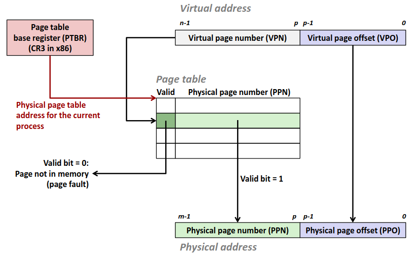
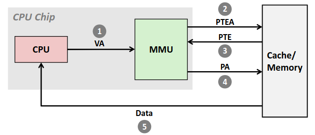
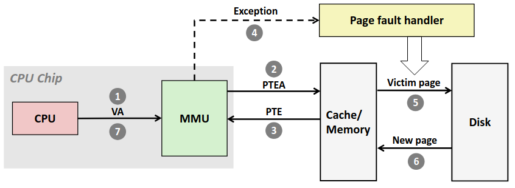
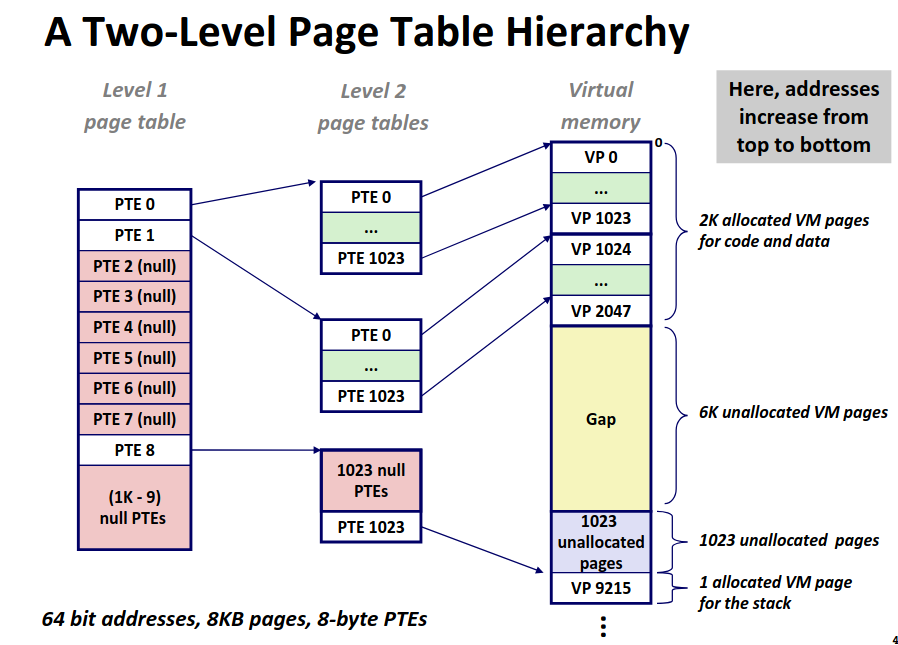
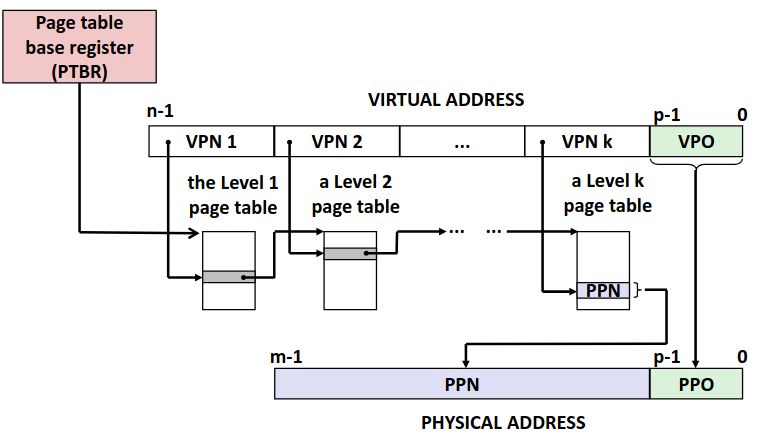

# Chapter 8.2 Address Translation

在上一节中我们讨论了关于虚拟内存的一些基本的内容，这一节我们将进一步深入研究内存翻译这个过程。

## Address Translation

和 cache 中的思想方法一致，我们先对地址进行划分。

**Virtual address = Virtual page offset + Virtual page number (VA = VPO + VPN)**. VPN 不是梯子，是对应的页的编号，而 VPO 则是代表页内的偏移量。同理可以对物理内存进行划分。

**Physical address = Physical page offset + Physical page number (PA = PPO + PPN)**. 不难意识到，PPO 的大小应当等于 VPO 的大小，否者会出现无位置分配或者物理内存浪费的情况。

由于我们访问一个地址前需要先访问页表，而页表也是存在内存中的，那么这就矛盾了，我要访问内存，需要通过页表翻译为物理地址，然而页表又再内存中，我要先访问内存。

解决方案很简单，我们在 CPU 上引入一块新的寄存器，称为**页表基质寄存器 (Page Table Base Register, PTBR)**，里面存放当前进程的页表的**物理地址**(如果是虚拟地址又陷入循环了)。

那么每次内存访问，我们先将 VP 拆为 VPO 与 VPN，然后把 VPN 拿到页表中找到对应的 PPN 再把 PA = PPN + VPO，拿到物理地址到内存中找对应的地址即可。 

如果对应的页在内存中，就会形成如下图的访问顺序。

CPU 现将需要访问的 VA 发送给 MMU，MMU 再根据页表的位置向内存中去找页表中 VA 对应的条目，然后很幸运的对应的 VP 分配在了内存中，内存返回条目，然后 MMU 根据这些信息拼凑出对应实际的 PA，再向内存访问 PA，然后数据返还给 CPU。

不难意识到虽然只有一个内存访问请求但实际上需要两次的内存访问。

而如果对应的页不在内存中，那就灾难了，大致流程如下图。

可以看到我们需要去磁盘中寻找数据，并且还要将被替换页的数据写入磁盘中，代价十分惨烈。

## Translation Lookaside Buffer

可以看到目前为止虚拟内存虽然带来了一些好处，但在效率上却不尽如人意。对于 Page Fault 的情况无法避免，总要访问到在磁盘上而不在内存中的数据的，就算直接采用物理地址也无法避免。糟糕的在与 Page Hit 时我们竟然也需要访问两次内存，而如果采用物理地址只需要一次，而且页表也是在内存中的数据，增加了数据总量，考虑到 cache，代价更大了。

核心在与 PTE 作为重要的数据，混杂在了所有数据当中，占内存抢 cahce，如果我们对它区别对待，增加一块缓存专门用于存储页表的项，会极大提高效率！

**转译后备缓冲器 (Translation Lookaside Buffer, TLB)，也称为页表缓存**，一块新的 cache 在 CPU 芯片上，非常小，仅能存储极少的条目(8~16条)。

那么我们在从 VPN 得到 PPN 的过程中，就像访问 cache 一样，将 VPN 划分为索引与标记，先去 TLB 中找对应的条目。 

这种方法极大的加快了访问速度，我们一直提到 cache 的访问极快，更别说 TLB 直接在 CPU 芯片上，速度几乎和 L1cahce 等同，相较于后面的内存访问，这个代价几乎可以忽略不计了。

但是 TLB 的条目不是很少吗，miss rate 不会很高吗？如果我们条目过多显然会增加硬件实现的成本，在 CPU 这个寸土寸金的地方容不得我们挥霍。那么为什么很少的条目就足够了呢？核心在于**页很大**，对于一个进程，往往用到的页的数量是相当有限的，所以极少的条目就可以保证一个极高的 hit rate 了。

## Multi-Level Page Tables

在前文里我们说页表像一个数组一样，里面存储所有虚拟页与实际页的对应，就像一个魔法箱，你给一个 VA，它出一个 PA。但是如果你实际算一笔账的话就会意识到不对。

如果我们考虑需要 O(1) 访取元素，显然页表中的元素应当顺序组织，而不能用链表，必须直接索引，如果接触过桶排序的同学就能意识到，通过桶的想法能实现我们的需求，即开辟一个很大的数组，数组索引对应了 VA 的标号，数组存的值对应 PA。有经验的同学就会意识到对于桶最大的限制来源于空间复杂度。

如果考虑 4K 的页大小，以及 48 位的地址空间的话，如果每个条目 8 字节大。那么对于一个页表我就需要 \\(2^{48}\*2^{-12}\*2^3=2^{39} \space bytes \\) ，约 512 GB 的空间！完全不可接受。

然而实际上大部分虚拟页都是不可能分配的，这种稀疏的桶优化为哈希表是常见的思路。利用 Hashing 的思想，我们提出了**多级页表(Multi-Level Page Tables)**。

多级页表即采用间接映射，第一级的页表每个条目实际上为一个指针指向第二级页表，第二级页表在指向更低一级的页表。直到最低一级的页表中的条目存放的是 PPN。

而这种方案节省内存在于我只需要激活高级页表中用到的节点所对应的低级页表，对于没用到的部分空间便被省去了。

前文中提到哈希或许对部分同学有误导性，对于哈希，低级的存储常用链表结构，那我们页表的低级也采用链表结构的话在低级需要常数级的访问。有人说常数级就常数级呗，很快啊。别忘了每次对页表的访问都是一次赤裸裸的内存访问，在这种系统级问题下，完全是灾难级的负优化。

但是哈希我们低层次采用链表的原因是递属哈希节点下的实体数目是不确定的，然而对于最低层次的页表下所拥有的实体数仍是确定的，所以我们仍可在最低层次的页表下直接建立桶，实现 O(1) 的访问。

那么一整套的内存访问逻辑就以及构筑完成了，主要到多级页表的访问仍然需要多次访问内存，显然不是级数越多越好，并且这种访问是缓存不友好的，但是考虑到 TLB 的存在，页表的访问本身就极少了，所以这种效率也可以接受了。

那么对于虚拟内存部分的主体内容就大致结束了，下一节我们将会在讲一讲关于内存映射即共享内存相关的内容，再举一个简单的例子。

------
© 2025. ICS Team. All rights reserved.
