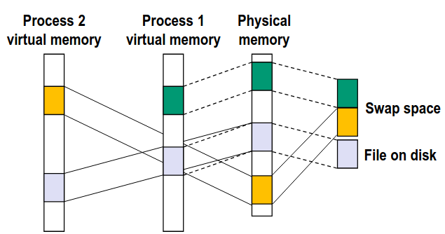
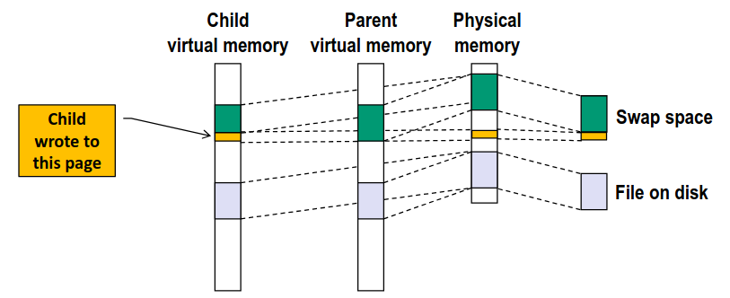
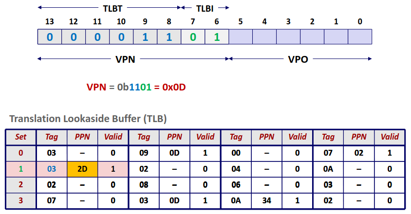
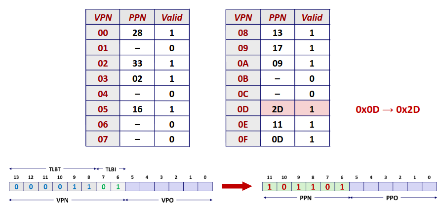
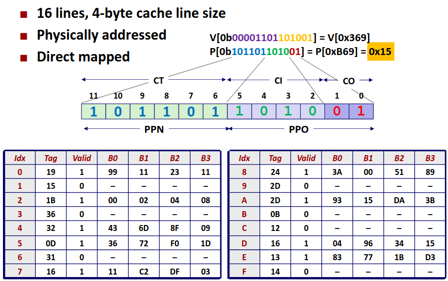

# Chapter 9.3 Memory Mapping

最后一节我们来讨论关于内存映射部分的内容并且举一个简单的内存系统模型加深理解。

## Memory Mapping

我们先前讨论了虚拟内存的基本知识以及地址翻译的设计。在虚拟内存的优势部分我们曾说过，通过虚拟内存的机制，我们可以很简单的实现共享库这个强大的工具。在介绍如何实现以前我们还需要介绍关于 linux 系统常见关于内存管理的设计。

在先前我们提到对于虚拟内存映射到物理内存上时我们提到应当在磁盘上也为这个虚拟内存分配一块位置，而将主存视为对磁盘的缓存。而在硬盘上分配的空间，或者说主存中放不下的工作集，就可以存放在硬盘上的 **swap 分区**中。

而对于实现共享库的核心在与不同的进程之间共享**文件**，而文件不过是硬盘上一块数据，对于共享库的实现方法就很显然了，我只需要磁盘上的文件放在主存中，然后不同的进程的不同或者同一 VA 一同映射到同一 PA 上即实现了文件共享。

而我们如果把 swap 分区也视为文件，那么这套机制设计统一、逻辑自洽，也完美符合了 Linux 的设计理念：一切皆文件。

同理在先前在讲进程的时候我们提到对于 fork，产生一个与父进程完全相同的子进程时，我们会采用 **"Copy-on-write"** 的策略，这种策略可以有效提高我们 fork 的效率，那么在虚拟内存的下 Copy-on-write 的实现也非常简单了，子进程产生的时候**直接复制父进程的页表**，这样子进程的所有 VA 就映射到父进程对应的 PA 上，两者享有了完全一样的内存。

这时候我就从 OS 层面将对应的内存权限缩紧，父进程或者子进程试图修改对应位置的值时，再触发复制机制即可。

当然这个设计只是一个现有的设计而不是一个普适性的设计，比如在 Windows 系统中就限制了 swap 分区的使用甚至抛弃这种设计。利弊讨论超越了本课程的范围，感兴趣的同学可以查阅资料了解。
 
## Simple Memory System

我们通过一个例子算一算参数来加深对内存系统的理解~~(从考试角度这部分可能反而更重要因为方便出计算题)~~

对于一组简单的数据物理内存大小为 4K，即需要 12 位来表示，而虚拟内存大小为 16K，即需要 14 位来表示，而页的大小为 64 bytes，那么自然需要 6 位 \\(2^6=64\\) 表示在页内偏移。那么 VA 与 PA 可以如下图划分。

现在来看我们的 TLB，TLB 可以存 16 个实体，采用四路组相连。那么显然 \\(2^2=4\\) TLBI 需要两位，剩下的留作 TLBT。

可以看到图中对于一个 VPN 我们将其进行划分，至于为什么 Set index 采用中间的位在 cache 中已经讨论过了。

来到页表这一层次，相对就简单很多了直接根据 VPN 的索引找到 PPN，和 VPO 拼在一起再访问物理内存就可以了。

在得到 PA 后，再访问内存，如果考虑的更为复杂，这中间还有 cache 的访问，我们这里就直接考虑访问内存了。内存采用全相连的模式，顺序比较 tag 即可，我们就得到了需要的数据。

我们关于虚拟内存基本知识的介绍就到此为止了，接下来几节我们将会在虚拟内存的基础上介绍动态内存分配的基本知识，希望对你有帮助🌹

------
© 2026. ICS Team. All rights reserved.
