# Chapter 9.4 Dynamic Memory Allocation: Basic Concepts

当运行时需要额外的虚拟内存时，动态内存分配器就要派上用场了。较之低级的mmap和munmap，动态内存分配器更方便，也有更好的移植性。

**动态内存分配器**（dynamic memory allocator）维护着一个进程的虚拟内存区域，称为**堆**（heap）。下图展示了它的具体结构。假设堆是一个请求二进制零的区域，它会紧接在未初始化的数据（Uninitialized Data）区域后面开始，并向上生长（即向高地址生长）。对于每个进程，内核维护着一个变量brk，它指向堆的顶部。

<div align="center">
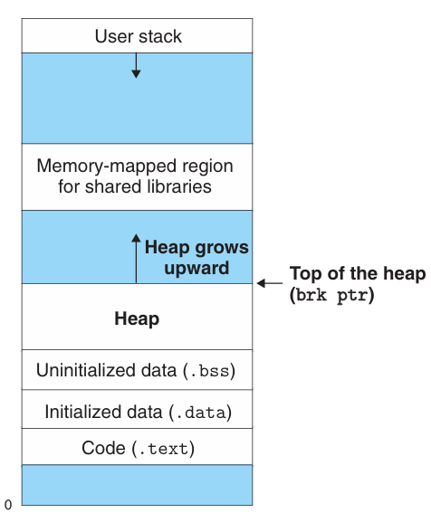
</div>

分配器将堆视为一组不同大小的**块**（block）的集合来维护。每个块就是一个连续的虚拟内存片（chunk），其状态要么是已分配（allocated）的，要么是空闲（free）的。

分配器有以下两种基本风格，这两种风格都要求应用显式地分配块，它们的不同之处在于由哪个实体来负责释放已分配的块。

* 显式分配器（explicit allocator）：要求应用显式地释放任何已分配的块。e.g. C标准库中的malloc和free函数。

* 隐式分配器（implicit allocator）：要求分配器当检测到一个已分配块不再被程序使用时，就释放这个块。e.g. 高级语言（如Lisp, Java）中的垃圾收集（garbage collection）。

本课程将围绕显式分配器进行讨论，对隐式分配器感兴趣的同学可参阅CSAPP第9.10节的内容或自行查阅相关资料。

##  The malloc and free Functions

C标准库提供了一个称为malloc程序包的显示分配器，程序通过调用malloc函数来从堆中分配块。

```C
#include <stdlib.h>
void *malloc(size_t size);
```

malloc函数分配成功会返回一个指针，指向大小至少为size字节的内存块。这个块会为可能包含在块内的任何数据对象类型做对齐。在32位模式中，malloc返回的块地址总是8的倍数，而在64位模式中总是16的倍数。

如果malloc分配失败，它就会返回NULL，并设置errno。

像malloc这样的动态内存分配器可以通过使用mmap和munmap函数显式地分配和释放堆内存，也可以使用sbrk函数：

```C
#include <unistd.h>
void *sbrk(intptr_t incr);
```

sbrk函数通过将内核的brk指针增加incr来扩展和收缩堆。如果成功，它就会返回brk的旧值，否则返回-1，并将errno设置为ENOMEM。

其他动态分配函数：
* calloc函数：是一个基于malloc函数的瘦包装函数，可以将分配的内存初始化为零。
* realloc函数：可以改变一个以前已分配的块的大小。

程序通过调用free函数来释放已分配的堆块：

```C
#include <stdlib.h>
void free(void *ptr);
```

free函数的ptr参数必须指向一个从malloc、calloc或者realloc获得的已分配块的起始位置。如果不是，那么free的行为就是未定义的，而且由于它不产生返回，所以就不会告诉应用出现了错误，这会导致出现一些令人迷惑的运行时错误。

下图概念性地模拟了malloc和free的实现，图中每个方框对应一个字（8字节），每个粗线标出的矩形对应一个块。阴影部分是已分配的块，无阴影部分是空闲块。堆地址是从左往右增加的。

<div align="center">
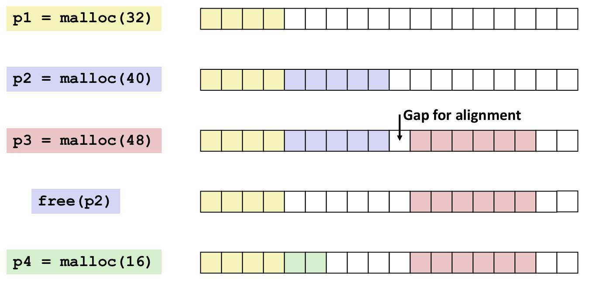
</div>

几个需要注意的地方：
* 在申请`p2=malloc(40)`时，程序请求一个5字的块，malloc实际分配了6字的块，是为了保持双字边界对齐。
* 在`free(p2)`时，调用free返回后，指针p2仍然指向被释放了的块。所以在它被一个新的malloc调用重新初始化之前，不能再使用p2。

##  Allocator Requirements and Goals

显示分配器必须在一些非常严格的约束条件下工作：

* 处理任意请求序列。一个应用可以有任意的满足约束条件的分配请求和释放请求序列。（即每个释放请求对应一个当前已分配块，这个块是由一个以前的分配请求获得的。）因此，分配器不可以假设分配和释放请求的顺序。
* 立即响应请求。不允许分配器为了提高性能重新排列或缓冲请求。
* 只使用堆。
* 对齐块（满足对齐要求）。
* 不修改已分配的块。一旦块被分配，就不允许修改或移动它了。

在这些限制条件下，分配器的编写者的目标仍然是实现**吞吐率**（throughput）最大化和**内存使用率**（memory utilization）最大化，然而性能和开销永远势不两立，这也意味着这两者是相互矛盾的。所以，分配器设计所面临的一个挑战就是在两个目标之间找到一个适当的平衡点。

## Fragmentation

造成堆利用率很低的主要原因是一种称为**碎片**（fragmentation）的现象。它发生在虽然有未使用的内存但不能满足分配请求时。有两种形式的碎片：内部碎片（internal fragmentation）和外部碎片（external fragmentation）。

**内部碎片**是在一个已分配块比有效载荷大时发生的，如下图所示：

<div align="center">
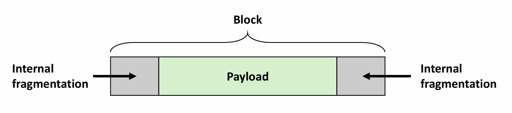
</div>

产生内部碎片的原因有很多，比如维护堆数据结构产生的的额外开销，或者为了满足对齐约束条件而增加块的大小。

内部碎片的量化非常简单，它就是所有已分配块的大小和它们的有效载荷大小之差的总和。所以内部碎片的数量只取决于以前请求的模式和分配器的实现方式。

**外部碎片**是当空闲内存合并起来能够满足一个分配请求，但是没有一个单独的空闲块足够大到能处理这个请求时发生的。例如在前面malloc和free示例图中，如果在`free(p2)`之后再申请8字的块，就无法满足要求。问题的产生在于，虽然堆中仍有8个空闲的字，但是它们分在两个空闲块中。

外部碎片的量化比内部碎片难得多，因为它不仅取决于以前请求的模式和分配器的实现方式，还取决于将来请求的模式，然而我们不可能知道将来请求的模式。所以分配器通常使用启发式策略来试图维持少量的大空闲块，而不是大量的小空闲块。

## Implementation Issues

一个实际的分配器要在吞吐率和利用率之间把握好平衡，就必须考虑以下几个问题：

* 空闲块组织（free block organization）：如何记录空闲块？
* 放置（placement）：如何选择一个合适的空闲块来放置一个新分配的块？
* 分割（splitting）：在将一个新分配的块放置到某个空闲块之后，如何处理这个空闲块中的剩余部分？
* 合并（coalescing）：如何处理一个刚刚被释放的块？

接下来我们将详细地讨论这些问题，并介绍几种不同的空闲块组织结构。

## Implicit Free Lists

任何实际的分配器都需要一些数据结构，允许它来区分块边界，以及区别已分配块和空闲块。大多数分配器将这些信息嵌入块本身。一个简单的方法如下图所示：

<div align="center">
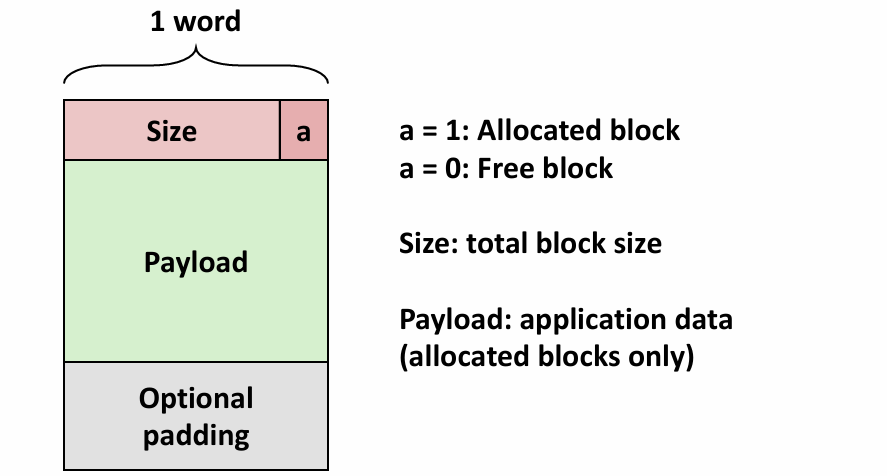
</div>

在这种情况中，一个块由头部（Header，大小为一个字）、有效载荷（Payload），以及可能的一些额外填充（Padding）组成。头部编码了这个块的完整大小和分配状态（即标志这个块是已分配的还是空闲的）。

> 注：因为有双字的对齐约束条件存在，块的大小总是16的倍数，即块大小的最低四位总是0。因此我们只需前面的高位来存储块大小，用最低四位来指明这个块的分配状态。这样就使得原来需要2字空间存储的头部节省为只需1字。

假设块的结构如上图所示，我们可以将堆组织为一个连续的已分配块和空闲块序列，如下图所示：

<div align="center">
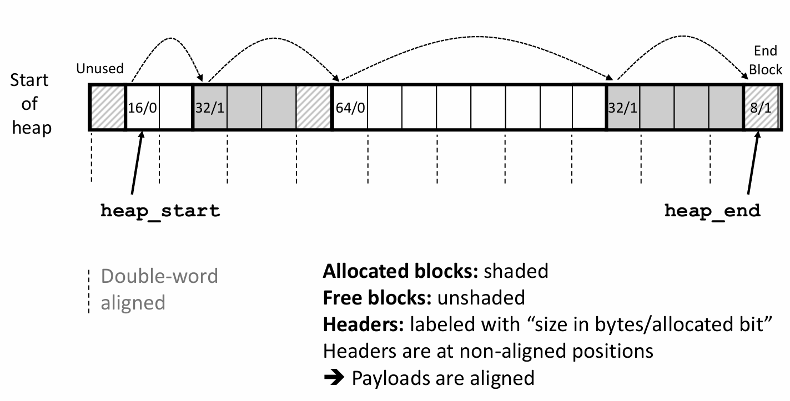
</div>

我们称这种结构为**隐式空闲链表**（implicit free lists），是因为空闲块通过头部中的大小字段隐含地连接着。分配器可以通过遍历堆中所有的块，从而间接地遍历整个空闲块的集合。

在上图中不难发现，所有块的头部都处在不满足双字对齐约束条件的位置，这恰恰是为了使每个块的有效载荷满足双字对齐。

同时，在链表结尾还设置了一个已分配的终止头部（terminating header），我们将在实现一个动态内存分配器时看到它实际上简化了空闲块的合并。

隐式空闲链表的优点是简单，相对应地，其显著的缺点就是开销过大，对空闲链表进行搜索所需要的时间与堆中已分配块和空闲块的总数呈线性关系。

## Placing Allocated Blocks

当一个应用请求一个k字节的块时，分配器搜索空闲链表，查找一个足够大可以放置所请求块的空闲块。分配器执行这种搜索的方式是由**放置策略**（placement policy）确定的。一些常见的策略是**首次适配**（first fit）、**下一次适配**（next fit）和**最佳适配**（best fit）。

* 首次适配：从头开始搜索空闲链表，选择第一个合适的空闲块。其优点是它趋向于将大的空闲块保留在链表的后面。缺点是它趋向于在靠近链表起始处留下小空闲块的“碎片”，这就增加了对较大块的搜索时间。

* 下一次适配：由大名鼎鼎的Donald Knuth提出。（源于这样一个想法：如果上一次在某个空闲块中发现了一个匹配，那么很可能下一次也能在这个剩余块中发现匹配。）它和首次适配很相似，区别在于它是从上一次查询结束的地方开始搜索。下一次适配比首次适配运行起来明显要快一些，尤其是当链表的前面布满了许多小碎片时。但是下一次适配的内存利用率比首次适配低得多。

* 最佳适配：检查每个空闲块，选择适合所需请求大小的最小空闲块。最佳适配比首次适配和下一次适配的内存利用率都要高一些。然而，在简单空闲链表组织结构中，比如隐式空闲链表，使用最佳适配的缺点是它要求对堆进行彻底的搜索。

## Splitting Free Blocks

一旦分配器找到一个匹配的空闲块，它就必须做另一个策略决定，那就是要分配这个空闲块中的多少空间。一个选择是用整个空闲块，虽然这种方法简单快捷，但是主要的缺点就是它会产生内部碎片。如果放置策略趋向于产生好的匹配，那么额外的内部碎片还可以接受。然而，如果匹配不太好，那么分配器通常会选择将这个空闲块**分割**（split）为两部分。第一部分变成分配块，剩下的变成一个新的空闲块。

下图展示了分配器如何分割一个48字节的空闲块，来满足一个应用对堆内存32字节的请求。

<div align="center">
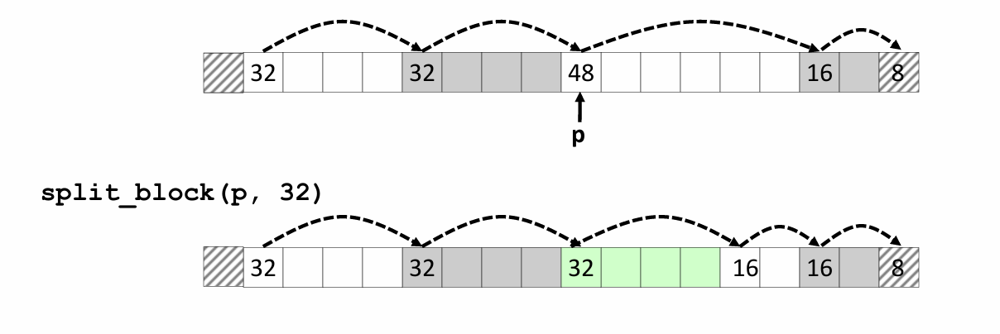
</div>

## Coalescing Free Blocks

当分配器释放应该已分配块时，可能有其他空闲块与这个新释放的空闲块相邻。这些邻接的空闲块可能引起一种现象，叫做**假碎片**（fault fragmentation），就是有许多可用的空闲块被切割成小的、无法使用的空闲块。比如，下图展示了释放一个分配块后产生的问题，结果是两个相邻的空闲块，大小分别为32字节和16字节，那么接下来一个对5字（需分配6字即48字节）有效载荷的请求就会失败，尽管两个空闲块的合计大小其实是足够大的。

<div align="center">
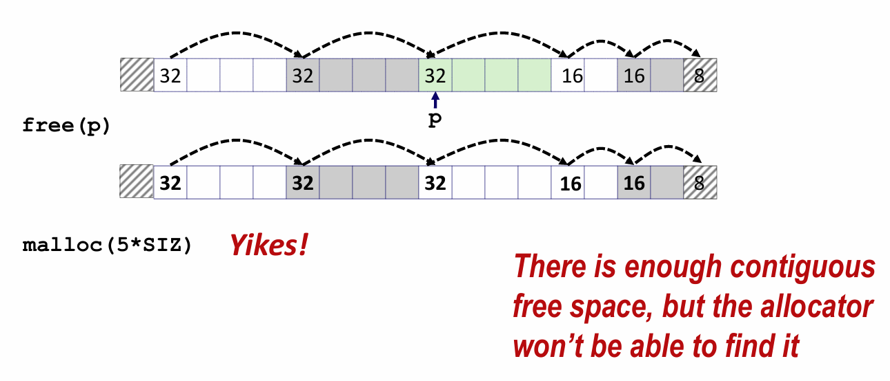
</div>

为了解决假碎片问题，任何实际的分配器都必须合并相邻的空闲块，该过程称为**合并**（coalescing）。这就出现了一个重要的策略决定，即何时执行合并。分配器有两种选择：

* 立即合并（immediate coalescing）：在每次一个块被释放时，就合并所有的相邻块。
* 推迟合并（deferred coalescing）：等到某个稍晚的时候再合并空闲块。比如等到某个分配请求失败时再扫描整个堆，合并所有空闲块。

## Coalescing with Boundary Tags

我们称想要释放的块为**当前块**。合并下一个空闲块显然是简单且高效的：当前块的头部指向下一个块的头部，可以检查这个指针来判断下一个块是不是空闲的。如果是，就将它的大小简单地加到当前块头部的大小上，这两个块就在常数时间内被合并了。

但是如何合并前面的块呢？如果是在一个带头部的隐式空闲链表中，唯一的选择就是搜索整个链表，记住前面块的位置，直到到达当前块。这无疑会浪费大量的时间。

Donald Knuth（没错，又是这位传奇人物）提出了一种聪明且通用的技术，叫做**边界标记**（boundary tag），允许在常数时间内进行对前面块的合并。这种思想是在每个块的结尾处添加一个**脚部**（footer，边界标记），如下图所示。脚部就是头部的一个副本（记录块大小和分配状态），现在分配器就可以通过检查每个块的脚部，来判断前面一个块的起始位置和状态。

<div align="center">
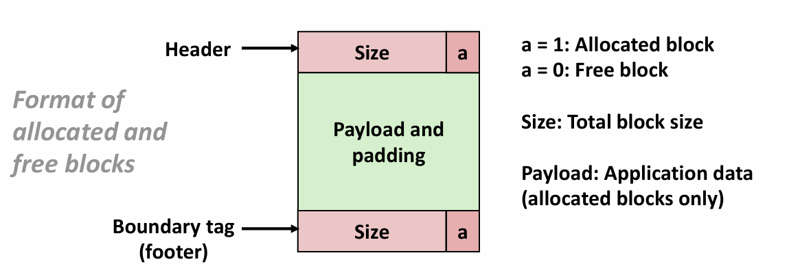
</div>

下面列举了分配器释放当前块时的不同情况中，使用边界标记合并的结果（在每种情况下中，合并都是在常数时间内完成的）：

1. 前面的块和后面的块都是已分配的。

<div align="center">
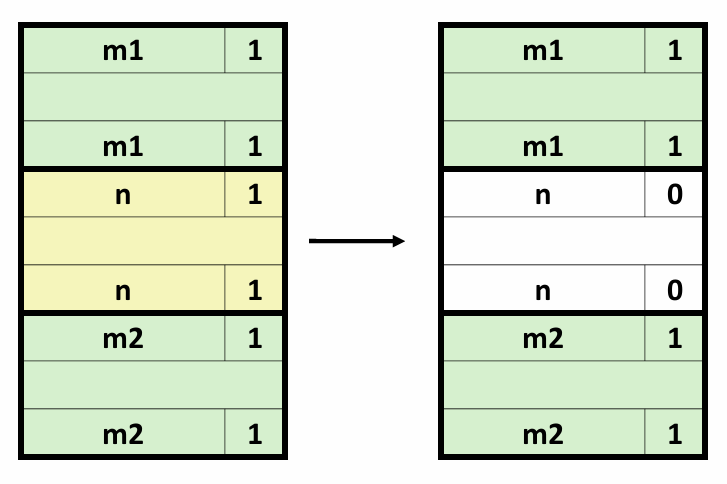
</div>

2. 前面的块是已分配的，后面的块是空闲的。

<div align="center">
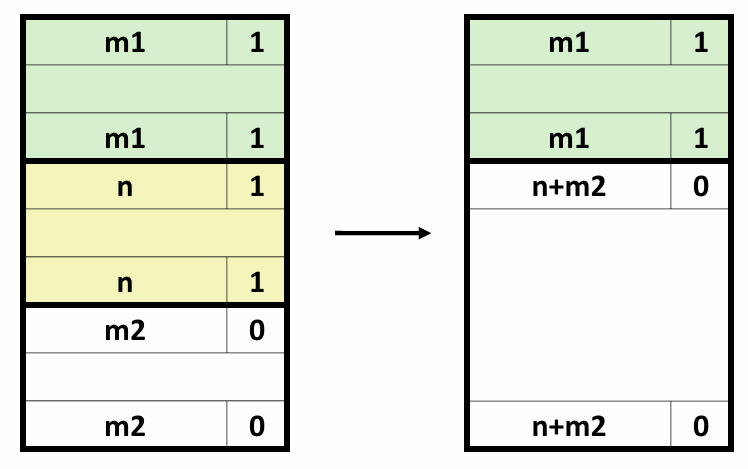
</div>

3. 前面的块是空闲的，后面的块是已分配的。

<div align="center">
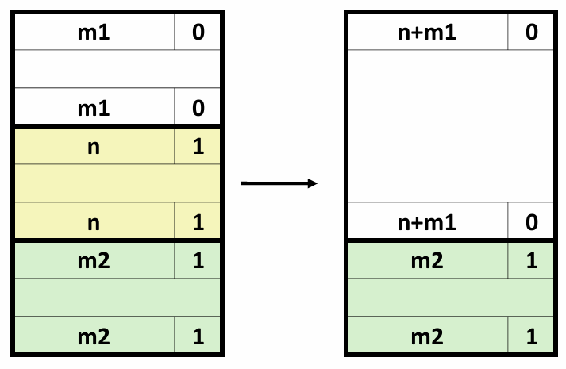
</div>

4. 前面的块和后面的块都是空闲的。

<div align="center">
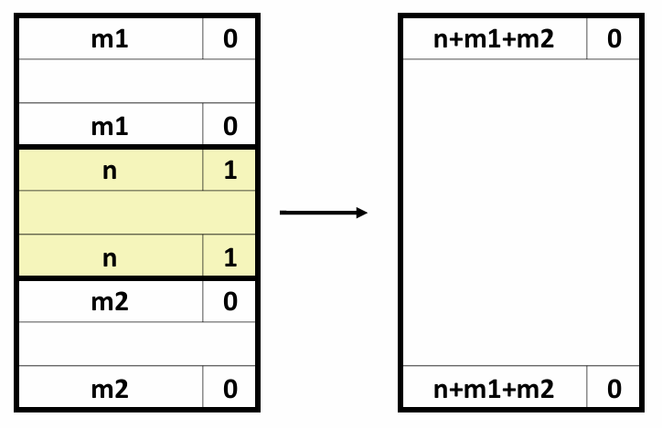
</div>

边界标记的概念是简单优雅的，它对许多不同类型的分配器和空闲链表组织都是通用的。然而，它也存在一个潜在的缺陷：它要求每个块都保持一个头部和一个脚部，在应用程序操作许多个小块时，会产生显著的内存开销。

幸运的是，有一种非常聪明的边界标记优化方法。想一想究竟是哪些块需要一个脚部？没错，只有前面的块是空闲块时，当前块才需要用到脚部。也就是说，已分配块中不需要脚部。因此，我们只需将前面块的分配位存放在当前块中多出来的低位中即可（双字对齐时，size是16的整数倍，因此有4个位可以空出，用于存储前面块的分配状态和当前块的分配状态）。如下图所示：

<div align="center">
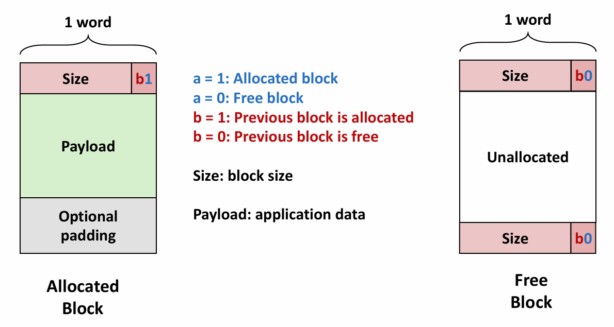
</div>


------
到此为止，我们介绍了动态内存分配的基础知识。在下一节中，我们将学习一些进阶的知识，包括更复杂的空闲链表组织结构，并尝试实现一个简单的分配器。


 
------
© 2026. ICS Team. All rights reserved.
