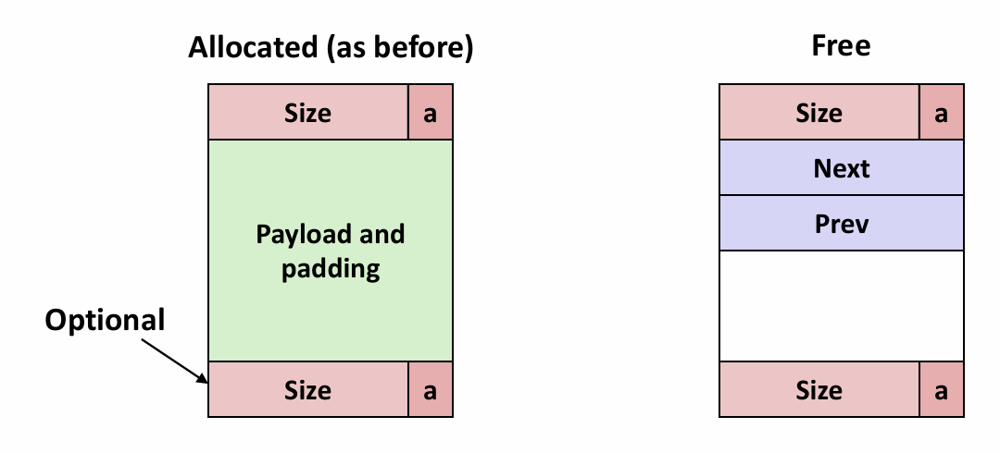

# Chapter 9.5 Dynamic Memory Allocation: Advanced Concepts

## Explicit Free Lists

隐式空闲链表是一种较为简单的空闲链表组织结构。然而，由于块分配与堆块的总数呈线性关系，所以对于通用的分配器，隐式空闲链表是不适合的。一种更好的方法是将空闲块组织为某种形式的显式数据结构。因为程序实际上不需要一个空闲块的主体，因此实现这个数据结构的指针就可以存放在这些空闲块的主体中。

例如，堆可以组织成一个双向空闲链表，在每个空闲块中，都包含一个prev（前驱）和next（后继）指针，如下图所示：

使用双向链表代替隐式空闲链表，我们实际上只需要维护空闲块的链表，这使得首次适配的分配时间从块总数的线性时间减少到空闲块数量的线性时间。

不过对于释放一个块来说，它的时间可能是线性的，也可能是个常数，这取决于空闲链表中块的排序策略。

一种方法是用**后进先出**（LIFO）的顺序维护链表，将新释放的块放置在链表的开始处。使用LIFO的顺序和首次适配的放置策略，分配器会最先检查最近使用过的块。在这种情况下，释放一个块可以在常数时间内完成。如果使用了边界标记，那么合并也可以在常数时间内完成。

另一种方法是按照**地址顺序**来维护链表，其中链表中每个块的地址都小于它后继的地址。在这种情况下，释放一个块需要线性时间的搜索来定位合适的前驱。不过，按照地址排序的首次适配比LIFO排序的首次适配有更高的内存利用率，接近于最佳适配的内存利用率。

一般而言，显示链表的缺点是空闲块必须足够大，这样才能够包含所有需要的指针，以及头部和可能需要的脚部。这就导致了更大的最小块大小，也潜在地提高了内部碎片的程度。

## Segregated Free Lists

一个使用单向空闲块链表的分配器需要与空闲块数量呈线性关系的时间来分配块。一种流行的减少分配时间的方法，通常称为**分离存储**（segregated storage），就是维护多个空闲链表，其中每个链表中的块有大致相等的大小。一般的思路是将所有可能的块大小分成一些等价类，也叫做**大小类**（size class）。

分配器维护着一个空闲链表数组，每个大小类一个空闲链表，按照大小的升序排列。当分配器需要一个大小为n的块时，它就搜索相应的空闲链表。如果不能找到合适的块与之匹配，它就搜索下一个链表，以此类推。

分离的空闲链表的优势是有更高的吞吐率和内存利用率。例如对于以2的幂次方划分的的大小类，分配时间从线性缩短到对数时间。同时，它的首次适配搜索近似于整个堆的最佳适配搜索。（极端情况：每个块大小都有一个对应的大小类，此时等价于最佳适配。）

------

© 2025. ICS Team. All rights reserved.