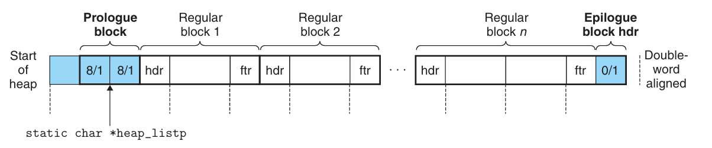

# Chapter 9.6 Implementing a Simple Allocator

本节将基于前面所讲知识，从头到尾实现一个简单的分配器。这也直接对应我们课程的malloc lab。当然，本节内容也只是为构建动态内存分配器提供一种简单的思路和实现框架，具体不同层面上的实现还需要同学们自行完成。

我们所实现的分配器基于隐式空闲链表，使用立即边界标记合并方式，最大块大小为\\(2^{32}=4GB\\)。代码可以不加修改地运行在32位或64位的进程中。

## General Allocator Design

我们的分配器使用`memlib.c`包所提供的一个内存系统模型，它允许我们在不干涉已存在的系统层mmalloc包的情况下，运行分配器。

`memlib.c`实现如下：

```C
  /*Private global variables*/
  static char *mem_heap; /*Points to first byte of heap*/
  static char *mem_brk; /*Points to last byte of heap plus 1*/
  static char *mem_max_addr; /*Max legal heap addr plus 1*/
 
  /*
  *mem_init-Initialize the memory system model
  */
  void mem_init(void)
  {
    mem_heap=(char*)Malloc(MAX_HEAP);
    mem_brk=(char*)mem_heap;
    mem_max_addr=(char*)(mem_heap+MAX_HEAP);
  }
 
  /*
  *mem_sbrk-Simple model of the sbrk function. Extends the heap
  * by incr bytes and returns the start address of the new area. In
  * this model, the heap cannot be shrunk.
  */
  void *mem_sbrk(int incr)
  {
    char *old_brk=mem_brk;
    
    if((incr<0)||((mem_brk+incr)>mem_max_addr)){
        errno=ENOMEM;
        fprintf(stderr,"ERROR: mem_sbrk failed. Ran out of memory...\n");
        return (void*)-1;
    }
    mem_brk+=incr;
    return (void*)old_brk;
  }
```

分配器包含在一个源文件`mm.c`中，用户可以编译和链接这个源文件到他们的应用中。分配器输出三个函数到应用中：

```C
extern int mm_init(void);
extern void *mm_malloc(size_t size);
extern void mm_free(void *ptr);
```

mm_init函数初始化分配器，如果成功返回0，否则返回-1。mm_malloc和mm_free函数与它们对应的系统函数有相同的接口和语义。分配器使用我们在9.4小节提到的带边界标记的块格式（块结尾加一个footer）。最小块大小为16字节，空闲链表组织成如下形式的隐式空闲链表：

<div align="center">

</div>

第一个字是一个双字边界对齐的不使用的填充字（padding），填充后面紧跟着一个特殊的**序言块**（prologue block），这是一个8字节的已分配块，只有一个头部和脚部组成。序言块是在初始化时创建的，并且永不释放。 在序言块后面紧跟的是零个或多个由malloc或者free调用创建的普通块。堆的末尾是一个特殊的**结尾块**（epilogue block），这个块是一个大小为零的已分配块，只有一个头部组成。这种设置的好处我们在前面的章节已经提到过，它是一种消除合并时边界条件的技巧。分配器使用一个单独的私有全局变量heap_listp，它总是指向序言块。这里我们可以做一个优化，即让它指向下一个块，而不是这个序言块。

##  Basic Constants and Macros for Manipulating the Free List

下面展示了一些我们在分配器编码中将要使用的基本常数和宏。第2~4行定义了一些基本的大小常数。第9~25行定义了一小组宏来访问和遍历空闲链表。

```C
 1 /*Basic constants and macros*/
 2 #define WSIZE 4 /*Word and header/footer size (bytes)*/
 3 #define DSIZE 8 /*Double word size (bytes)*/
 4 #define CHUNKSIZE (1<<12) /*Extend heap by this amount (bytes)*/
 5
 6 #define MAX(x,y) ((x)>(y)?(x):(y))
 7
 8 /*Pack a size and allocated bit into a word*/
 9 #define PACK(size,alloc) ((size)|(alloc))
 10
 11 /*Read and write a word at address p*/
 12 #define GET(p) (*(unsignedint*)(p))  //读取和返回参数p引用的字
 13 #define PUT(p,val) (*(unsignedint*)(p)=(val)) //将val存放在参数p指向的字中
 14
 15 /*Read the size and allocated fields from address p*/
 16 #define GET_SIZE(p) (GET(p)&~0x7)//从地址p的头部或脚部返回大小
 17 #define GET_ALLOC(p) (GET(p)&0x1)//从地址p的头部或脚部返回已分配位
 18
 19 /*Given block ptr bp, compute address of its header and footer*/
 20 #define HDRP(bp) ((char*)(bp)-WSIZE)//返回指向这个块的头部的指针
 21 #define FTRP(bp) ((char*)(bp)+GET_SIZE(HDRP(bp))-DSIZE)//返回指向这个块的脚部的指针
 22
 23 /*Given block ptr bp, compute address of next and previous blocks*/
 24 #define NEXT_BLKP(bp) ((char*)(bp)+GET_SIZE(((char*)(bp)-WSIZE)))//返回指向后面的块的块指针
 25 #define PREV_BLKP(bp) ((char*)(bp)-GET_SIZE(((char*)(bp)-DSIZE)))//返回指向前面的块的块指针
```

## Creating the Initial Free List

在调用mm_malloc或者mm_free之前，应用必须通过调用mm_init函数来初始化堆。

mm_init函数从内存系统中得到4个字，并将它们初始化，创建一个空的空闲链表。然后调用extend_heap函数，该函数将堆扩展CHUNKSIZE字节，并且创建初始的空闲块。

```C
 1 int mm_init(void)
 2 {
 3   /*Create the initial empty heap*/
 4   if((heap_listp=mem_sbrk(4*WSIZE))==(void*)-1)
 5      return -1;
 6   PUT(heap_listp,0); /*Alignment padding*/
 7   PUT(heap_listp+(1*WSIZE),PACK(DSIZE,1));/*Prologue header*/
 8   PUT(heap_listp+(2*WSIZE),PACK(DSIZE,1));/*Prologue footer*/
 9   PUT(heap_listp+(3*WSIZE),PACK(0,1)); /*Epilogue header*/
 10  heap_listp+=(2*WSIZE);
 11
 12  /*Extend the empty heap with a free block of CHUNKSIZE bytes*/
 13  if(extend_heap(CHUNKSIZE/WSIZE)==NULL)
 14     return -1;
 15  return 0;
 16 }
```

##  Freeing and Coalescing Blocks

应用通过调用mm_free函数来释放一个以前分配的块，这个函数释放所请求的块（bp），然后使用边界标记合并技术将之与邻接的空闲块合并起来。

```C
 1 void mm_free(void *bp)
 2 {
 3   size_t size=GET_SIZE(HDRP(bp));
 4
 5   PUT(HDRP(bp),PACK(size,0));
 6   PUT(FTRP(bp),PACK(size,0));
 7   coalesce(bp);
 8 }
 9
 10 static void *coalesce(void *bp)
 11 {
 12   size_t prev_alloc=GET_ALLOC(FTRP(PREV_BLKP(bp)));
 13   size_t next_alloc=GET_ALLOC(HDRP(NEXT_BLKP(bp)));
 14   size_t size=GET_SIZE(HDRP(bp));
 15
 16   if(prev_alloc&&next_alloc){ /*Case1*/
 17   return bp;
 18   }
 19
 20   else if(prev_alloc&&!next_alloc){ /*Case2*/
 21     size+=GET_SIZE(HDRP(NEXT_BLKP(bp)));
 22     PUT(HDRP(bp),PACK(size,0));
 23     PUT(FTRP(bp),PACK(size,0));
 24   }
 25
 26   else if(!prev_alloc&&next_alloc){ /*Case3*/
 27     size+=GET_SIZE(HDRP(PREV_BLKP(bp)));
 28     PUT(FTRP(bp),PACK(size,0));
 29     PUT(HDRP(PREV_BLKP(bp)),PACK(size,0));
 30     bp=PREV_BLKP(bp);
 31   }
 32
 33   else{ /*Case4*/
 34     size+=GET_SIZE(HDRP(PREV_BLKP(bp)))+
 35     GET_SIZE(FTRP(NEXT_BLKP(bp)));
 36     PUT(HDRP(PREV_BLKP(bp)),PACK(size,0));
 37     PUT(FTRP(NEXT_BLKP(bp)),PACK(size,0));
 38     bp=PREV_BLKP(bp);
 39   }
 40   return bp;
 41 }
```

## Allocating Blocks

一个应用通过调用mm_malloc函数来向内存请求大小为size字节的块。在检查完请求的真假后，分配器必须调整请求块的大小，从而为头部和脚部留有空间，并满足双字对齐的要求。

一旦分配器调整了请求的大小，它就会搜索空闲链表，寻找一个合适的空闲块，如果有合适的，那么分配器就放置这个请求块，并可选地分割出多余的部分，然后返回新分配块的地址。

如果分配器不能够发现一个匹配的块，那么就用一个新的空闲块来扩展堆，把请求放置在这个新的空闲块里，可选地分割这个块，然后返回一个指针，指向这个新分配的块。

```C
 1 void *mm_malloc(size_t size)
 2 {
 3   size_t asize; /* Adjusted block size*/
 4   size_t extendsize;/* Amount to extend heap if no fit*/
 5   char *bp;
 6
 7   /*Ignore spurious requests*/
 8   if(size==0)
 9      return NULL;
 10
 11   /*Adjust block size to include over head and alignment reqs.*/
 12   if(size<=DSIZE)
 13      asize=2*DSIZE;
 14   else
 15      asize=DSIZE*((size+(DSIZE)+(DSIZE-1))/DSIZE);
 16
 17   /*Search the free list for a fit*/
 18   if((bp=find_fit(asize))!=NULL){
 19      place(bp,asize);
 20      return bp;
 21   }
 22
 23   /*No fit found. Get more memory and place the block*/
 24   extendsize=MAX(asize,CHUNKSIZE);
 25   if((bp=extend_heap(extendsize/WSIZE))==NULL)
 26      return NULL;
 27   place(bp,asize);
 28   return bp;
 29 }
```


以上就是采用隐式空闲链表实现的一个简单的动态内存分配器。本章内容到这里也就结束了。🌹


------
© 2025. ICS Team. All rights reserved.